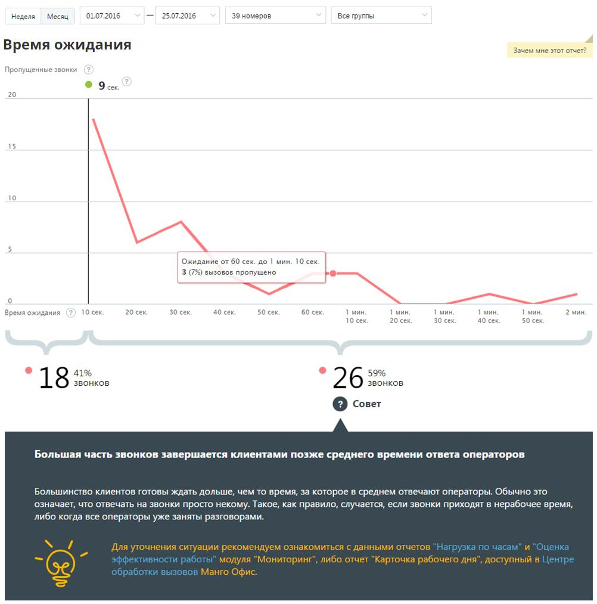

# 15.1.1.3. Время ожидания

> Трассировка: PDF §15.1.1.3 · сквозные стр. 425-426 · источники: ч.5 `kb/mango-product-docs/sources/mango-cc-manual/CC_manual_1.26.23-part-5.pdf` с.21-22.

Отчет «Время ожидания» отображает информацию о времени ожидания пропущенного внешнего входящего вызова, поступившего за выбранный временной период через выбранные линии. Звонки, пропущенные в IVR и не дошедшие до групп, в отчет не включаются. В верхней части отчета приведены данные о средней продолжительности вызовов в виде инфографики. В зависимости от значения времени ожидания формируется текст совета.

Диаграмма представлять собой визуализацию динамики изменения количества пропущенных внешних входящих звонков в зависимости от времени ожидания до завершения вызова. Ломаная строится по точкам, соответствующим суммарному числу пропущенных звонков за определенный промежуток времени. При наведении на любую точку участка ломаной отображается всплывающее окно, содержащее дополнительные данные о вызовах. Также диаграмма содержит маркер, отображающий среднее время ответа операторов на принятые внешние входящие звонки. Маркер представляет собой вертикальную линию, снабженную числовым показателем, который отражает среднее время ответа операторов на принятые внешние входящие звонки. Таким образом, в левой колонке отчета, расположенной до маркера, приводится информация о количестве вызовов, длительность ожидания по которым меньше или равна среднему времени ожидания ответа оператора. Здесь же указывается процентная доля таких звонков от всех внешних входящих пропущенных звонков за период с учетом выбранных значений фильтров. В правой колонке отчета, расположенной после маркера, приводится числовой показатель, отражающий количество вызовов, длительность ожидания по которым больше среднего времени ожидания ответа оператора. Здесь же указывается процентная доля таких звонков от всех внешних входящих пропущенных звонков за период с учетом выбранных значений фильтров.
