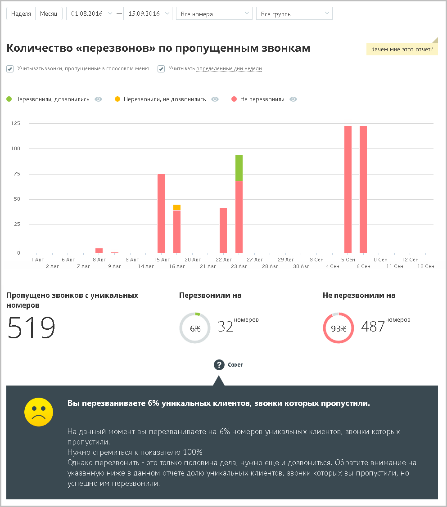

# 15.1.1.5. Количество "перезвонов" по пропущенным звонкам

> Трассировка: PDF §15.1.1.5 · сквозные стр. 428-429 · источники: ч.5 `kb/mango-product-docs/sources/mango-cc-manual/CC_manual_1.26.23-part-5.pdf` с.24-25.

Отчет «Количество перезвонов по пропущенным звонкам» в графическом виде отображает информацию о перезвонах по пропущенным вызовам. Перезвоном в данном случае считается исходящий внешний звонок на номер, с которого был зафиксирован пропущенный внешний входящий вызов, в течение 24 часов с момента получения пропущенного вызова. Если флаг Учитывать звонки, пропущенные в голосовом меню не установлен, то из подсчета общего числа пропущенных звонков исключаются вызовы, пропущенные в IVR меню. При установленном флаге Учитывать определенные дни недели в отчете учитываются только указанные вами дни недели. По умолчанию данный флаг не устанавливается. Отчет условно состоит из двух частей. В первой части в виде графика и круговых диаграмм содержится детальная информация с учетом параметров фильтрации: • о количестве пропущенных звонков с уникальных номеров; • о количестве уникальных номеров из числа пропущенных, на который был выполнен перезвон; • о количестве уникальных номеров из числа пропущенных, на который перезвон не был осуществлен. Для того, чтобы скрыть/отобразить вызовы определенного типа, щелкните по соответствующим переключателям над графиком.

Во второй части отчета в виде круговых диаграмм приводятся данные о количестве уникальных номеров, на которые были совершены успешные и неуспешные перезвоны соответственно.
