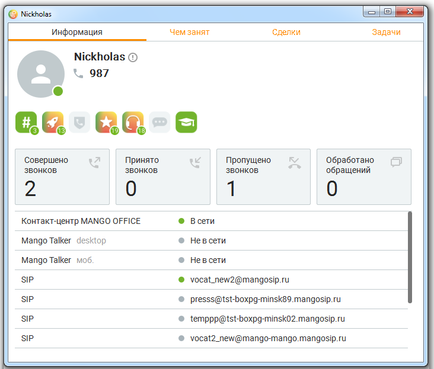

# 2.5.1.1. Профиль

> Трассировка: PDF §2.5.1.1 · сквозные стр. 49-52 · источники: ч.1 `kb/mango-product-docs/sources/mango-cc-manual/CC_manual_1.26.23-part-1.pdf` с.49-52.

Для перехода к просмотру профиля текущего сотрудника следует нажать на аватар сотрудника, расположенный в правом верхнем углу приложения, и выбрать пункт меню Профиль. В результате на экране отобразится карточка сотрудника.

Карточка сотрудника содержит следующую информацию: • Фотографию сотрудника (аватар); • Должность и отдел; • Внутренний номер (при его наличии); • Достижения сотрудника; • Список средств связи; • Исходящий номер;

| Автосекретарь; |
| --- |
| Регион сотрудника. |

При изменении исходящего номера в Личном кабинете ВАТС или профиле сотрудника, исходящий номер также изменяется в карточке сотрудника и в верхней панели основного окна Контакт-центра. Для выбора аватара следует нажать на него и выбрать нужное изображение. Для удаления

аватара следует навести курсор на аватар и щелкнуть по пиктограмме .

По клику на пиктограмме откроется окно, содержащее информацию о группах, в которых состоит сотрудник, статусе сотрудника в данной группе и других сотрудниках группы с аналогичным статусом.

По клику на пиктограмме открываются окна редактирования соответствующих данных. Больше о карточке сотрудника узнайте здесь.

