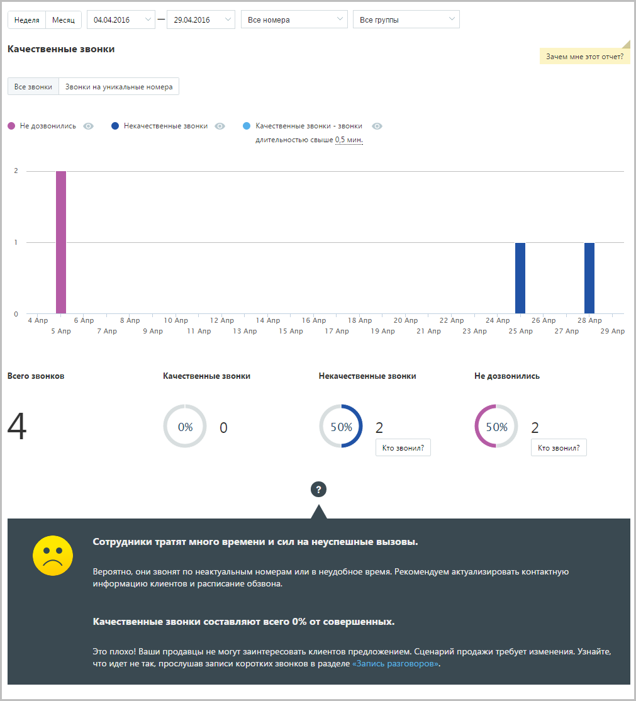
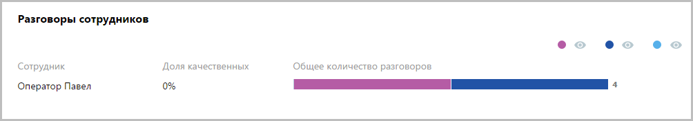

# 15.1.2.1. Качественные звонки

> Трассировка: PDF §15.1.2.1 · сквозные стр. 431-432 · источники: ч.5 `kb/mango-product-docs/sources/mango-cc-manual/CC_manual_1.26.23-part-5.pdf` с.27-28.

Отчет «Качественные звонки» отображает информацию о количестве качественных исходящих звонков в соответствии с заданными параметрами фильтрации. Качественным звонком считается принятый вызов с определенной длительностью. Как правило, длительность разговора должна быть достаточной для того, чтобы продавец смог найти точку контакта с клиентом. По умолчанию качественным вызовом считается принятый вызов с длительностью не менее 30 секунд. Вы можете изменить длительность самостоятельно, установив другое значение в поле Качественные звонки – звонки длительностью свыше … мин. после формирования отчета. Если переключатель установлен в положение Звонки на уникальные номера, то отчет содержит только информацию об исходящих внешних вызовах, совершенных за выбранный календарный период через выбранные линии сотрудниками, входящими в состав выбранных групп на уникальные номера. Пример сформированного отчета приведен на рисунке ниже. Отчет содержит детальную информацию о количестве качественных вызовов в соответствии с заданными параметрами фильтрации, а именно: • графическое отображение динамики изменений количества вызовов определенных типов в течение выбранного периода; • круговые диаграммы с информацией о процентном соотношении количества вызовов определенного типа от общего количества звонков. Для того, чтобы скрыть/отобразить различные категории вызовов зависимости от указанной длительности, щелкните по пиктограмме "Просмотр" нужного цвета. Для того, чтобы узнать, кем были совершены некачественные или неудавшиеся звонки, нажмите на кнопку Кто звонил под соответствующей диаграммой. В результате выполнится переход к странице отчета «История вызовов».

Отчет позволяет увидеть детализацию по звонкам не только для групп в целом, но и для каждого сотрудника группы, совершавшего вызовы, в отдельности.

Для того, чтобы скрыть/отобразить различные категории вызовов зависимости от указанной длительности, щелкните по пиктограмме "Просмотр" нужного цвета.
