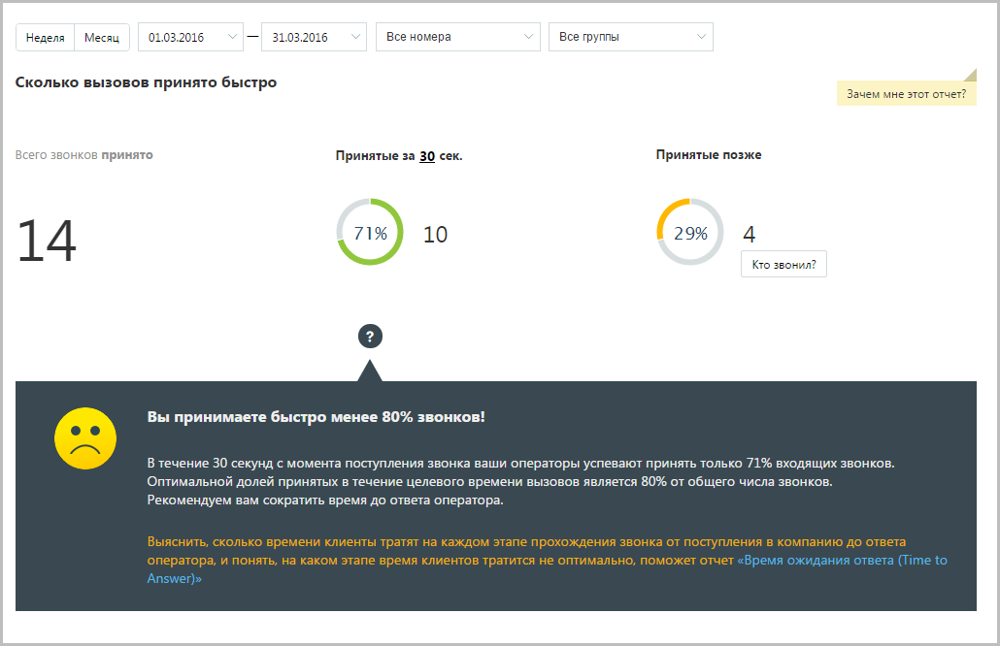
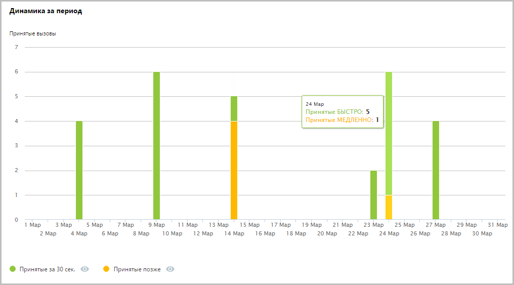

# 15.2.1.1. Сколько звонков принято быстро

> Трассировка: PDF §15.2.1.1 · сквозные стр. 438-439 · источники: ч.5 `kb/mango-product-docs/sources/mango-cc-manual/CC_manual_1.26.23-part-5.pdf` с.34-35.

Отчет «Сколько звонков принято быстро» содержит информацию о количестве входящих вызовов, принятых «быстро», то есть за определенное время. По умолчанию быстро принятым вызовом считается вызов, принятый в течение 30 секунд. При необходимости измените это время самостоятельно, установив другое значение в поле «Принятые за n секунд» после формирования отчета. В верхней части отчета приведены данные о принятых звонках в виде инфографики.

В нижней части окна отображается детальная информация по заданному периоду.

Используйте кнопки Принятые за n сек и Принятые позже для того, чтобы скрыть/отобразить соответствующие показатели на графике.
