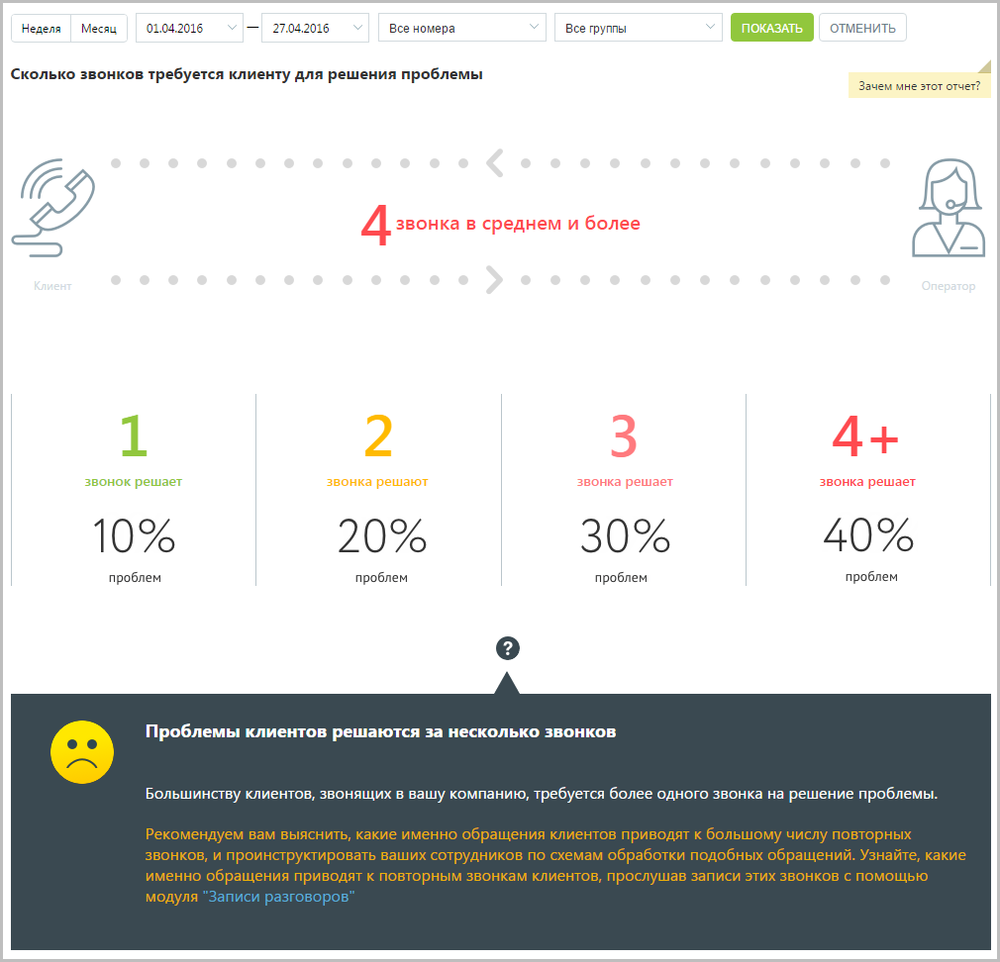

# 15.2.1.6. Сколько звонков требуется клиенту для решения проблемы

> Трассировка: PDF §15.2.1.6 · сквозные стр. 443-444 · источники: ч.5 `kb/mango-product-docs/sources/mango-cc-manual/CC_manual_1.26.23-part-5.pdf` с.39-40.

Отчет «Сколько звонков требуется клиенту для решения проблемы» количество повторных звонков, сделанных клиентом для решения его вопроса.

Эталонное количество звонков, за которое должна быть решена проблема клиента – один звонок. При большем количестве звонков рекомендуем прослушать записи разговоров в Истории вызовов.
