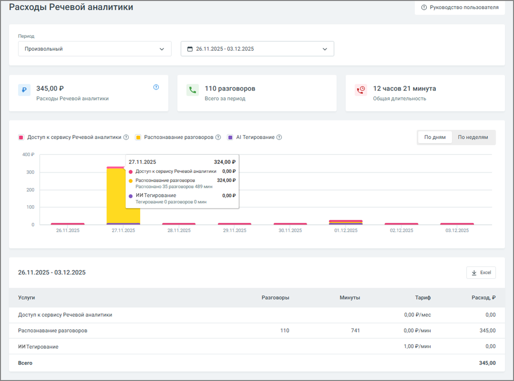

# 16.1.1. Расходы Речевой аналитики

> Трассировка: PDF §16.1.1 · сквозные стр. 453-454 · источники: ч.5 `kb/mango-product-docs/sources/mango-cc-manual/CC_manual_1.26.23-part-5.pdf` с.49-50.

Страница расходов помогает быстро понять, сколько стоит использование сервиса за выбранный период и какие услуги вносят основной вклад в затраты.

| Доступ к отчету регулируется в настройках ролей ЛК ВАТС. Доступ к отчету открыт, если |
| --- |
| у пользователя есть доступ к разделам Финансы и Баланс Лицевого счета: "Просматривать |
| информацию о расходах за текущий и предыдущий месяцы". |

Период и выбор дат В верхней части страницы можно выбрать период, за который будут отображены расходы. Чаще всего пользователи выбирают: • текущий день или вчера — чтобы быстро оценить недавнюю активность; • текущую неделю или месяц — для регулярного мониторинга; • произвольный период — когда нужно посмотреть данные за конкретные даты. После выбора периода информация на странице сразу обновляется — ничего дополнительно подтверждать не нужно. Основные показатели за период Под блоком выбора дат отображаются три ключевых значения, которые дают быстрый обзор ситуации: • сумма расходов за выбранный период; • количество обработанных разговоров; • общая длительность разговоров.

Эти показатели помогают сразу оценить нагрузку и стоимость работы сервиса. График расходов График визуально показывает динамику затрат по дням или неделям. Это полезно, если вы хотите: • увидеть, когда были пики активности, • понять, какие услуги формируют ключевые расходы, • быстро сравнить дни между собой. Цветовая маркировка помогает сразу отличать: • расход на доступ к сервису, • распознавание разговоров, • ИИ-тегирование. При наведении курсора на столбец появляется всплывающая подсказка с деталями по конкретному дню: сумма расходов по каждой услуге, количество разговоров и длительность. Таблица расходов Внизу страницы расположена таблица с подробной разбивкой по услугам. Для каждой услуги указано: • сколько разговоров было обработано, • сколько минут распознано, • какой тариф использовался, • какая сумма начислена. В конце таблицы отображается итоговый расход за период. Если данные нужно передать коллегам или приложить к отчёту — таблица легко выгружается в формате Excel.
