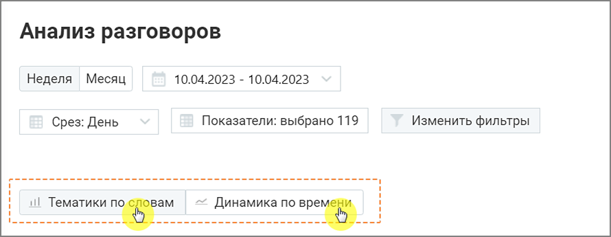
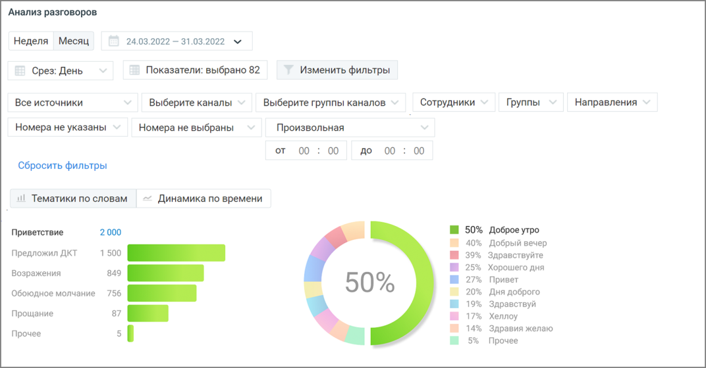
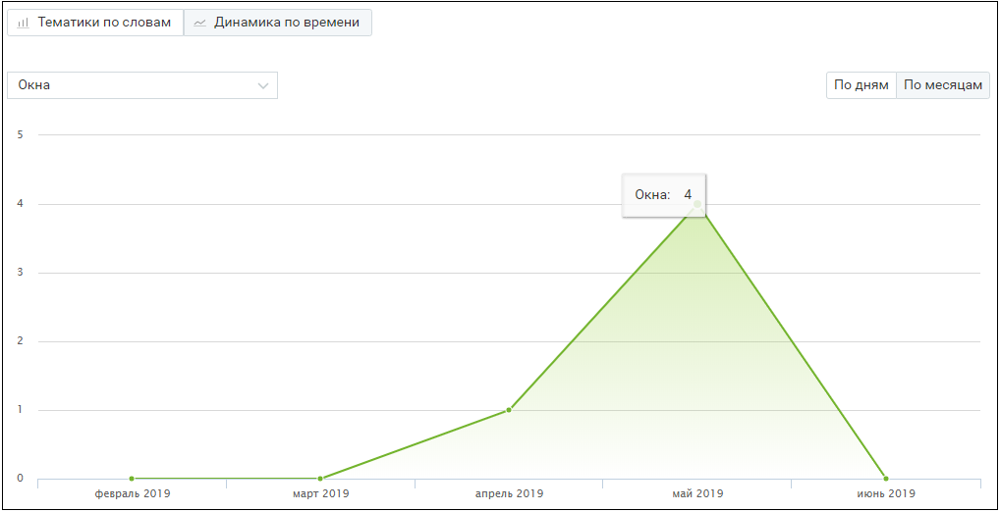
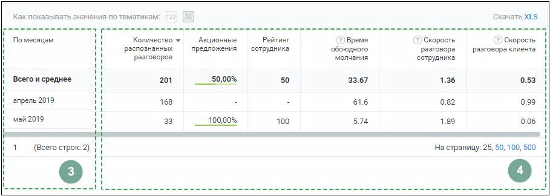
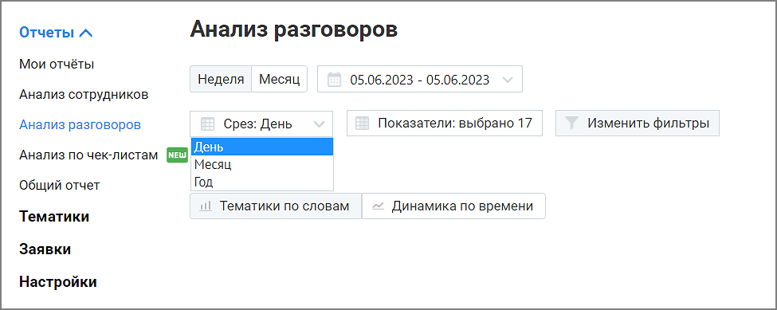
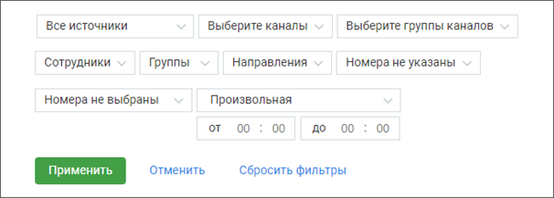
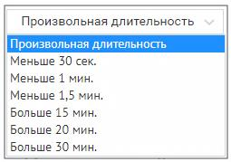

# 16.1.3. Отчет "Анализ разговоров"

> Трассировка: PDF §16.1.3 · сквозные стр. 461-465 · источники: ч.5 `kb/mango-product-docs/sources/mango-cc-manual/CC_manual_1.26.23-part-5.pdf` с.57-61.

Отчет «Анализ разговоров» состоит из двух блоков: • Блока таблицы • Блока визуализаций: Тематики по словам и Динамика по времени. Блоки визуализаций отображаются по щелчку на соответствующей вкладке:

Визуализация “Тематики по словам” В поле визуализации “Тематики по словам” отображается:

• Топ 5 выбранных тематик – наиболее популярные тематики (не более 5-ти) из тематик, выбранных пользователем во всплывающем окне Показатели, подраздел Количество разговоров по тематикам. Позволяет определить – какие из установленных тематик содержат наибольшее количество звонков. Таким образом руководитель может видеть, к примеру, вектор заинтересованности клиентов в тех или иных товарах. Клик по любой из предложенных тематик позволяет увидеть подробную детализацию по этой тематике. • Что говорят в тематике – для тематики, выбранной в “ТОП-5 популярных тематик”, показывает процентное соотношение распознанных терм по отношению к общему количеству терм тематики. В гистограмме отображается не более 10 строк. Если тематика содержит более 10 терм, наименее популярные из них помечаются, как Прочие.

Визуализация “Динамика по времени” Визуализация “Динамика по времени” представляет собой график изменений выбранного показателя в заданный период времени. Выпадающий список в левом верхнем углу графика содержит доступные для выбора показатели. При наведении курсора на элементы графика отображается всплывающая подсказка с информацией по соответствующему дню/месяцу.

Блок таблицы Таблица формируется по срезу День/Месяц/Год и заданным пользователем в окне "Показатели" параметрам.

| Для типа записи разговора «Текстовые коммуникации» в качестве показателей |
| --- |
| отображаются только данные разговоров по тематикам. |

Таблица может включать следующие данные:

Срез: день, месяц или год. Этот показатель присутствует в таблице всегда.

Показатели: • название тематики – в примере на скриншоте выбрана тематика «Акционные предложения». При выборе для отчета большего количества тематик, данные по каждой из них будут отображаться в отдельном столбце. Где заголовок – название выбранной тематики.

| Данные столбца могут отображаться в двух вариантах: 1) в виде процентного соотношения |  |  |
| --- | --- | --- |
|  | разговоров в срезе, отнесенных к данной тематике, к общему числу разговоров в срезе 2) в |  |
| числовом виде – количество разговоров в срезе, отнесенных к данной тематике. |  |  |

• Количество распознанных разговоров. Этот показатель присутствует в таблице всегда • Время обоюдного молчания • Скорость разговора клиента • Скорость разговора сотрудника • Рейтинг сотрудника Для фильтрации данных отчета по возрастанию/убыванию следует щелкнуть по наименованию столбца. Предусмотрен экспорт файла отчета «Тематики по словам» в формате XLS. После клика на кнопку XLS будет открыто стандартное диалоговое окно браузера, позволяющее сохранить файл. Как настраивается отчет “Анализ разговоров” Для построения отчета “Анализ разговоров” выберите временной период, срез (день/месяц/год) и показатели, по которым будет формироваться отчет.

О показателях, по которым осуществляется формирование отчета, подробнее здесь. Данные выбранных чекбоксов в таблице отчета “Анализ разговоров” отображаются, как столбцы. Для сохранения внесенных изменений нажмите на кнопку Применить.

| Если нажать кнопку «Отменить» или пиктограмму , изменения не будут внесены, а |
| --- |
| выборка показателей вернется к последней сохраненной версии. |

По завершению работы указанных выше фильтров отчет будет сформирован автоматически. Для дополнительной фильтрации данных в отчете откройте выпадающий список Изменить фильтры. Откроются поля дополнительных фильтров.

Источник записи – выбор типа записи разговора: телефонные разговоры/ офлайн-записи /текстовые коммуникации. Каналы коммуникации – выбор из выпадающего списка доступных в разделе «Текстовые коммуникации» ЛК ВАТС каналов коммуникации. Варианты: Чат на сайте, ВКонтакте, Telegram, Max, WhatsApp, Авито, Max.. При выборе типа записи разговора «телефонные разговоры» фильтр недоступен. Группы каналов – выбор из выпадающего списка созданных в разделе «Текстовые коммуникации» ЛК ВАТС групп каналов коммуникации. При выборе типа записи разговора «офлайн-записи» или «телефонные разговоры» фильтр недоступен. Сотрудники – список всех сотрудников, сгруппированный по группам. При выборе типа записи разговора «текстовые коммуникации» в списке доступны только выбранные в разделе Настройки/Аналитика текстовых коммуникаций сотрудники. Если ни один сотрудник не выбран, отчет формируется по всем сотрудникам. Группы – при установке флага напротив наименования группы сформированный отчет будет включать только выбранные группы. Для быстрого выбора всех групп предусмотрен общий флаг.

Направление – входящий, исходящий, внутренний звонок или текстовое сообщение. Номера клиента – фильтрация только по любым добавленным номерам. При выборе типа записи разговора «текстовые коммуникации» фильтр недоступен. Номер ВАТС – фильтрация только выбранным номерам ВАТС. При выборе типа записи разговора «текстовые коммуникации» или «офлайн-записи» фильтр недоступен. Длительность – продолжительность разговора. По умолчанию установлен параметр «произвольная длительность». При выборе типа записи разговора «текстовые коммуникации» фильтр недоступен.

| Внутри фильтра действует принцип фильтрации – ИЛИ (когда одно из условий истинно). |
| --- |
| Между фильтрами действует принцип фильтрации – И (когда все условия истинны). |

<!-- изображение на стр. 465: байты не извлечены (PyMuPDF недоступен) -->

Кнопкой Выбрать сохраните внесенные изменения.
