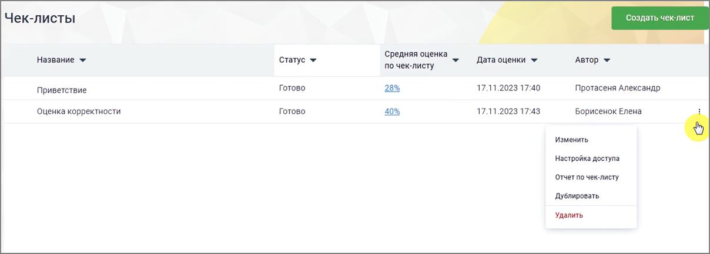
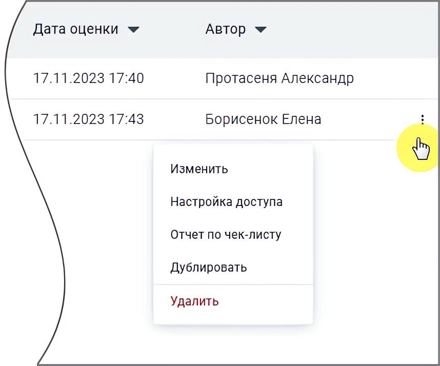

# 16.1.4. Анализ по чек-листам

> Трассировка: PDF §16.1.4 · сквозные стр. 465-466 · источники: ч.5 `kb/mango-product-docs/sources/mango-cc-manual/CC_manual_1.26.23-part-5.pdf` с.61-62.

Отчет предназначен для автоматической оценки разговора сотрудника с клиентом на соответствие стандартам компании. Клик по строке меню «Анализ по чек-листам» открывает перечень всех созданных пользователем чек-листов для оценки разговоров операторов. В окне списка доступен просмотр статистики по созданным чек-листам и создание нового чек-листа в Конструкторе.

Заголовки столбцов (доступна сортировка): Название – задается автором на странице Конструктора Средняя оценка по чек-листу – отображается если чек-лист был просчитан. Может отображаться как цифрами, так и в процентах. Если чек лист не был просчитан – ставится прочерк

Дата оценки – дата и время, когда была выставлена оценка (задается автоматически). Если чек-лист не был просчитан – ставится прочерк Статус – чек-лист может находиться в одном из следующих статусов, задаваемых автоматически: • Черновик – анализ по чек-листу не проводился, статистики нет; • В процессе – чек-лист находится на этапе просчета; • Ошибка просчета – любая из ошибок. При появлении ошибки рекомендуется запустить оценку по чек-листу повторно; • Готово – чек-лист оценен и есть цифровое значение. Ячейка с цифровыми данными является кнопкой, которая переводит на страницу Статистики.

Клик по пиктограмме в строке выделенного чек-листа открывает выпадающее меню: • Удалить – после подтверждения согласия на удаление чек-лист удаляется; • Дублировать – создание дубля чек-листа, в котором все поля кроме Названия и Описания заполнены так же, как и в оригинале. Если в списке уже создано 10 чек-листов кнопка не работает; • Отчет по чек-листу – переход на страницу Статистики по данному чек-листу; • Изменить – переход на страницу Конструктора, с возможностью редактировать чек-лист.
