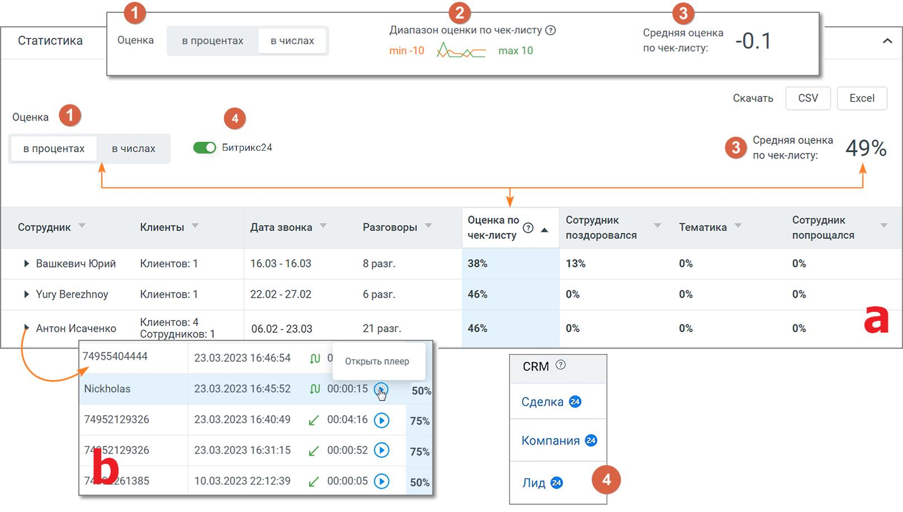
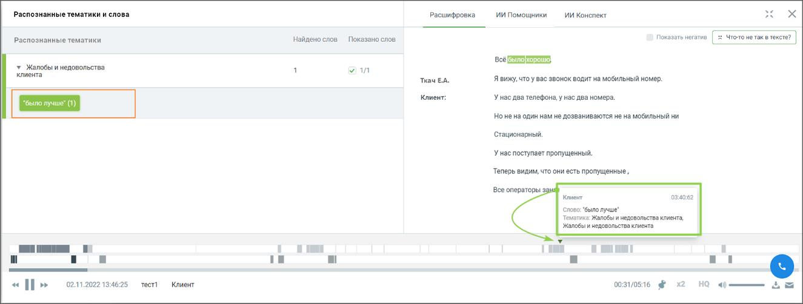
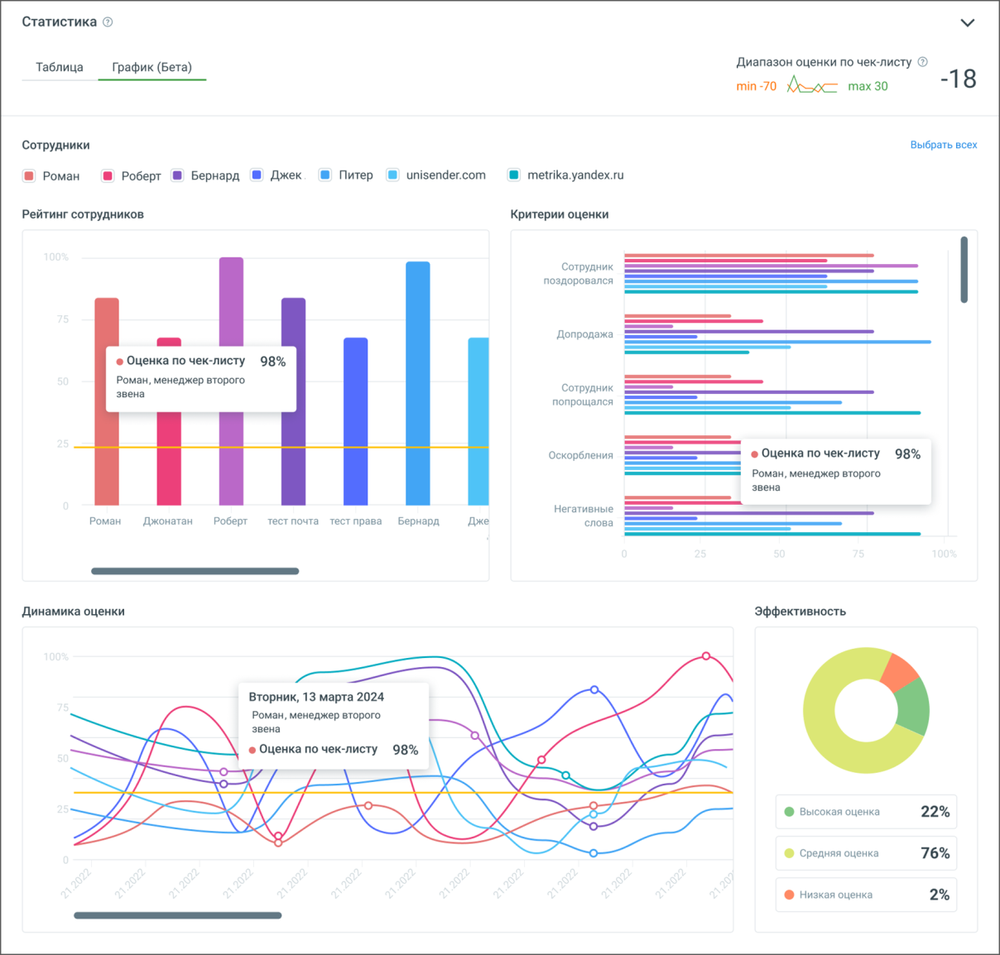

# 16.1.4.2. Статистика по чек-листам

> Трассировка: PDF §16.1.4.2 · сквозные стр. 471-474 · источники: ч.5 `kb/mango-product-docs/sources/mango-cc-manual/CC_manual_1.26.23-part-5.pdf` с.67-70.

Статистика отчета по Чек-листам содержит вкладки «Таблица» и «График», которые позволяют комплексно анализировать результаты оценок в отчете. Вкладка "Таблица" Статистика по чек-листу отображается в процентах и числах и показывает результаты просчета чек-листа по заданным в блоке «Критерии» чек-листа критериям и фильтрам.

Элементы окна статистики:

1) Заголовок окна 1. Выбор отображения данных: Оценка в процентах или числах. По умолчанию установлен вариант «в процентах». Если в окне статистики пользователь выбирает вариант «в числах», то в списке чек-листов средняя оценка по чек-листу также будет отображаться в числах. 2. Виджет "Диапазон оценки по чек-листу" – максимальные и минимальные оценки, которые можно получить по данному чек-листу. В отчете отображается если выбрана оценка «в числах». 3. Средняя оценка по чек-листу – отображается в процентах или в числах, в зависимости от выбора отображения данных. 2) Таблица (a) с блоком детализации (b) • Сотрудник – имя сотрудника, которого анализируем; • Клиенты – количество клиентов. В детализации номер телефона или имя клиента; • Дата звонка – диапазон дат, в которые совершались звонки. В детализации – дата и время конкретного звонка; • Разговоры – количество разговоров. В детализации – длительность и тип разговора (пиктограмма со стрелкой: входящий, исходящий, внутренний); • Оценка по чек-листу – усредненная оценка по чек-листу по всем разговорам. В детализации – точная оценка по чек-листу каждого разговора. Отображается в зависимости от выбора отображения в процентах или числах; • Настраиваемые показатели – соответствуют названиям критериев, которые выбраны в Конструкторе при создании чек-листа. Отображаются в зависимости от выбора отображения в процентах или числах;

Клик по пиктограмме открывает окно встроенного плеера для прослушивания разговора со следующей информацией: • Тематики и ключевые слова – список распознанных ключевых слов, сгруппированный по тематикам. • Расшифровка текста разговора – помимо текста разговора включает данные сотрудника и клиента, а также метки вхождений. Для внутренних разговоров – данные обоих сотрудников.

• Плеер с отметками фрагментов разговора и вхождений терм .

3) Кнопки «Сохранить», «Вернуться к списку» • Клик по кнопке «Вернуться к списку» открывает страницу списка чек-листов. • Клик по кнопке «Сохранить» сохраняет внесенные в чек-лист изменения. Если изменения не вносились, кнопка не активна.

4) Кнопки экспорта Файл статистики может быть экспортирован в форматах Csv, Excel. Для экспорта нажмите кнопку соответствующего формата рядом с подсказкой «Скачать». Вкладка "График"

Вкладка "График" содержит следующие элементы: • Рейтинг сотрудников: Бары отображают сравнительный рейтинг выбранных в чек-листе сотрудников. • Критерии оценки: Горизонтальные линейные графики показывают распределение различных оценочных критериев применительно к сотруднику. • Динамика оценки: Линейные графики для анализа изменений оценок каждого из сотрудников во времени. • Эффективность: Круговая диаграмма для визуализации процентного распределения оценок по сотрудникам.

