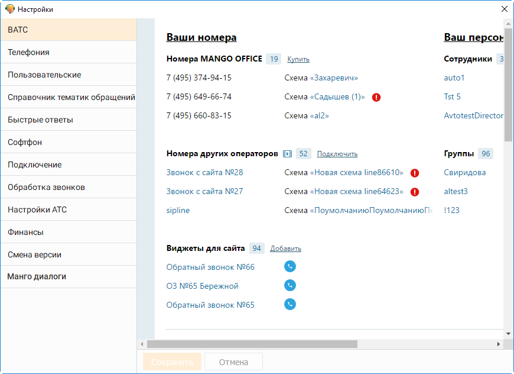

# 2.5.1.3.1. ВАТС

> Трассировка: PDF §2.5.1.3.1 · сквозные стр. 54-56 · источники: ч.1 `kb/mango-product-docs/sources/mango-cc-manual/CC_manual_1.26.23-part-1.pdf` с.54-56.

Данная вкладка предназначена для получения информации о настройках Виртуальной АТС, с которой используется Контакт-центр MANGO OFFICE.

Вкладка доступна пользователям с ролью Администратор.

| Подробное описание работы с настройками и инструментами ВАТС приведено в |  |  |
| --- | --- | --- |
|  | документе "Справочник ВАТС", который можно скачать с официального сайта компании |  |
| Манго-Телеком. В документе см. раздел "Продукт "Виртуальная АТС" и его подразделы. |  |  |

<!-- изображение на стр. 56: байты не извлечены (PyMuPDF недоступен) -->
