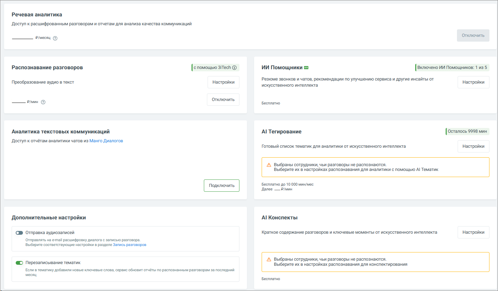
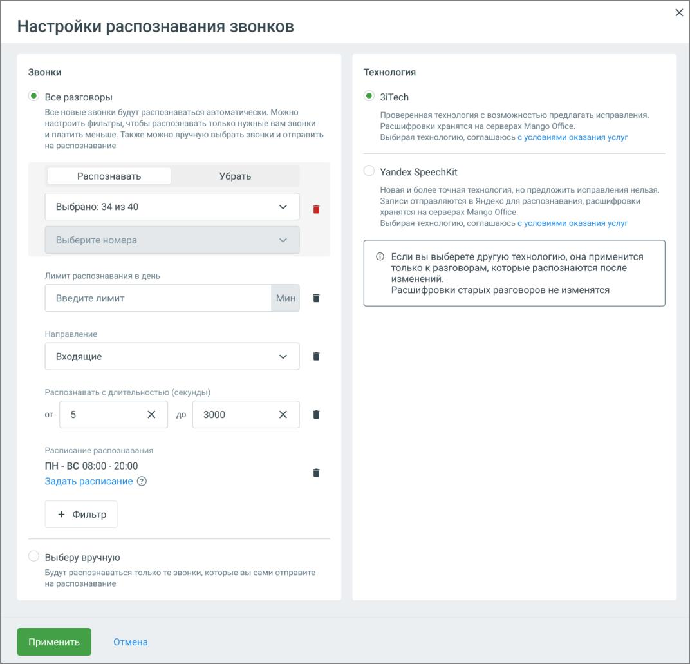
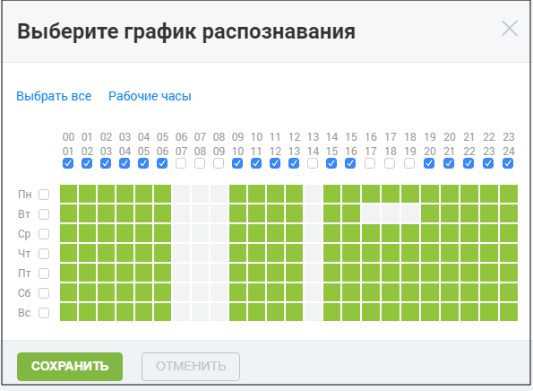
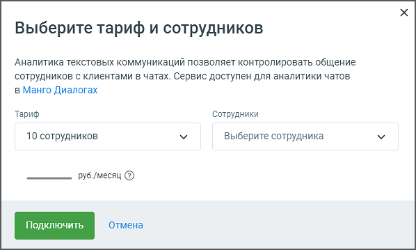
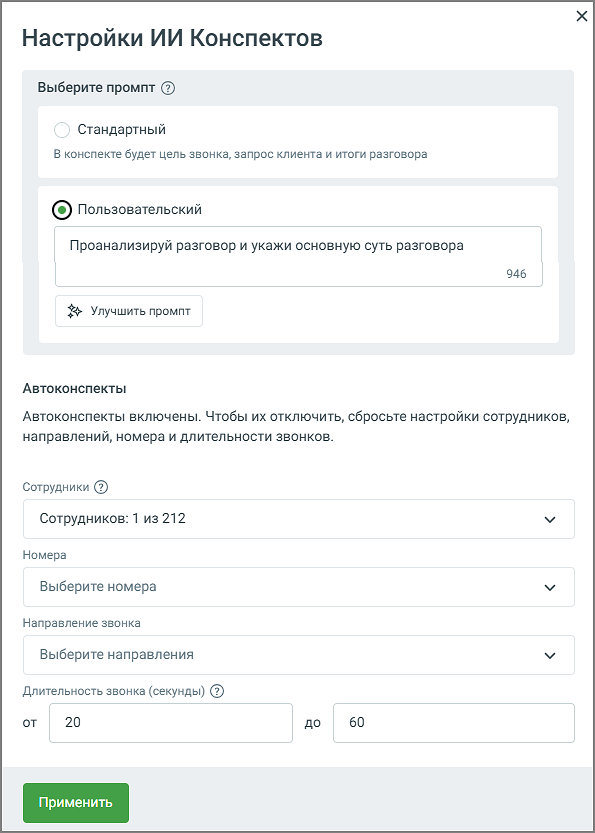
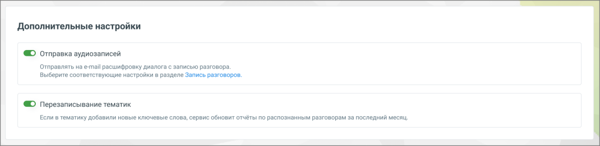

# 16.3. Настройки речевoй аналитики

> Трассировка: PDF §16.3 · сквозные стр. 490-498 · источники: ч.5 `kb/mango-product-docs/sources/mango-cc-manual/CC_manual_1.26.23-part-5.pdf` с.86-94.

Вкладка Настройки модуля Речевая аналитика содержит обучающий блок (онбординг), а также следующие блоки.

Услуга «Речевая аналитика» – отображается абонентская плата за услугу. Распознавание разговоров – отображается стоимость расшифровки и распознавания аудиозаписей разговоров. В настройках можно настроить условия распознавания аудиозаписей разговоров и выбрать технологию распознавания. Пользователь может отправлять на распознавание только нужные звонки. Аналитика текстовых коммуникаций – выбор тарифа и сотрудников, чьи текстовые коммуникации будут анализироваться. ИИ-инструменты 1. ИИ Помощники – инструмент для автоматического анализа диалогов по заданным правилам, который выдаёт не только краткое содержание, но также полезные выводы и рекомендации. 2. ИИ Конспекты – если переключатель включен, данная услуга Речевой Аналитики позволяет автоматически формировать краткое содержание диалога и выделять ключевые моменты с помощью искусственного интеллекта. 3. ИИ Тегирование – при подключенной услуге предоставляется возможность смыслового анализа разговоров на основе запросов к ИИ без подбора ключевых слов. Анализ разговоров с использованием ИИ-запросов доступен только при активированных услугах «Абонентская плата» и «Распознавание разговоров». Элементы настройки услуги: a. Сотрудники: Выбор диапазона сотрудников для анализа. Пользователь может выбрать конкретных сотрудников для фильтрации разговоров. Необходимо убедиться, что выбранные для анализа сотрудники совпадают с теми, кто уже выбран для распознавания разговоров. b. Направление: Позволяет выбрать направление (входящие, исходящие или внутренние звонки) по которому разговоры будут фильтроваться для отправки на тегирование.

| Стоимость услуги определяется на основе продолжительности анализируемых разговоров, |
| --- |
| а списание средств происходит каждую ночь. |

Все действия, произведенные в настройках Речевой аналитики, отражаются в Личном кабинете пользователя ВАТС в разделе Безопасность и ограничения/Журнал действий. Для удобного и последовательного ознакомления с функционалом Речевой аналитики разработан блок онбординга, который помогает быстро настроить все ключевые параметры и начать работу с сервисом.

Распознавание разговоров Блок Распознавание разговоров позволяет настроить функции распознавания и пересылки аудиозаписей разговоров сотрудников. По нажатию на кнопку Настройки открывается окно настроек распознавания звонков:

1. Режим распознавания: • Все разговоры — в этом режиме будут распознаваться все новые разговоры и записи, автоматически отправляемые на распознавание со страницы "Записи разговоров". • Выберу вручную — распознаются только те записи, которые вручную отправлены пользователем со страницы "Записи разговоров". 2. Управление сотрудниками — Распознавать/Убрать: • Возможность выбрать сотрудников, чьи разговоры должны распознаваться или исключаться из распознавания. 3. Ограничения по номерам (если соответствующая услуга подключена):

• В настройках распознавания возможно добавление ограничения по номерам телефонов, на которые будет распространяться функция распознавания. Эта настройка доступна не для всех пользователей и зависит от подключенной конфигурации услуги. Если данная опция активна, пользователю предоставляется возможность указать конкретные номера телефонов для входящих и исходящих вызовов, которые будут отправляться на распознавание. 4. Лимит распознавания в день: • Вводимое значение ограничивает количество минут разговоров, которые могут быть распознаны за один день. Пользователь может задать минимальное количество для обработки. 5. Направление звонков для распознавания (если соответствующая услуга подключена): Пользователь может выбрать направление звонков, которые будут распознаваться: • Входящие • Исходящие • Внутренние 6. Расписание распознавания (если соответствующая услуга подключена): • Пользователь может настроить время работы системы распознавания по дням недели. Клик по кнопке Задать расписание откроет окно настройки расписания. Зеленым цветом отмечено время, когда разговоры будут отправляться на распознавание. В соответствии с настроенным расписанием под распознавание будут попадать все (с учетом других настроек распознавания) записанные разговоры, время начала которых лежит в заданном интервале. Часовой пояс – Москва. • При необходимости можно обновить расписание, нажав кнопку Обновить.

7. Выбор технологии распознавания – предлагается две технологии на выбор:

• 3iTech – проверенная технология с возможностью предлагать исправления, хранение расшифровок на серверах Mango Office. При выборе 3iTech пользователю доступны 700 приветственных минут для распознавания звонков. • Yandex SpeechKit – более точная технология, но без возможности внесения исправлений. Отправка записей в Яндекс для распознавания с последующим хранением расшифровок на серверах Mango Office. После настройки всех параметров необходимо нажать кнопку Применить для сохранения изменений. Если внесенные изменения не требуются, можно выбрать Отмена, чтобы вернуться к предыдущим настройкам. Эти настройки дают гибкость в управлении процессом распознавания аудиозаписей, позволяют ограничить количество обрабатываемых записей, а также задать удобное расписание для работы системы.

| Для подключения отсутствующих услуг необходимо обращаться к Персональному |
| --- |
| менеджеру. |

Аналитика текстовых коммуникаций Блок Аналитика текстовых коммуникаций позволяет настроить услугу аналитики текстовых коммуникаций, которая контролирует взаимодействие сотрудников с клиентами в чатах. По нажатию на кнопку Настройки открывается окно "Выберите тариф и сотрудников":

В данном разделе пользователю предлагаются следующие возможности: 1. Тариф: • Пользователь может выбрать один из доступных тарифных планов в выпадающем списке. Тариф определяется количеством сотрудников, чаты которых будут анализироваться (в примере на скриншоте выбран тариф на 10 сотрудников). 2. Сотрудники: • В данном поле отображается количество сотрудников, выбранных для аналитики. В выпадающем списке можно выбрать сотрудников, чаты которых будут контролироваться. 3. Стоимость услуги: • В зависимости от выбранного тарифа автоматически рассчитывается ежемесячная стоимость услуги. После выбора тарифа и сотрудников необходимо нажать кнопку Применить, чтобы активировать или изменить услугу. Если пользователь передумал или не хочет вносить изменения, можно нажать кнопку Отмена, чтобы вернуться к предыдущему экрану без сохранения изменений.

Эта настройка позволяет гибко управлять количеством сотрудников, чаты которых будут анализироваться, а также контролировать расходы на услугу в зависимости от выбранного тарифа. ИИ Тегирование Блок ИИ Тегирование позволяет настроить анализ разговоров сотрудников с использованием ИИ. Сервис анализирует разговоры не только по словам, но и по смыслу, что делает аналитику более точной и детализированной.

Услуга доступна для подключения в демо- и стандартном режиме, с поминутной оплатой. Для активации услуги необходимо нажать кнопку Подключить и выбрать вариант демо- или стандартный режим.

1. Настройки сотрудников и направлений: По нажатию на иконку Настройки пользователь может выбрать сотрудников, чьи разговоры отправляются на анализ через ИИ. Открывается дополнительное окно Сотрудники и направления для ИИ аналитики, где можно: • Выбрать сотрудников (в примере на скриншоте выбрано 200 сотрудников из 226 возможных). Для выбора доступны только те сотрудники, кто уже выбран для распознавания разговоров. • Указать направления звонков для анализа: любое, входящие, исходящие или внутренние звонки. 2. После настройки сотрудников и направлений нужно нажать кнопку Применить, чтобы сохранить изменения и запустить анализ для выбранных параметров. 3. При необходимости услугу можно отключить кнопкой Отключить. Эта настройка дает пользователю гибкость в управлении, позволяя выбирать конкретных сотрудников и направления звонков для более точного анализа с помощью ИИ. ИИ Конспекты Блок ИИ Конспекты позволяет автоматически формировать краткое содержание телефонных разговоров с помощью искусственного интеллекта. Это упрощает анализ диалогов и помогает быстро понять суть общения без необходимости прослушивания каждой записи.

Функциональные возможности блока: 1. Автоматическое создание краткого резюме для каждого обработанного звонка — выделение ключевых моментов разговора, включая суть обращения клиента, действия и предложения оператора, а также итог. Резюме отображается рядом с деталями звонка и формируется на основе выбранного промпта. Доступны два варианта: стандартный промпт от MANGO OFFICE или настраиваемый пользовательский промпт до 1000 символов. 2. Обработка разговоров с подключённой речевой аналитикой — ИИ Конспекты доступны только для звонков, прошедших распознавание. При выборе звонка, который не был расшифрован, запись звонка отправляется на расшифровку и дальнейшее конспектирование. 3. Формирование архивов и выгрузка — возможность экспортировать резюме для внешнего анализа или отчётности. 4. Возможность отключения — если пользователю больше не требуется данная функция, ее можно легко отключить с помощью кнопки Отключить. При включённой функции Пробный период вы можете бесплатно протестировать работу ИИ Конспектов — до 100 минут обработанных разговоров в сутки. Настройки ИИ Конспектов Нажмите кнопку Настройки на плитке ИИ Конспекты и откройте окно настроек:

Задайте параметры, по которым будет формироваться конспект:

• В блоке «Выберите промт» вы можете выбрать стандартный промпт от MANGO OFFICE или создать свой. При выборе «Пользовательский» откроется текстовое поле «Свой промпт конспекта», где можно ввести собственный шаблон. Ограничение по длине промпта - 1000 символов. Вы всегда можете вернуться к стандартному промпту от MANGO OFFICE, выбрав соответствующую опцию, или отредактировать сохранённый пользовательский промпт. Сохранённый промпт автоматически применяется для конспектирования, запускаемого как из Журнала разговоров, так и из плеера. Все изменения промпта (создание и редактирование) фиксируются в журнале событий для отслеживания. • Сотрудники - выберите конкретных сотрудников, чьи разговоры нужно обрабатывать. Это позволяет исключить технические номера, ботов и т. д. Необходимо следить за тем, чтобы сотрудники, выбранные для распознавания в общих настройках, совпадали с теми, кто настроен для анализа через ИИ-запросы. В противном случае система не сможет отправить разговоры на тегирование, так как для этих сотрудников не будет распознаваемых данных. • Направление звонка - уточните, какие звонки нужно обрабатывать: входящие, исходящие, внутренние. Это позволяет ещё точнее ограничить круг анализируемых звонков. • Длительность звонка - задайте минимальную и максимальную длительность звонков (в секундах), для которых будут автоматически создаваться ИИ-конспекты. Звонки, не попадающие в заданный диапазон, автоматически пропускаются системой. После настройки нажмите кнопку Применить, чтобы сохранить параметры.

| Используйте кнопку «Улучшить промпт» для получения рекомендаций по оптимизации |
| --- |
| текста. Убедитесь, что ваш промпт чётко определяет желаемые элементы конспекта, такие |
| как краткое содержание, предложения оператора и удовлетворённость клиента. |

Дополнительные настройки Блок Дополнительные настройки позволяет пользователю управлять расширенными функциями обработки и распознавания разговоров.

В данном блоке доступны следующие опции: 1. Отправка аудиозаписей: • Если переключатель включен, клиенту, использующему сервис "Речевая аналитика" и подключившему услугу "Расшифровка разговоров", на электронную почту отправляются текстовая расшифровка и аудиозапись соответствующего разговора. 2. Перезаписывание тематик: • Если в тематике добавлены новые ключевые слова, сервис автоматически обновит отчёты по уже распознанным разговорам за последний месяц. Это позволяет поддерживать

актуальность данных в отчетах без необходимости ручного обновления. Подробнее о тематиках узнайте здесь.

| Эта настройка относится ко всем добавленным тематикам и может изменить текущие |
| --- |
| данные в отчетах. |

| ПРИМЕР: |
| --- |
| Руководителю необходимо оценить заинтересованность клиентов в приобретении товаров на |
| период новогодних распродаж. |
| Для этого создается тематика, и задаются условия её проставления. |
| 15.11.2018 создается тематика “Акции” с ключевыми словами: акция, скидка, распродажа. |
| Прослушав звонки, которым проставилась тематика, руководитель решает изменить условия |
| проставления, сделав их более конкретными. |
| 15.12.2018 меняются условия внутри тематики, изменяются ключевые слова: новогодняя акция, |
| новогодняя скидка, новогодняя распродажа. |
| Чтобы данные отчетов соответствовали новым условиям, Речевая аналитика проверит все |
| записанные и распознанные звонки (с момента создания первой версии тематики) на соответствие |
| внесенным изменениям, и перепроставит тематику заново. |
| Таким образом, нет необходимости ожидать накопления новых распознанных разговоров для |
| оценки заинтересованности клиентов. Руководитель получает уточненные (либо новые) данные |
| немедленно, из уже записанных ранее звонков. И, на основе этих данных, может корректировать |
| работу организации. |

Все действия, произведенные в настройках Речевой аналитики, отражаются в Личном кабинете пользователя ВАТС в разделе Безопасность и ограничения/Журнал действий.
