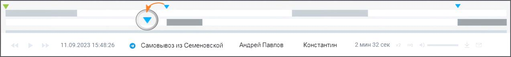
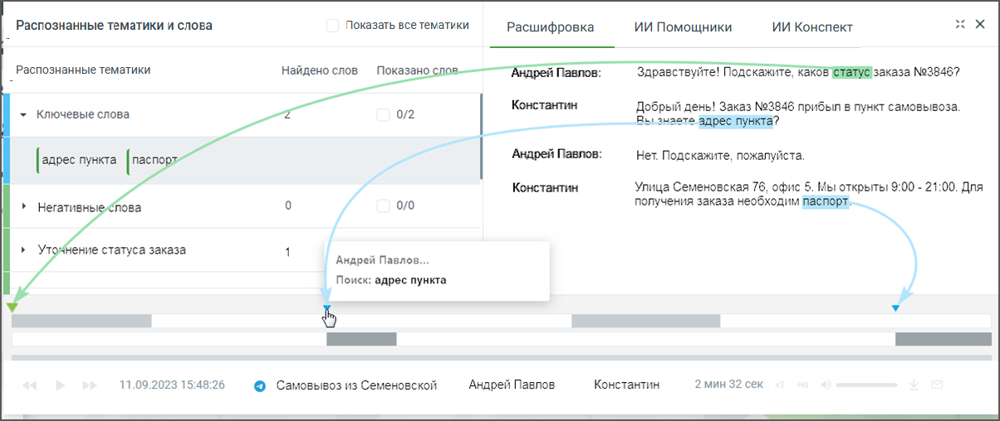
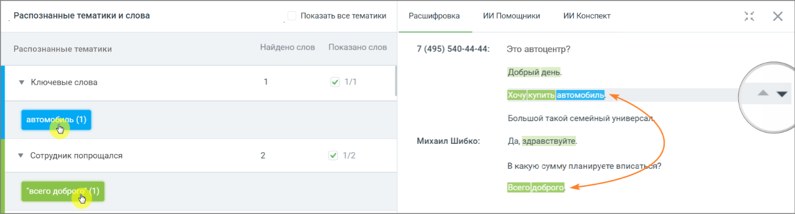

# 16.6.2. Метки на осциллограмме диалога

> Трассировка: PDF §16.6.2 · сквозные стр. 507-508 · источники: ч.6 `kb/mango-product-docs/sources/mango-cc-manual/CC_manual_1.26.23-part-6.pdf` с.2-3.

Для отображения результатов поиска в текстовых сообщениях используется осциллограмма диалога, с выделенными фрагментами диалога.

При наведении курсора в область осциллограммы на тех участках диалога, где были вхождения терм, отображаются:

• метка для терм, найденных из строки ввода ключевых слов;

• метка для терм из тематик.

При наведении курсора на метки и осциллограммы отображается всплывающее окно с указанием канала, в рамках которого была распознана терма, а также сама терма. Поиск по текстовым сообщениям может осуществляться: • по ключевым словам, в строке поиска; • с учетом выбранных в фильтре тематик. Соответственно будут различаться метки на осциллограмме диалога.

 Если во всплывающем окне осциллограммы в списке тематик выбрать какую-либо тематику, то на осциллограмме будут отображены метки, принадлежащие только этой тематике, и не будут отображены метки, принадлежащие другим тематикам из списка.  Если во всплывающем окне осциллограммы в списке ключевых слов выбрать какое- либо ключевое слово, то на осциллограмме будут отображены метки, принадлежащие только этому ключевому слову, и не будут отображены метки, принадлежащие другим ключевым словам из списка. Выбор термы или ключевого слова в блоке «Распознанные словари и слова» выделяет

фрагмент диалога, с этой термой/ключевым словом. Пиктограммы позволяют быстро переключаться между фрагментами, содержащими выбранные термы/ключевые слова.

<!-- изображение на стр. 508: байты не извлечены (PyMuPDF недоступен) -->

Клик по пиктограмме сворачивает окно диалога в компактный формат. Для отображения

<!-- изображение на стр. 508: байты не извлечены (PyMuPDF недоступен) -->

окна в полной форме следует нажать на пиктограмму ..
