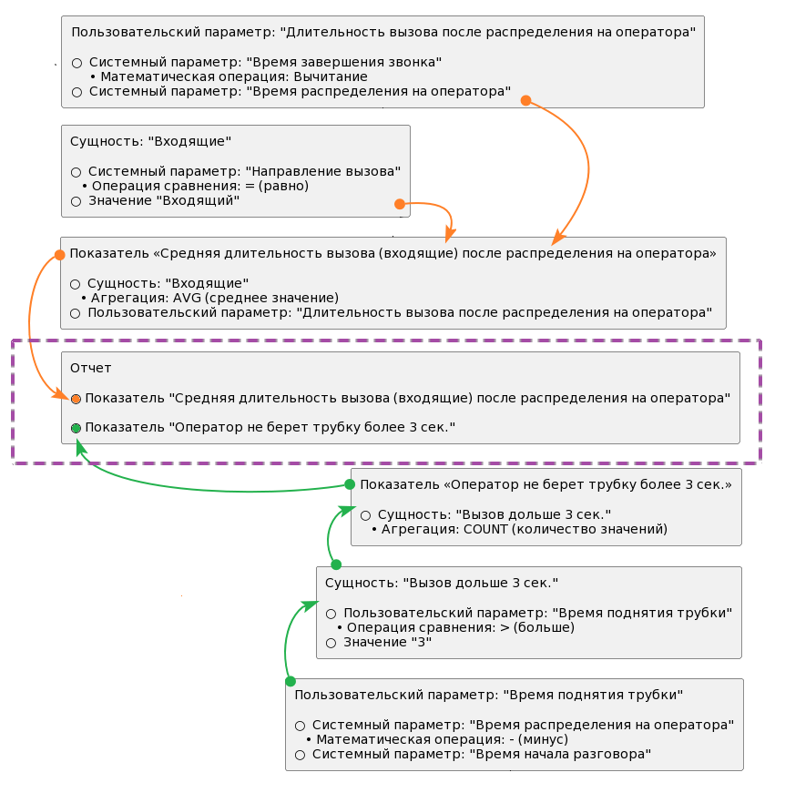
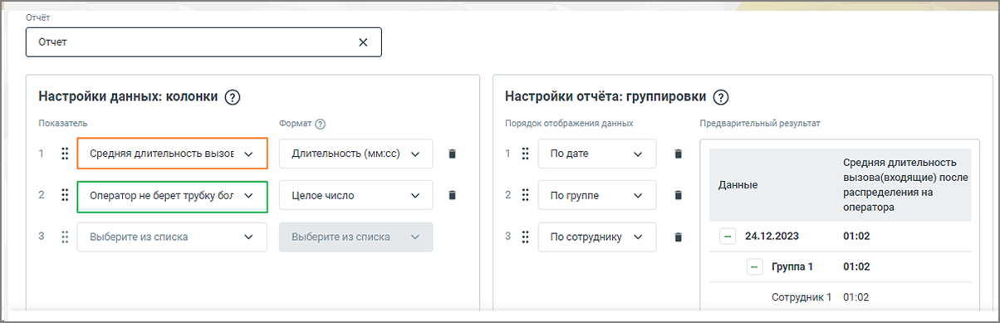
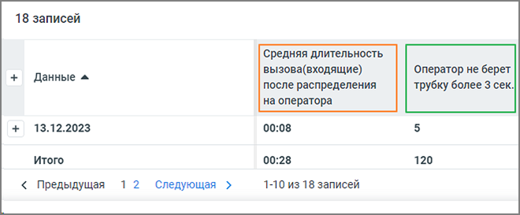

# 17.1. Пример отчета

> Трассировка: PDF §17.1 · сквозные стр. 516-518 · источники: ч.6 `kb/mango-product-docs/sources/mango-cc-manual/CC_manual_1.26.23-part-6.pdf` с.11-13.

Необходимо, чтобы оператор отвечал на входящие вызовы в течение трех секунд после того, как звонок поступил. Критерий отклика в течение трех секунд является важным фактором в оценке эффективности работы операторов и общей эффективности обработки входящих вызовов. Задача: Для корректного расчета KPI оператора руководитель хотел бы иметь отчет, показывающий: • сколько времени в среднем операторы тратят на ответ на звонки; • количество звонков, где операторы долго не поднимали трубку (более 3 секунд). Пример последовательной настройки такого отчета:

Настройка отчета:

После фильтрации по времени, группам и сотрудникам, пользователь получит отчет, где столбцами будут заданные показатели, а строками – группировка.

