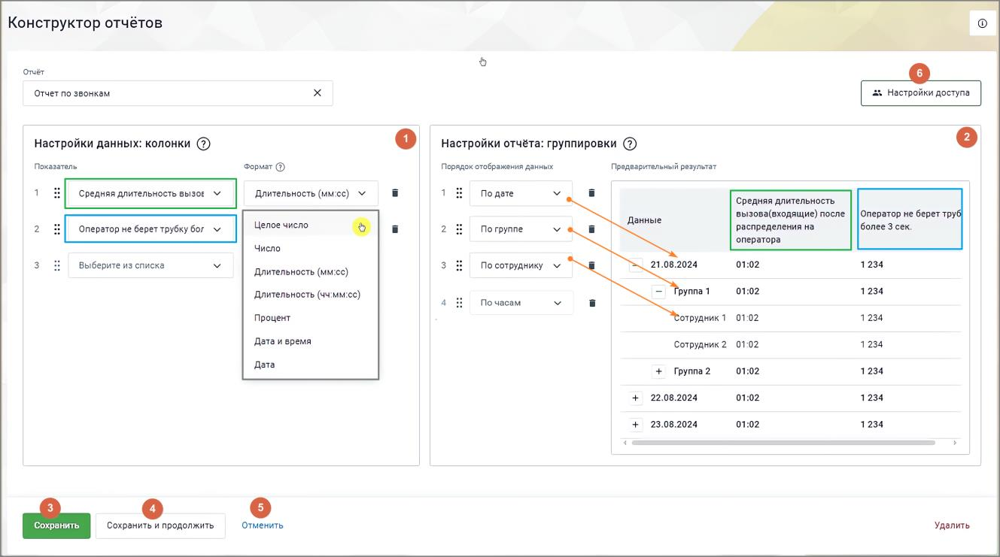
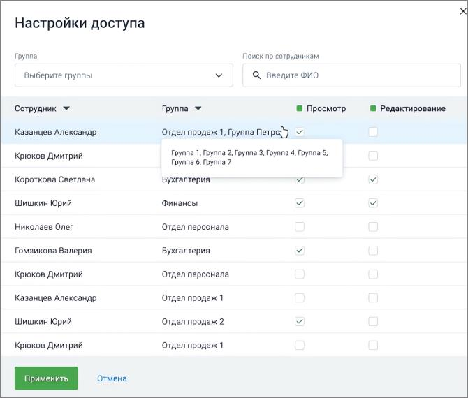

# 17.2.1. Добавление отчета

> Трассировка: PDF §17.2.1 · сквозные стр. 519-522 · источники: ч.6 `kb/mango-product-docs/sources/mango-cc-manual/CC_manual_1.26.23-part-6.pdf` с.14-17.

На странице "Отчеты" Конструктора отчетов нажмите кнопку Добавить отчет.

На открывшейся странице заполните поля: 1) Блок "Настройка данных: колонки" • Показатель – выбор показателя, который будет использоваться для отображения данных в отчёте. В выпадающем списке доступна функция поиска показателя по наименованию. • Формат – способ представления данных, определяющий их визуальное отображение. Варианты: целое число, число, длительность (мм:сс), длительность (чч:мм:сс), процент, дата и время, дата. Менять местами элементы внутри блоков можно, зафиксировав указатель мыши на

пиктограмме и переместив элемент вверх или вниз по списку. 2) Блок "Настройка отчета: группировки" • Порядок отображения данных – определение последовательности расположения данных в отчёте. Варианты: по дате, по группе, по сотруднику, по часам.

| Для отображения "по сотруднику" доступен выбор "не задан". Сюда попадают вызовы, с |  |  |
| --- | --- | --- |
|  | которых не было распределения на сотрудника. Например: вызовы завершенные в IVR, вызовы |  |
|  | распределенные на группу без сотрудников, или если в группе не было сотрудников в статусе, в |  |
| котором распределяются звонки |  |  |

• Предварительный результат – предварительный просмотр того, как в отчете будут отображаться колонки и группировки. 3) Кнопка "Сохранить" – клик по кнопке сохраняет внесённые изменения. Пользователь переходит на страницу списка отчетов. Созданный отчет отображается в списке. 4) Кнопка "Сохранить и продолжить" – клик по кнопке сохраняет внесённые изменения. Пользователь переходит на страницу созданного отчета. 5) Кнопка "Отменить" – клик по кнопке отменяет внесённые изменения. Пользователь переходит на страницу списка отчетов.

6) Кнопка "Настройки доступа" – клик по кнопке открывает окно настроек доступа сотрудников к отчету: просмотра и редактирования.

| Кнопка "Настройки доступа" отображается на странице редактирования отчета только для |
| --- |
| сотрудников, для которых в ЛК ВАТС включено право "Настройка прав видимости отчетов". |

Настройка доступа сотрудников к отчетам Функция "Настройка доступа" позволяет сотрудникам с определенными правами управлять видимостью и правами на редактирование отчетов для других сотрудников. Эта настройка доступна только для отчетов, созданных пользователями, и недоступна для предустановленных отчетов, которые видны всем сотрудникам по умолчанию. 1. Права доступа к отчетам Для каждого сотрудника можно настроить следующие права: • Просмотр — позволяет сотруднику видеть отчет. • Редактирование — позволяет сотруднику редактировать, удалять и копировать отчет. При настройке прав действуют следующие правила: • Если назначено право на редактирование, право на просмотр устанавливается автоматически. • При снятии права на просмотр автоматически отменяется право на редактирование (если оно было установлено). • Без доступа — сотрудник не имеет доступа к отчету (если не выбрано ни одно из прав). 2. Мультивыбор и массовое предоставление прав • Мультивыбор позволяет выбрать сразу несколько сотрудников для назначения одинаковых прав на просмотр или редактирование отчетов. Чтобы предоставить права всем сотрудникам в списке, нажмите на чек-бокс в заголовке списка. 3. Фильтрация сотрудников Для удобства выбора сотрудников можно использовать фильтры: • По группам — выберите одну или несколько групп сотрудников из выпадающего списка. o По умолчанию отображаются все сотрудники. o Сотрудники без группы отображаются в разделе "Без группы". • По ФИО — введите имя или его часть в поисковую строку. Поиск не зависит от регистра и работает по любой части имени. Список сотрудников отображается по алфавиту по умолчанию. 4. Сохранение настроек доступа После изменения настроек доступа доступны две опции:

• Применить — настройки применяются к отчету, но для их окончательного сохранения необходимо сохранить отчет. • Отменить — если вы решите не применять изменения, нажмите "Отмена".

| После нажатия "Применить" необходимо сохранить изменения в самом отчете, чтобы |
| --- |
| настройки доступа вступили в силу. |

Если вы пытаетесь выйти из редактирования отчета, не сохранив настройки, система предупредит вас о несохраненных изменениях и предложит два варианта: • Отменить переход и вернуться к редактированию, чтобы сохранить настройки. • Подтвердить переход без сохранения изменений, если вы уверены, что хотите их отменить.
