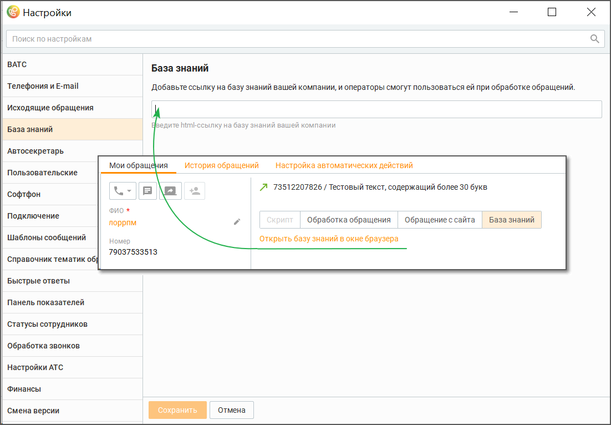

# 2.5.1.3.3. База знаний

> Трассировка: PDF §2.5.1.3.3 · сквозные стр. 59 · источники: ч.1 `kb/mango-product-docs/sources/mango-cc-manual/CC_manual_1.26.23-part-1.pdf` с.59.

В этом поле можно добавить ссылку на базу знаний вашей компании. При наличии ссылки в окне обращения оператора отобразится сообщение "Открыть базу знаний". Клик на сообщение откроет базу знаний.

