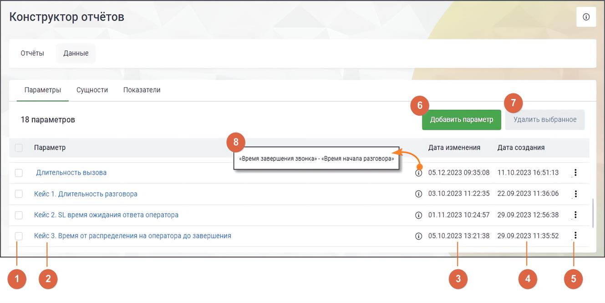

# 17.3.1.2. Пользовательские параметры

> Трассировка: PDF §17.3.1.2 · сквозные стр. 525-526 · источники: ч.6 `kb/mango-product-docs/sources/mango-cc-manual/CC_manual_1.26.23-part-6.pdf` с.20-21.

Пользовательские параметры – это параметры, созданные пользователем для решения конкретных задач.

Элементы вкладки: 1) Выбор параметров для проведения операции удаления – общий чекбокс позволяет выбрать все параметры, а чекбоксы в каждой строке позволяют выбрать конкретные параметры для действий. 2) Название параметра – уникальное название параметра, которое идентифицирует или описывает его содержание. 3) Дата изменения параметра – дата и время последнего изменения данного параметра. 4) Дата создания параметра – дата и время создания данного параметра.

5) Клик по пиктограмме открывает контекстное меню действий с параметром. Варианты: копировать, редактировать. 6) Кнопка "Добавить параметр" – клик по кнопке открывает страницу добавления параметра. 7) Удалить выбранное – клик по кнопке открывает окно подтверждения удаления. После подтверждения выбранные параметры удаляются из списка. Параметры, используемые в других разделах, недоступны для удаления. В случае попытки удаления таких параметров выводится информационное сообщение. 8) Пиктограмма "i" – клик по пиктограмме открывает окно с формулой параметра.

| С 2025 года всем новым пользователям доступны обновленные предустановленные |  |
| --- | --- |
|  | параметры. Пользователям, зарегистрированным до 2025 года, доступны прежние |
| параметры. |  |

Параметры, доступные для пользователей, зарегистрированных до 1.01.2025 года

| № | Название параметра | Заложенная формула для расчета |
| --- | --- | --- |
| 1 | SL | «Время начала разговора» – «Время первого распределения звонка на группу» |
| 2 | Длительность разговора | «Время завершения звонка» – «Время начала разговора» |
| 3 | Длительность вызова | «Время завершения звонка» – «Время попадания вызова в IVR» |
| 4 | Длительность ожидания начала разговора | «Время начала разговора» – «Время попадания вызова в IVR» |

Параметры, доступные для пользователей, зарегистрированных после 1.01.2025 года

| № | Название параметра | Заложенная формула для расчета |
| --- | --- | --- |
| 1 | SL | «Время начала разговора» – «Время первого распределения звонка на группу» |
| 2 | Длительность разговора | «Время завершения звонка» – «Время начала разговора» |
| 3 | Скорость ответа оператора | «Время начала разговора» – «Время распределения на оператора» |

Предустановленные параметры могут быть изменены или удалены только пользователями, имеющими в Личном кабинете ВАТС права максимального уровня на выполнение операций "Редактирование" и "Удаление".
