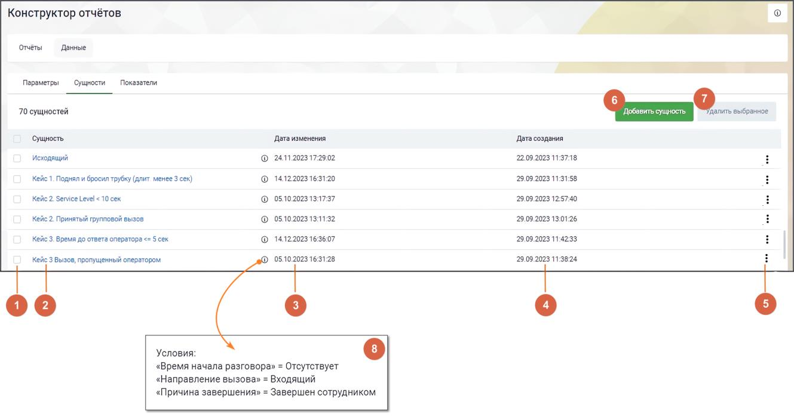

# 17.3.2. Сущности

> Трассировка: PDF §17.3.2 · сквозные стр. 528-532 · источники: ч.6 `kb/mango-product-docs/sources/mango-cc-manual/CC_manual_1.26.23-part-6.pdf` с.23-27.

Сущность представляет собой определённый тип вызовов, задаваемый при помощи одного или нескольких параметров. Сущность формируется на основе условия сравнения между параметром и каким-либо значением. • Параметр может быть пользовательским или системным. • Условие устанавливается с помощью операторов сравнения, таких как равно (=), не равно (≠), больше (>), больше или равно (>=), меньше (<) и меньше или равно (<=), и применяется к определенному значению. • Значение может быть числовым или текстовым, в зависимости от характеристики, описываемой параметром. На вкладке размещается список созданных сущностей:

Элементы вкладки: 1) Выбор сущностей для проведения операции удаления – общий чекбокс позволяет выбрать все сущности, а чекбоксы в каждой строке позволяют выбрать конкретные сущности для действий. 2) Название сущности – уникальное название сущности, которое идентифицирует или описывает ее содержание. 3) Дата изменения сущности – дата и время последнего изменения данной сущности. 4) Дата создания сущности – дата и время создания данной сущности.

5) Клик по пиктограмме открывает контекстное меню действий с сущностью. Варианты: копировать, редактировать. 6) Кнопка "Добавить сущность" – клик по кнопке открывает страницу добавления сущности. 7) Удалить выбранное – клик по кнопке открывает окно подтверждения удаления. После подтверждения выбранные сущности удаляются из списка. Сущности, используемые в

других разделах, недоступны для удаления. В случае попытки удаления таких сущностей выводится информационное сообщение. 8) Пиктограмма "i" – клик по пиктограмме открывает окно с условиями сущности.

| С 2025 года всем новым пользователям доступны обновленные предустановленные |
| --- |
| сущности. Пользователям, зарегистрированным до 2025 года, доступны прежние сущности. |

Сущности, доступные для пользователей, зарегистрированных до 1.01.2025 года В Конструкторе отчетов имеются следующие предустановленные сущности:

| № | Сущность | Условия |
| --- | --- | --- |
| 1 | SL 20 секунд | «SL» ≤ 20 сек. |
|  |  | «Направление вызова» = Входящий |
|  |  | «Время начала разговора» = Присутствует |
|  |  | «Признак группового вызова» = Да |
|  |  | «Учитывать дозвоны на операторов» = Нет |
| 2 | Все вызовы | Тип вызова = «Автоперезвон, Обратный звонок, Исходящий |
|  |  | обзвон, Обычный» |
| 3 | Принятый вызов | «Время начала разговора» = Присутствует |
|  |  | «Направление вызова» = Входящий, Исходящий |
| 4 | Принятый групповой вызов | «Время начала разговора» = Присутствует |
|  |  | «Признак группового вызова» = Да |
|  |  | «Направление вызова» = Входящий |
|  |  | «Учитывать дозвоны на операторов» = Нет |
| 5 | Принятый персональный | «Время начала разговора» = Присутствует |
|  | вызов | «Признак группового вызова» = Нет |
|  |  | «Направление вызова» = Входящий |
| 6 | Пропущенный вызов | «Время начала разговора» = Отсутствует |
|  |  | «Направление вызова» = Входящий |
| 7 | Успешный исходящий вызов | «Направление вызова» = Исходящий |
|  |  | «Время начала разговора» = Присутствует |
|  |  | «Тип вызова» ≠ Обратный звонок |
| 8 | Эффективный вызов | «Время начала разговора» = Присутствует |
|  | групповой | «Признак группового вызова» = Да |
|  |  | «Длительность разговора» ≥ 30 сек. |
|  |  | «Учитывать дозвоны на операторов» = Нет |
| 9 | Эффективный вызов | «Время начала разговора» = Присутствует |
|  | персональный | «Признак группового вызова» = Нет |
|  |  | «Длительность разговора» ≥ 30 сек. |

Сущности, доступные для пользователей, зарегистрированных после 1.01.2025 года

| № | Название сущности | Условия |
| --- | --- | --- |
| 1 | Групповые вызовы, пропущенные сотрудником | «Тип вызова» = Обычный «Направление вызова» = Входящий «Признак наличия разговора в рамках вызова» = Да «Время начала разговора» = Отсутствует «Признак группового вызова» = Да «Учитывать дозвоны на операторов» = Да |
| 2 | Групповые вызовы, пропущенные всеми | «Тип вызова» = Обычный «Направление вызова» = Входящий «Признак наличия разговора в рамках вызова» = Нет |

|  |  | «Время начала разговора» = Отсутствует «Признак группового вызова» = Да «Учитывать дозвоны на операторов» = Да |
| --- | --- | --- |
| 3 | Персональные пропущенные вызовы | «Тип вызова» = Обычный «Направление вызова» = Входящий «Признак наличия разговора в рамках вызова» = Нет «Время начала разговора» = Отсутствует «Признак группового вызова» = Нет |
| 4 | Внутренние вызовы | «Направление вызова» = Внутренний |
| 5 | Автоперезвоны принятые | «Тип вызова» = Автоперезвон «Признак наличия разговора в рамках вызова» = Да «Учитывать дозвоны на операторов» = Да «Время начала разговора» = Присутствует |
| 6 | Автоперезвоны принятые (для средней продолжительности) | «Тип вызова» = Автоперезвон «Признак наличия разговора в рамках вызова» = Да «Учитывать дозвоны на операторов» = Да «Длительность разговора» ≠ 0 сек. «Время начала разговора» = Присутствует |
| 7 | Автоперезвоны, пропущенные всеми | «Тип вызова» = Автоперезвон «Учитывать дозвоны на операторов» = Да «Время начала разговора» = Отсутствует «Направление вызова» = Входящий «Признак наличия разговора в рамках вызова» = Нет |
| 8 | Попытки дозвона (автоперезвоны) | «Тип вызова» = Автоперезвон «Признак наличия разговора в рамках вызова» = Да «Учитывать дозвоны на операторов» = Да |
| 9 | Попытки дозвона (Исходящий обзвон + обычные) | «Направление вызова» = Исходящий «Тип вызова» = Исходящий обзвон, Обычный |
| 10 | Принятые групповые эффективные вызовы | «Направление вызова» = Входящий «Тип вызова» = Обычный «Признак группового вызова» = Да «Длительность разговора» ≥ 30 сек. «Время начала разговора» = Присутствует «Учитывать дозвоны на операторов» = Да |
| 11 | Принятые персональные эффективные вызовы | «Направление вызова» = Входящий «Тип вызова» = Обычный «Признак группового вызова» = Нет «Длительность разговора» ≥ 30 сек. «Время начала разговора» = Присутствует |
| 12 | Входящие вызовы с SL 10 сек | «Направление вызова» = Входящий «Признак наличия разговора в рамках вызова» = Да «SL» < 10 сек. «Тип вызова» = Обычный «Признак группового вызова» = Да «Время начала разговора» = Присутствует «Учитывать дозвоны на операторов» = Да |

| 13 | Входящие вызовы с SL 20 сек | «Направление вызова» = Входящий «Признак наличия разговора в рамках вызова» = Да «SL» < 20 сек. «Тип вызова» = Обычный «Признак группового вызова» = Да «Время начала разговора» = Присутствует «Учитывать дозвоны на операторов» = Да |
| --- | --- | --- |
| 14 | Входящие вызовы с SL 30 сек | «Направление вызова» = Входящий «Признак наличия разговора в рамках вызова» = Да «SL» < 30 сек. «Тип вызова» = Обычный «Признак группового вызова» = Да «Время начала разговора» = Присутствует «Учитывать дозвоны на операторов» = Да |
| 15 | Все принятые вызовы | «Направление вызова» = Входящий «Тип вызова» = Автоперезвон, Обратный звонок, Обычный «Признак наличия разговора в рамках вызова» = Да «Учитывать дозвоны на операторов» = Да |
| 16 | Принятые вызовы (обычные) | «Направление вызова» = Входящий «Тип вызова» = Обычный «Признак наличия разговора в рамках вызова» = Да |
| 17 | Принятые вызовы (обычные + автоперезвон + обратный звонок) для средних | «Направление вызова» = Входящий «Признак наличия разговора в рамках вызова» = Да «Тип вызова» = Автоперезвон, Обратный звонок, Обычный «Учитывать дозвоны на операторов» = Да |
| 18 | Принятые групповые вызовы (обычные) | «Направление вызова» = Входящий «Тип вызова» = Обычный «Признак наличия разговора в рамках вызова» = Да «Признак группового вызова» = Да «Учитывать дозвоны на операторов» = Да «Время начала разговора» = Присутствует |
| 19 | Принятые групповые вызовы (обычный) для поствызывной обработки | «Признак наличия разговора в рамках вызова» = Да «Направление вызова» = Входящий «Тип вызова» = Обычный «Признак группового вызова» = Да «Время поствызывной обработки» ≠ 0 сек. |
| 20 | Принятые групповые вызовы (обычный + автоперезвон + обратный звонок) | «Тип вызова» = Автоперезвон, Обратный звонок, Обычный «Признак группового вызова» = Да «Длительность разговора» ≠ 0 сек. «Учитывать дозвоны на операторов» = Да «Признак наличия разговора в рамках вызова» = Да |
| 21 | Принятые групповые вызовы (обычный + обратный + исходящий обзвон) | «Тип вызова» = Обратный звонок, Исходящий обзвон, Обычный «Признак группового вызова» = Да |
| 22 | Обратные звонки принятые | «Тип вызова» = Обратный звонок «Признак наличия разговора в рамках вызова» = Да |

| 23 | Исходящий обзвон для поствызывной обработки | «Тип вызова» = Исходящий обзвон «Время поствызывной обработки» ≠ 0 сек. |
| --- | --- | --- |
| 24 | Состоявшиеся вызовы для поствызывной обработки | «Признак наличия разговора в рамках вызова» = Да «Направление вызова» = Входящий, Исходящий «Тип вызова» = Обратный звонок, Исходящий обзвон, Обычный |
| 25 | Внешние разговоры | «Направление вызова» ≠ Внутренний «Тип вызова» = Обратный звонок, Исходящий обзвон, Обычный «Признак наличия разговора в рамках вызова» = Да «Время начала разговора» = Присутствует |
| 26 | Исходящие вызовы общие | «Направление вызова» = Исходящий «Тип вызова» = Исходящий обзвон, Обычный «Длительность разговора» ≠ 0 сек. |
| 27 | Исходящие вызовы для поствызывной обработки | «Направление вызова» = Исходящий «Тип вызова» = Исходящий обзвон, Обычный «Время поствызывной обработки» ≠ 0 сек. |
| 28 | Совершенные вызовы | «Направление вызова» = Исходящий «Время начала разговора» = Присутствует «Тип вызова» ≠ Автоперезвон, Обратный звонок |

Предустановленные сущности могут быть изменены или удалены только пользователями, имеющими в Личном кабинете ВАТС права максимального уровня на выполнение операций "Редактирование" и "Удаление".
