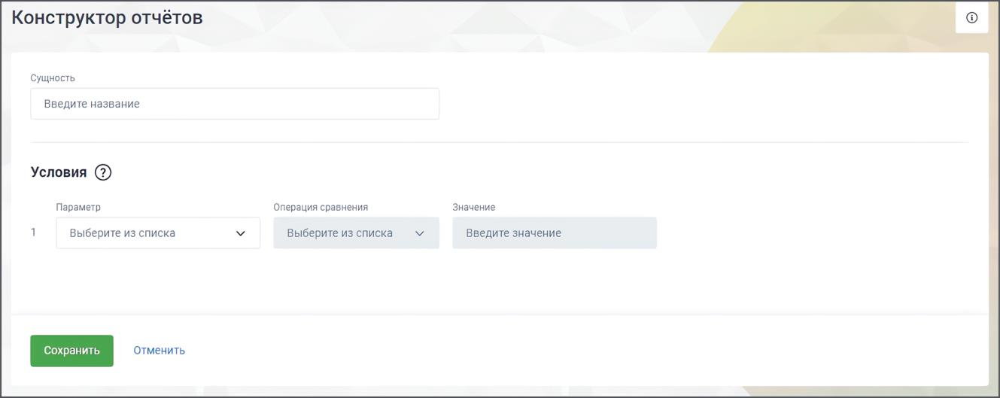

# 17.3.2.1. Создание сущности

> Трассировка: PDF §17.3.2.1 · сквозные стр. 532-535 · источники: ч.6 `kb/mango-product-docs/sources/mango-cc-manual/CC_manual_1.26.23-part-6.pdf` с.27-30.

На вкладке “Сущности” раздела “Данные” Конструктора отчетов нажмите кнопку Добавить сущность.

На открывшейся странице заполните поля: • Сущность – название сущности, уникальное в рамках Конструктора.

Условия: • Параметр – системный или пользовательский параметр, на основании которого будет создана сущность. • Операция сравнения – варианты: равно, не равно, больше, больше или равно, меньше, меньше или равно. • Значение – числовое или текстовое, в зависимости от параметра. Максимальное числовое значение – 100000, положительное, целое или дробное. Сохраните внесенные изменения кнопкой Сохранить. Созданная сущность отобразится в списке сущностей.

| Пример: Сущность "Эффективный исходящий звонок" может настраиваться следующим образом: |  |  |
| --- | --- | --- |
| Параметр | Операция сравнения | Значение |
| Направление вызова (системный) | = Равно | Исходящий |
| Длительность вызова (пользовательский) | > Больше | 20 сек. |

Доступные комбинации системных параметров, операций сравнения и значений при создании сущностей:

| Параметр | Операция сравнения | Значение |
| --- | --- | --- |
| Время завершения звонка | Равно | Присутствует Отсутствует |
| Время начала разговора | Равно | Присутствует Отсутствует |
| Время первого распределения звонка на группу | Равно | Присутствует Отсутствует |
| Время попадания вызова в IVR | Равно | Присутствует Отсутствует |
| Время создания звонка | Равно | Присутствует Отсутствует |
| Тип вызова | Равно Не равно | (доступен множественный выбор) Автоперезвон Обратный звонок Исходящий обзвон Обычный |
| Количество групп, участвовавших в вызове |  | Числовое значение |

| Параметр | Операция сравнения | Значение |
| --- | --- | --- |
|  | Больше Больше или равно Меньше Меньше или равно |  |
| Количество попыток распределения | Равно Не равно | Числовое значение |
|  | Больше Больше или равно Меньше Меньше или равно |  |
| Время попадания вызова в IVR | Равно | Присутствует Отсутствует |
| Время поствызывной обработки | Равно Не равно Больше Больше или равно Меньше Меньше или равно | Числовое значение |
| Время распределения на оператора | Равно | Присутствует Отсутствует |
| Направление вызова | Равно Не равно | (доступен множественный выбор) Внутренний Входящий Исходящий |
| Признак группового вызова | Равно | Да Нет |
| Признак анонимной конференции | Равно | Да Нет |
| Причина завершения |  |  |

| Параметр |  |  | Операция сравнения | Значение |  |
| --- | --- | --- | --- | --- | --- |
|  |  |  | Не равно | Завершен сотрудником |  |
| Постзвонковая оценка |  |  | Равно Не равно Больше Меньше Больше или равно Меньше или равно | Числовое значение от 1 до 5 (только целые) |  |
| Тип перевода |  |  | Равно Не равно | (доступен множественный выбор) Слепой |  |
|  |  |  |  | Консультативный |  |
|  | При группировке отчета «по сотрудникам» при переводе звонка будет отображаться два |  |  |  |  |
|  |  | вызова — КТО перевел и НА КОГО перевели. При использовании группировок «по группе» |  |  |  |
|  |  | и «по дате», будет отображаться один вызов. При переводе звонка между группами, |  |  |  |
|  | отображение будет аналогично. |  |  |  |  |
| Равно Да Учитывать дозвоны на операторов (способ подсчета вызовов) Нет |  |  |  |  |  |
|  |  |  |  |  |  |
|  | «Учитывать дозвоны на операторов» — означает считать дозвоны до каждого оператора. |  |  |  |  |
|  |  | «Не учитывать» — означает смотреть только дозвон на группу. Рекомендуется |  |  |  |
|  |  | использовать со всеми параметрами, в которых для подсчета нужны данные по дозвону до |  |  |  |
|  | операторов. |  |  |  |  |

<!-- изображение на стр. 535: байты не извлечены (PyMuPDF недоступен) -->
