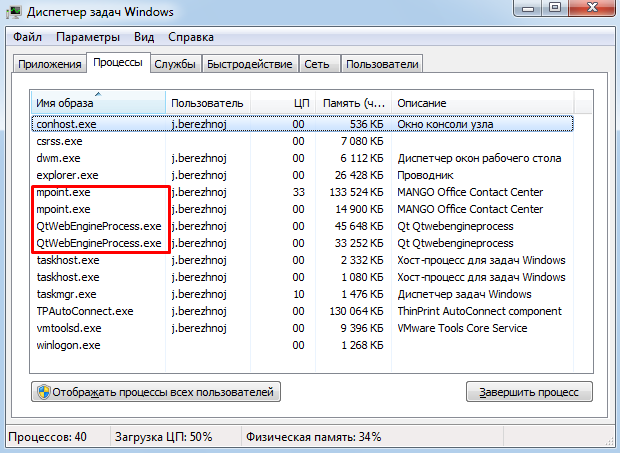

# 22. Приложение 5: Блокировка Контакт-центра

> Трассировка: PDF §22 · сквозные стр. 601 · источники: ч.6 `kb/mango-product-docs/sources/mango-cc-manual/CC_manual_1.26.23-part-6.pdf` с.96.

Для того, чтобы основные и дочерние процессы Контакт-центра MANGO OFFICE не блокировались службами безопасности вашей компании, в диспетчере задач Windows следующие процессы приложения следует добавить в исключения:

• mpoint (корневой) – главное приложение; • mpoint (дочерний) – проигрыватель mp3 записей; • QtWebEngineProcess.exe – браузер для отображения Web-содержимого в клиентском приложении (количество процессов определяется количеством загруженных страниц и их содержимого); • u.mpoint – установщик обновлений (запускается только при автоматическом обновлении).
