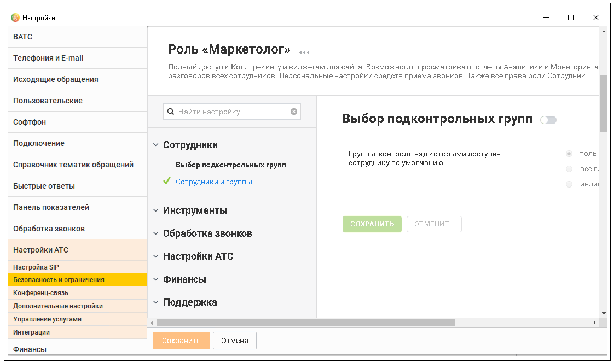
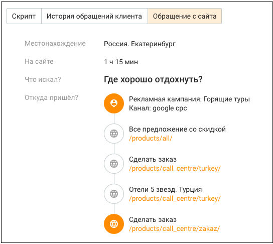
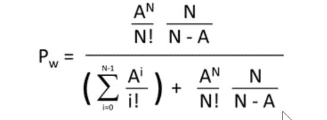
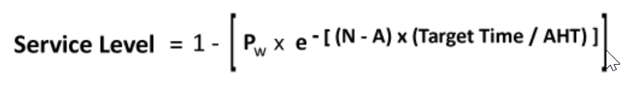

# 23. Приложение 6: Дополнительные возможности Контакт-Центра

> Трассировка: PDF §23 · сквозные стр. 602-608 · источники: ч.6 `kb/mango-product-docs/sources/mango-cc-manual/CC_manual_1.26.23-part-6.pdf` с.97-103.

| 23. Приложение 6: Дополнительные возможности Контакт- |
| --- |
| Центра |

Запрет звонков на персональные контакты других сотрудников В Контакт-центре реализована защита от звонков на скрытые номера при активированной настройке «Просматривать персональные контакты – только свои». Сотрудники, ограниченные этой настройкой, не смогут совершать вызовы на скрытые номера, а также видеть телефон клиента, если за ним закреплён другой ответственный. Это исключает несанкционированный доступ к базе персональных контактов. Данная функциональность снижает риск утечки персональных данных и защищает клиентскую базу от возможного несанкционированного использования. Компании получают дополнительный уровень безопасности, сохраняя конфиденциальность информации и уменьшая вероятность финансовых убытков, связанных с неправомерным раскрытием данных. Скрытие номера клиента Скрытие номера клиента и блокирование элементов редактирования номера клиента распространяется на пользователей, для которых выполняются оба условия: 1. На продукте пользователя подключена услуга Скрытие номера клиента. 2. Пользователь обладает ролью, в которой отключена настройка "Выбор подконтрольных групп" в разделе Безопасность и ограничения/Настройка доступа.

Скрытие номера клиента распространяется на следующие разделы Контакт-центра: • контроль обращений; • мои обращения – заблокированы элементы редактирования полей, содержащих номера клиентов. Возможность создавать клиента с номером телефона услугой не заблокирована; • классификации обращений; • очередь обращений – вызовы, заказы обратного звонка; • история вызовов; • обслуживание входящих вызовов; • пропущенные вызовы – в отчете о пропущенных вызовах и верхней панели; • сделки – скрыты номера в карточках создания и редактирования сделки, в поиске клиента по номеру, а также скрыт номер в результатах поиска сделок;

• адресная книга – скрыты номера в списке контактов, клиенты со скрытыми номерами отсутствуют в выгрузке контактов адресной книги; • клиенты – в карточках клиентов нет возможности редактировать номер (если поле "мобильный телефон" заполнено, то вместо номера отображается замаскированный номер); • карточки сотрудников; • исходящий обзвон – скрыт номер в карточках исходящего обзвона; • скрипт – скрыт номер в прохождении скриптов; • задачи – скрыт номер при постановке задачи на автодозвон клиенту. Недоступно редактирование номера, но доступно создание задачи со скрытым номером; • софтфон – скрыт номер в карточках софтфона, в карточках обратного звонка (пользователь видит номер телефона только при наборе номера, при любом состоянии вызова номер скрыт). • форма перевода звонка на клиента; • информация об обращении. Вместо скрытого номера клиента отображается замаскированный номер. ФИО и иные данные клиентов остаются доступны.

| Это политика для работы с голосовыми вызовами. |
| --- |
| Функция «Скрытие номера клиента» в первую очередь предназначена для защиты номера |
| телефона в процессах, связанных с звонками. |
| Как это работает на практике: Система знает номер и сама может его набрать, но не показывает |
| его оператору. Оператор может позвонить, принять или перевести вызов, не видя полного номера |
| абонента. |
| Главный принцип: Оператору не нужно знать точный номер, чтобы совершить звонок. |

Конфиденциальность контактных данных Для обеспечения безопасности персональной информации клиентов в системе действует функция маскирования контактных данных. Это означает, что вместо полных номеров телефонов, идентификаторов и адресов электронной почты сотрудник будет видеть их частично скрытую версию. Когда применяется маскирование? Данные для сотрудника маскируются автоматически, если выполняются два условия: 1. Для роли сотрудника в настройках «Безопасность и ограничения» запрещён «Выбор подконтрольных групп». 2. На продукте подключена услуга Скрытие номера клиента. Как выглядят замаскированные данные? • Номер телефона, SMS, WhatsApp: видны только первые 2 и последние 4 цифры. Пример: 79*****9002 • Telegram, Max: видны только последние 2 цифры. Пример: *******24 • ВКонтакте: видны последние 2 цифры ID. Если ID короче 3 символов, цифры скрываются полностью. Пример: id*****56 • Email: видны первый и последний символы имени ящика и полный домен после «@».

Пример: i**v@gmail.com • Авито / Авито Работа: видны первые 5 символов идентификатора. Пример: 30f73******** Где именно отображаются замаскированные контакты? Функция маскирования применяется в следующих разделах и элементах интерфейса: 1. Карточка контакта: вкладка «Контакты». 2. Раздел «Клиенты»: • Вкладка «Контакты» – столбец «Телефон» (кнопка «Написать сообщение» для SMS). • Вкладка «Контакты» – столбец «Контакты» (кнопка «Написать сообщение» для других каналов). • Вкладка «Организации» – столбец «Основной контакт» (кнопка «Написать сообщение»). 3. Карточка организации: вкладка «Контактные лица» (кнопка «Написать»). 4. Раздел «Обращения»: • Вкладки «Мои обращения → В работе» и «Мои обращения → Закрытые». • Быстрая карточка контакта (кнопка «Создать текстовое обращение»). • Окно обработки обращения (адрес email скрыт). 5. История обращений: столбцы с «id клиента». 6. Карточка сделки (текущей или закрытой): кнопка «Отправить сообщение». 7. Задачи: окно «Добавить задачу» → действие «Написать». 8. Текстовые рассылки: «Статистика по кампании» – столбец «Номер WhatsApp». 9. Очередь обращений: вкладка «Текст» (при просмотре подробной информации). 10. Карточка рабочего дня: при нажатии на маркер пропущенного вызова. Данные в чате на сайте и клиентском приложении не маскируются.

| Это политика для работы с текстовыми сообщениями. |  |  |  |  |
| --- | --- | --- | --- | --- |
|  | Функция «Конфиденциальность контактных данных» в первую очередь предназначена для |  |  |  |
|  | защиты информации при переписке с клиентом через SMS, мессенджеры и email. |  |  |  |
|  | Как это работает на практике: Система показывает оператору часть контакта (например, |  |  |  |
|  | 79*****9002), чтобы он мог убедиться, что пишет нужному человеку (отличить Иванова от |  |  |  |
|  | Петрова), но при этом не мог скопировать или записать полный номер, email или ID. |  |  |  |
|  | Главный принцип: Оператору нужно видеть, кому он пишет, но не нужно иметь полный доступ |  |  |  |
| к его контактам. |  |  |  |  |

Отображение информации о посетителе Функция доступна только при наличии на продукте подключенных услуг Динамический коллтрекинг, а также услуги Информация об интересах клиента до начала разговора.

| Следующая информация о клиенте доступна при заказе обратного звонка на сайте, для |
| --- |
| обращений с сайта и для звонков динамического коллтрекинга: |

• Город – город, где находится клиент; • Таймер – время нахождения на сайте в формате дд:чч:мм; • Что искал – что интересует посетителя на сайте; • Откуда пришел – сайт-источник; • Данные о канале/источнике – рекламная кампания, канал кампании; • История переходов – список страниц сайта, посещенных клиентом; • Текущая страница – страница, с которой произведен заказ обратного звонка.

Получение push-уведомлений от компании MANGO Telecom О проведении регламентных работ пользователи Контакт-центра информируются при помощи системных push-уведомлений от компании MANGO Telecom. Если компьютер пользователя выключен или заблокирован, то пользователь получает уведомление после включения/разблокировки компьютера. Время жизни уведомлений 5 дней. Интеграция с Google Analytics События Контакт-центра могут транслироваться в аккаунт Google-аналитики. События создаются согласно протоколу передачи статистических данных Google Analytics (Measurement Protocol) по форме event/Категория/Действие/Ярлык/pageview/страница/название страницы. Переход по вкладкам основного меню, содержащим подвкладки, записывается в событие перехода в подвкладку, на которой оказался пользователь.

| ПРИМЕР: |
| --- |
| Пользователь кликнул в основном меню на Обращения, попал на Контроль обращений. Затем |
| перешел на подвкладку История обращений. Потом – перешел во вкладку основного меню Клиенты. |
| Потом – кликнул по вкладке Обращения (и оказался на История обращений). В Google-аналитику |
| будут переданы следующие события: |
| • Активация вкладки "Контроль обращений" |
| • Активация вкладки "История обращений" |
| • Активация вкладки "Клиенты" |
| • Активация вкладки "История обращений". |

Экспорт данных По умолчанию при экспорте для каждого отчета или списка пользователю предлагается наименование файла, которое он может изменить:

| Отчет/Список | Наименование файла экспорта |
| --- | --- |
| Контакты | Контакты_DD-MM-YYYY_HH-MM.csv |
| История обращений | История_обращений_DD-MM-YYYY_HH-MM.csv |
| История сделок | История_сделок_DD-MM-YYYY_HH-MM.csv |
| Сделки в работе | Сделки_в_работе_DD-MM-YYYY_HH-MM.csv |
| Воронка продаж | Воронка_продаж_DD-MM-YYYY_HH-MM.csv |
| История вызовов | История_вызовов_DD-MM-YYYY_HH-MM.csv |
| Пропущенные вызовы | Пропущенные_вызовы_DD-MM-YYYY_HH-MM.csv |
| Эффективность кампании ИО | Эффективность_кампании_ИО_DD-MM-YYYY_HH-MM.csv |
| Статистика по кампании ИО | Статистика_по_кампании_ИО_DD-MM-YYYY_HH-MM.csv |
| Скрипты – Статистика ответов | Скрипты_Статистика_ответов_DD-MM-YYYY_HH-MM.csv |
| Скрипты – Эффективность сотрудников | Скрипты_Эффективность_сотрудников_DD-MM-YYYY_HH- MM.csv |
| Отчет по задачам | Отчет_по_задачам_DD-MM-YYYY_HH-MM.csv |
| Карточка рабочего дня | Карточка_рабочего_дня_DD-MM-YYYY_HH-MM.pdf |
| Рабочее время сотрудника | Рабочее_время_сотрудника_DD-MM-YYYY_HH-MM.csv |
| Производительность сотрудников | Производительность_сотрудников_DD-MM-YYYY_HH- MM.csv |
| Производительность групп | Производительность_групп_DD-MM-YYYY_HH-MM.csv |
| Обслуживание входящих вызовов | Обслуживание_входящих_вызовов_DD-MM-YYYY_HH- MM.csv |

где DD-MM-YYYY_HH-MM – дата и время инициации экспорта. Форматированный текст при экспорте в CSV конвертируется как текст без форматирования. Расчет прогноза потерь звонков по формуле Эрланга Формула Эрланга – формула вероятности блокировки, которая описывает вероятность потерь вызовов для группы идентичных параллельных ресурсов (телефонных линий, цепей, каналов трафика или эквивалентов).

где: Pw – вероятность ожидания вызова A – интенсивность трафика: это продолжительность времени, которое потребовалось бы для всех телефонных звонков за час, если бы они были заказаны от начала до конца. Таким образом, если у нас есть 200 звонков со средним временем обработки 3 минуты, у нас будет в общей сложности 200 x 3 = 600 минут звонков или 10 часов звонков = 10 эрлангов

N – количество операторов = (A+1) i= N-1

e – математическая константа (число Эйлера), всегда равное 2,71828 TargetTime - целевое время ответа (сек.) AHT – среднее время обработки вызова (сек.) Если Servece Level (SL) ниже целевого показателя, необходимо увеличить количество операторов.

| 24. Приложение 7. Взаимодействие КЦ со сторонними |
| --- |
| программами |
