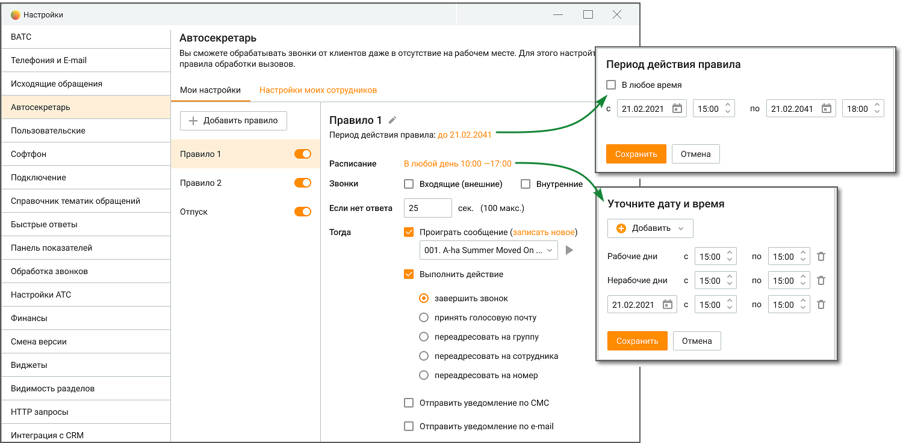

# 2.5.1.3.5. Автосекретарь

> Трассировка: PDF §2.5.1.3.5 · сквозные стр. 60-62 · источники: ч.1 `kb/mango-product-docs/sources/mango-cc-manual/CC_manual_1.26.23-part-1.pdf` с.60-62.

Вкладка предназначена для настройки правил Автосекретаря.

Вкладка доступна, если в Личном кабинете подключена услуга "Автосекретарь". Редактировать настройки могут пользователи с правом "Настраивать индивидуальные правила обработки звонков (Автосекретарь)". Пользователь может просмотреть настроенные правила даже в том случае, если у него нет прав на редактирование автосекретаря.

На вкладке пользователю доступны следующие настройки: Переключатель «Правила переадресации» – в положении «включен» определяет Правило, как действующее. Кнопка «Добавить правило» – максимальное количество правил для одного сотрудника – 5. Если для сотрудника создано несколько правил, у которых пересекаются условия, то срабатывает первое правило из списка. Для каждого правила можно задать следующие параметры:

| Период действия правила – настройка периода поступления звонка; |
| --- |
| Расписание – настройка времени поступления звонка с разделением на рабочие и |
| нерабочие дни; |

3. Направление звонка (входящий внешний и/или внутренний) – настройка условия направления звонка для обработки; 4. Если нет ответа __ сек – время в секундах, в течение которого ожидается ответ сотрудника. Максимальное время ожидания – 100 секунд. По истечении установленного времени срабатывают настройки: 5. Проиграть голосовое сообщение – выберите из выпадающего списка голосовое сообщение, которое будет проигрываться, если в течение установленного в п.3 времени ответа от сотрудника не поступило. Выбранное голосовое сообщение можно прослушать при

помощи встроенного плеера, кликнув по пиктограмме . Там же можно загрузить новое голосовое сообщение, если пользователь обладает правом "Добавлять, просматривать и удалять аудиофайлы". 6. Выполнить действие – после воспроизведения голосового сообщения Автосекретарь выполнит одно из указанных в настройках действий: • завершить звонок. • принять голосовую почту – абонент сможет записать и отправить голосовое сообщение на e-mail сотрудника, после чего звонок завершается. • переадресовать на группу – звонок будет переадресован на указанную группу. Далее звонок обрабатывается по правилам, настроенным в Личном кабинете для обработки звонков группой. Если в рамках алгоритма распределения для группы вызов должен быть переадресован на данного сотрудника, то автосекретарь не обрабатывает звонок повторно.

• Переадресовать на сотрудника – звонок будет переадресован на указанного сотрудника. При переадресации на сотрудника используются параметры дозвона, указанные в карточке данного сотрудника в Личном кабинете. Если в процессе прохождения звонка, звонок поступил на сотрудника, для которого уже сработали индивидуальные правила переадресации, то автосекретарь не обрабатывает звонок повторно. • Переадресовать на номер телефона – звонок будет переадресован на указанный номер. При переадресации используется время ожидания ответа, указанное в поле рядом. Таким образом, в рамках одного вызова для одного сотрудника правило автосекретаря может сработать только один раз.

| Автосекретарь не работает для групповых вызовов с последующим распределением на |
| --- |
| сотрудника. |

7. Отправить сообщение о пропущенном звонке • Отправить уведомление по СМС – чекбокс открывает поле для ввода мобильного телефона в формате "+79", "79" или "89". • Отправить уведомление по e-mail – чекбокс открывает поле для ввода адреса электронной почты. По умолчанию заполняется e-mail из карточки сотрудника.

| Пример 1: |
| --- |
| Если включен чек-бокс «Отправить уведомление по СМС», то на указанный номер приходит СМС со |
| следующим текстом: "<текущая дата> в <текущее время> сотрудником <ФИО сотрудника, для |
| которого сработало правило> пропущен звонок с номера <номер, с которого поступил звонок>". |
| Пример 2: |
| Если включен чек-бокс «Отправить уведомление по e-mail», то на указанный адрес электронной |
| почты приходит сообщение со следующим текстом: "<текущая дата> в <текущее время> |
| сотрудником <ФИО сотрудника, для которого сработало правило> пропущен звонок с номера |
| <номер, с которого поступил звонок>". Тема письма "Пропущенный звонок от <текущая дата> в |
| <текущее время>". |

При включенных чекбоксах поля являются обязательными для заполнения. Сохраните настройки кнопкой Сохранить. Клик по кнопке Отмена отменяет изменения и возвращает настройки обработки звонков к последнему сохраненному значению.

<!-- изображение на стр. 62: байты не извлечены (PyMuPDF недоступен) -->

Клик по пиктограмме "корзина" приводит к удалению правила Автосекретаря.
