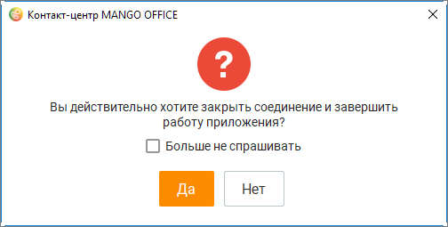
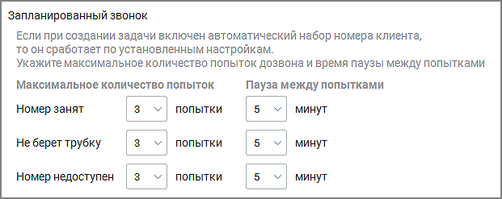

# 2.5.1.3.6. Пользовательские

> Трассировка: PDF §2.5.1.3.6 · сквозные стр. 62-65 · источники: ч.1 `kb/mango-product-docs/sources/mango-cc-manual/CC_manual_1.26.23-part-1.pdf` с.62-65.

Данная вкладка предназначена для редактирования настроек непосредственно программы.

Вкладка доступна всем пользователям. Основные Предупреждать при попытке выхода из приложения При включенной настройке при попытке выхода из Контакт-центра MANGO OFFICE с помощью: • кнопки закрытия • комбинации клавиш Alt+F4

• пункта Выход контекстного меню, отображаемого при щелчке правой кнопкой мыши по значку в трее (если установлен флажок Не оставлять Контакт-центр MANGO OFFICE в Панели задач Windows (сворачивать в трей) на экране отображается окно подтверждения запроса на закрытие программы:

При выключенной настройке Контакт-центр MANGO OFFICE закроется без дополнительного подтверждения. Предупреждать при попытке звонка из браузера При включенной настройке при попытке совершения исходящего вызова из браузера на экране отображается окно с предупреждающим сообщением. Не оставлять Контакт центр MANGO OFFICE в Панели задач Windows (сворачивать в трей) При включенной настройке после нажатия кнопки Свернуть окно Контакт-центр MANGO OFFICE сворачивается в трей (область системных значков и уведомлений). При выключенной настройке Контакт-центр MANGO OFFICE сворачивается на панель задач. Разворачивать окно приложения, панель софтфона и звонковое обращение при принятии входящего вызова При включенной настройке в случае, когда окно программы свернуто, при принятии нового входящего вызова в момент поднятия трубки окно программы разворачивается и осуществляется переход к обработке звонкового обращения. Запускать Контакт центр MANGO OFFICE при входе в систему Автоматический запуск Контакт центр MANGO OFFICE при старте операционной системы. Переход в статус "Перерыв" в периоде бездействия При включенной настройке и бездействии пользователя статусы На линии и Обзвон автоматически меняются на Перерыв при следующих условиях: • компьютер заблокирован пользователем (Win+L); • компьютер перешёл в спящий режим (без гибернации); • при запуске экранной заставки, спустя 5 секунд (допускается небольшая задержка); • компьютер перешёл в режим энергосбережения (функция отключения дисплея). Возобновление работы после периода бездействия происходит во всех случаях, когда ни одно из условий блокировки не выполняется. Не показывать уведомления "Назначена новая задача" При включенной настройке пользователь не будет получать системные уведомления, если на него назначена новая задача.

Звуковые уведомления

Для настройки звукового уведомления следует установить соответствующий переключатель в положение "включено". Обработка текстовых обращений Чекбокс Автоматически переключать на новое обращение регулирует автоматическое переключение оператора на новое поступившее текстовое обращение. При активации данной опции оператор автоматически переходит к новому обращению сразу после его поступления, что позволяет оперативно реагировать на новые запросы. • Если опция включена, система автоматически переключает фокус оператора с текущего обращения на новое. Это позволяет быстро обработать поступившее обращение без необходимости ручного выбора. • Если опция отключена, оператор продолжает работать с текущим обращением без автоматического переключения на новое. Это позволяет завершить начатое обращение, не отвлекаясь на вновь поступившие. Данная настройка сохраняется локально для каждого оператора, что позволяет персонализировать поведение системы в зависимости от предпочтений пользователя. Запланированный звонок

В поле задается максимальное количество попыток дозвона (по умолчанию – 3 попытки), а также время паузы между попытками (по умолчанию 5 мин.). • Номер занят – количество попыток дозвона и интервал времени между повторной попыткой в случае, если номер сотрудника занят; • Не берут трубку – количество попыток дозвона и интервал времени между повторной попыткой в случае, если сотрудник не берет трубку; • Номер недоступен – количество попыток дозвона и интервал времени между повторной попыткой в случае, если сотрудник недоступен. История вызовов Количество выводимых вызовов

Это поле с регулятором позволяет указать общее количество выводимых в истории вызовов. Значение по умолчанию — 1000 записей; максимальное значение — 10 000 записей.

| При установке чрезмерно большого значения данного параметра возможно существенное |  |  |  |  |
| --- | --- | --- | --- | --- |
|  | замедление работы программы! |  |  |  |
|  |  | При использовании устройства с небольшой диагональю экрана рекомендуем уменьшить |  |  |
|  | установленное по умолчанию значение (200 записей), чтобы повысить удобство работы с |  |  |  |
| историей вызовов. |  |  |  |  |

<!-- изображение на стр. 65: байты не извлечены (PyMuPDF недоступен) -->

<!-- изображение на стр. 65: байты не извлечены (PyMuPDF недоступен) -->

Обработка звонков Автоматически поднимать трубку при звонке Если указанная настройка выбрана, при поступлении звонка пользователю происходит автоматическое поднятие трубки (авто соединение с абонентом). Эта настройка устанавливается в Личном кабинете ВАТС по следующему пути: «Общие настройки» → «Безопасность и ограничения» → «Настройка доступа». Настройка роли, раздел "Инструменты" → блок "Управление звонками". Установить или удалить настройку может только пользователь с соответствующими правами доступа. Отклонять входящий вызов, если вы уже разговариваете по телефону

| При включенной настройке если пользователю во время разговора поступает второй звонок |
| --- |
| (например, распределенный на пользователя входящий звонок, обзвон по пропущенным в |
| рамках кампании Исходящего обзвона, задача на автоматический перезвон т. д.), второй и |
| последующие вызовы автоматически отклоняются (как если бы пользователь нажал кнопку |
| "Отклонить" на карточке соответствующего входящего вызова). |

При выключенной настройке (по умолчанию) вызовы не будут отклоняться, и карточки входящего вызова будут отображаться вне зависимости от того, сколько вызовов уже распределено на пользователя через Контакт-центр MANGO OFFICE. Скрывать окно вызова при работе в других программах При включенной настройке плавающие виджеты всех вызовов (кроме виджетов входящего и исходящего вызовов) не отображаются в случае, когда окно приложения не является активным Внутреннее общение Показывать в списке всех сотрудников, заведенных на ВАТС При включенной настройке в панели Сотрудники также отображаются сотрудники, не имеющие логина и пароля для входа в Личный кабинет и Контакт-центр MANGO OFFICE.
