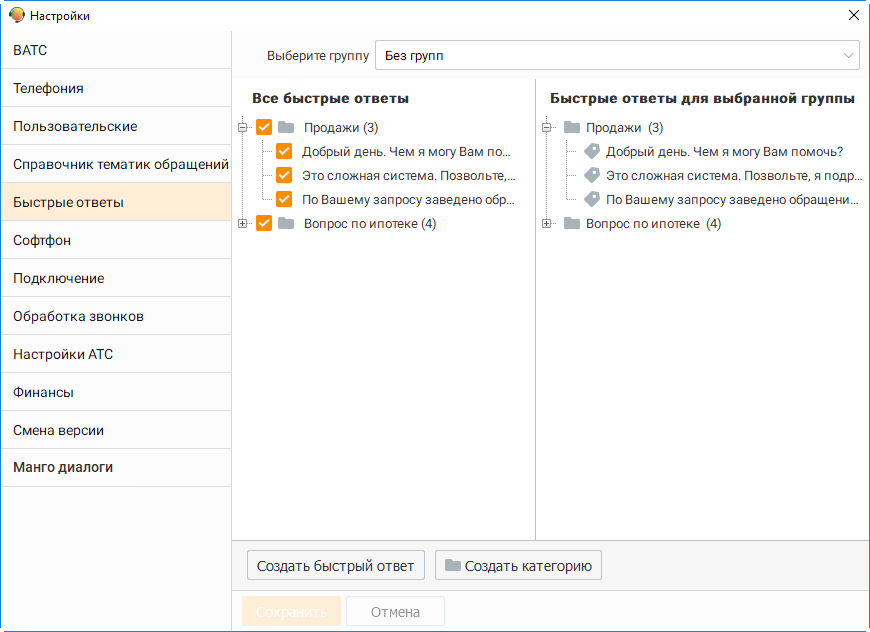
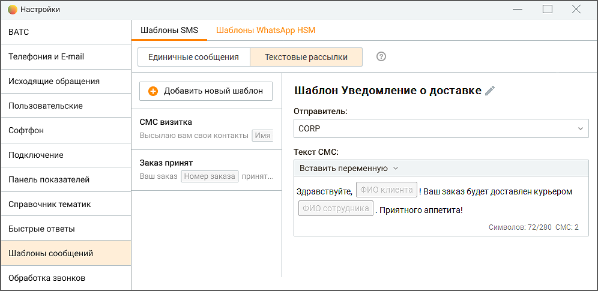

# 2.5.1.3.10. Быстрые ответы

> Трассировка: PDF §2.5.1.3.10 · сквозные стр. 71-73 · источники: ч.1 `kb/mango-product-docs/sources/mango-cc-manual/CC_manual_1.26.23-part-1.pdf` с.71-73.

На данной вкладке осуществляется редактирование списка быстрых ответов, применяемых при обработке обращений.

| Доступ к вкладке и возможности по редактированию зависят от роли пользователя: |  |  |  |  |
| --- | --- | --- | --- | --- |
|  | Сотрудник, Бухгалтер, Оператор – доступ закрыт; |  |  |  |
|  | Супервизор – редактирование быстрых ответов всех групп, в которых пользователь |  |  |  |
|  | является супервизором; |  |  |  |
| Администратор – редактирование быстрых ответов всех групп. |  |  |  |  |

Список в левой части окна содержит все созданные быстрые ответы. В правой части окна отображается список быстрых ответов, выбранных для текущей группы сотрудников. Выбор быстрых ответов осуществляется при установке флага напротив нужной категории либо быстрого ответа. Сохранение изменений выполняется автоматически.

Категории и быстрые ответы группы "Без группы" будут доступны всем пользователям Категория или быстрый ответ создаются в иерархическом дереве последним элементом текущего элемента. Быстрые ответы без категории отображаются в форме "быстрых ответов" после всех прочих категорий. Чтобы добавить быстрый ответ, нажмите кнопку Создать быстрый ответ. Введите название быстрого ответа и нажмите клавишу Enter. Чтобы добавить категорию, нажмите кнопку Создать категорию. Введите название категории и нажмите клавишу Enter. Чтобы добавить быстрый ответ в определенную категорию, установите курсор на наименование категории и нажмите кнопку Создать быстрый ответ. Созданный ответ будет автоматически добавлен в указанную категорию. Два одинаковых быстрых ответа нельзя добавить в одну категорию, но можно добавить в разные категории. Чтобы изменить быстрый ответ, выберите его. Выбранный быстрый ответ подсвечивается

цветом. Затем нажмите кнопку либо дважды щелкните левой кнопкой мыши. Измените название и нажмите клавишу Enter. Аналогичным образом допускается изменение категории.

Чтобы изменить положение категории либо быстрого ответа, используйте кнопки и . В результате положение быстрого ответа изменится в рамках одного уровня.

Чтобы удалить быстрый ответ, выберите его и нажмите кнопку .

Чтобы удалить категорию, выберите ее и нажмите кнопку . При этом будут удалены все быстрые ответы данной категории.

<!-- изображение на стр. 73: байты не извлечены (PyMuPDF недоступен) -->

Изменения, внесенные в список быстрых ответов, сохраняются автоматически.
