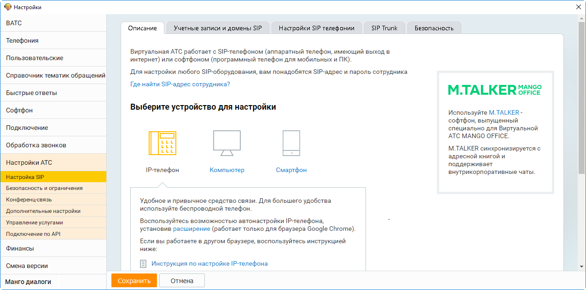

# 2.5.1.3.14. Настройки АТС

> Трассировка: PDF §2.5.1.3.14 · сквозные стр. 83 · источники: ч.1 `kb/mango-product-docs/sources/mango-cc-manual/CC_manual_1.26.23-part-1.pdf` с.83.

Данная вкладка содержит блоки настроек АТС.

Подробное описание настроек приведено в справочнике абонента "Виртуальная АТС MANGO OFFICE".
