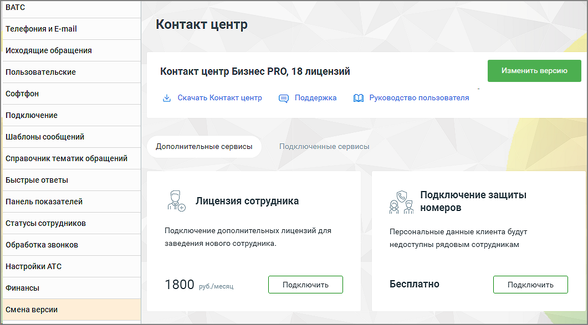

# 2.5.1.3.16. Смена версии

> Трассировка: PDF §2.5.1.3.16 · сквозные стр. 84 · источники: ч.1 `kb/mango-product-docs/sources/mango-cc-manual/CC_manual_1.26.23-part-1.pdf` с.84.

Данная вкладка предназначена для изменения версии и тарифа продукта на другие, согласно потребностям и расходам. А также для подключения дополнительных сервисов.

Подробное описание процесса приведено в справочнике абонента "Виртуальная АТС MANGO OFFICE".
