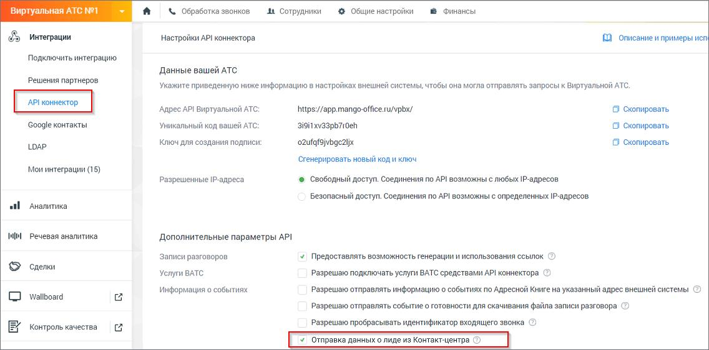
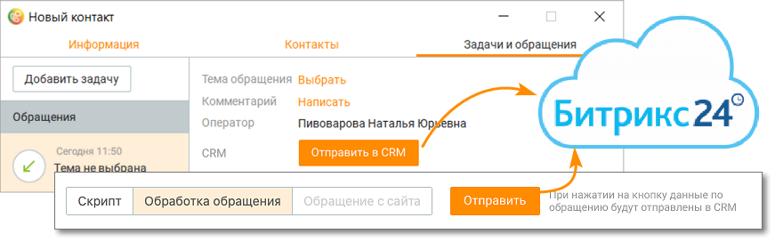

# 2.5.1.3.20.1. Битрикс 24

> Трассировка: PDF §2.5.1.3.20.1 · сквозные стр. 91 · источники: ч.1 `kb/mango-product-docs/sources/mango-cc-manual/CC_manual_1.26.23-part-1.pdf` с.91.

Для отправки данных из Контакт-центра в CRM Битрикс 24 необходимо подключить услугу Интеграции в Личном кабинете пользователя ВАТС, а также настроить API коннектор. Подключение осуществляется в разделе "Интеграции" → кнопка "API коннектор" → подраздел "Дополнительные параметры API". Установите галочку в чекбоксе "Отправка данных о лиде из Контакт-центра". Перезапустите приложение Контакт-центр MANGO OFFICE для обновления настроек.

При подключенной интеграции на вкладке в Контакт-центре отображается уведомление – Услуга подключена. По умолчанию включен режим ручной отправки данных операторами Контакт-центра, кликом по кнопке "Отправить".

Отправка обращения в Битрикс24 возможна, только если обращение привязано к контакту адресной книги (вкладка Клиенты/Контакты).
