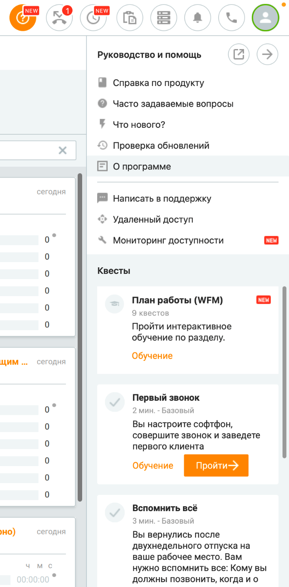

# 2.5.1.4. Квесты

> Трассировка: PDF §2.5.1.4 · сквозные стр. 94-100 · источники: ч.1 `kb/mango-product-docs/sources/mango-cc-manual/CC_manual_1.26.23-part-1.pdf` с.94-100.

| Модуль Квесты доступен при подключении в Личном кабинете соответствующей услуги. |
| --- |
| Для подключения обратитесь к Персональному менеджеру. |

Список доступных пользователю квестов зависит от его роли и находится в п. "Квесты" в Меню программы.

В пункте меню значком отображается количество не пройденных пользователем квестов. Квесты, пройденные в режиме обучения, считаются не пройденными. Если у пользователя

имеется хотя бы один не пройденный квест, на аватаре профиля отображается значок . При нажатии на иконку профиля, и далее на строчку меню Квесты открывается окно с блоком квестов.

В списке квестов отображаются следующие данные:

• Состояние квеста – "Заново" или "Пройти"; • Название квеста; • Описание квеста; • Максимальное время прохождения квеста; • Уровень сложности квеста – "Базовый", "Средний", "Продвинутый"; • Фактическое время выполнения – в формате ММ:СС, только для квестов в состоянии "Пройден". Если квест был пройден несколько раз, отображается минимальное время прохождения из всех попыток; Прохождение квеста – это пошаговое выполнение пользователем ключевых действий. Прохождение квестов позволяет сотруднику получать Достижения. • За успешное прохождение одного квеста сотруднику даётся достижение Знаток и значок

. • За успешное прохождение всех квестов сотруднику даётся достижение Знаток и значок

. Режим обучения Пользователь может пройти квест в режиме обучения, нажав на кнопку "Обучение" в списке квестов. Пользователь может приостановить выполнение квеста на любом шаге нажатием на

кнопку , и продолжить позже. Также возможно повторное прохождение квеста в режиме обучения. Время выполнения квеста не ограничено. Режим "квест"

Нажатие на кнопку приводит к завершению прохождения квеста. Впоследствии прохождение начинается сначала. Время выполнения квеста ограничено. По истечении времени выполнения квест прерывается и считается не выполненным. На каждом шаге

выполнения квеста пользователь может вызвать подсказку нажатием на кнопку . Количество подсказок ограничено. При использовании всех подсказок, далее подсказки в рамках данной попытки прохождения квеста недоступны.

Если все ключевые действия квеста выполнены, пиктограмма меняется на , и квест считается пройденным. Квесты Контакт-центра периодически обновляются и дополняются. Примеры квестов: Квест "Клиент всегда прав"

| № | Наименование шага | Ключевое действие |
| --- | --- | --- |
| шага |  |  |
| 1 | Установите статус "Обзвон" | Установка статуса "Обзвон". Если статус "Обзвон" уже был установлен ранее, требуется повторный выбор того же статуса |
| 2 | Откройте меню профиля | Клик по кнопке "Профиль сотрудника" |
| 3 | Перейдите к настройкам | Клик в пункте "Настройки" |
| 4 | Откройте настройки софтфона | Клик в пункте меню "Софтфон" в окне настройки профиля |

| 5 | Перейдите к настройкам звука и настройте гарнитуру и микрофон | Клик по кнопке "Настройки звука" |
| --- | --- | --- |
| 6 | Проверьте микрофон и динамик, отрегулируйте громкость | Нажатие на кнопку "Далее" в окне подсказки |
| 7 | Откройте софтфон | Нажатие на кнопку вызова софтфона |
| 8 | Сделайте пробный звонок на номер своего мобильного телефона, которого нет в адресной книге | Нажатие на кнопку "Вызов" Система начинает дозвон по набранному номеру. В случае некорректно набранного номера переход к следующему шагу не происходит |
| 9 | Примите свой собственный звонок (с мобильного телефона) и завершите вызов | Завершение вызова любым способом |
| 10 | Перейдите в раздел "Обращения" | Переход в раздел "Обращения" |
| 11 | Посмотрите обращение, созданное в ответ на ваш звонок в разделе "Мои обращения" | Клик по вкладке "Мои обращения" |
| 12 | Создайте нового клиента из карточки обращения, внесите информацию о клиенте | Нажатие на кнопку "Создать клиента" |
| 13 | Перейдите к обработке обращения во вкладке "Обработка обращения" | Клик по вкладке "Обработка обращения" |
| 14 | Укажите тему обращения, добавьте комментарий, сохраните изменения | Нажатие на кнопку "Сохранить" |

Квест "Вспомнить все"

| № | Наименование шага | Ключевое |
| --- | --- | --- |
| шага |  | действие |
| 1 | Откройте планировщик задач | Клик по кнопке «Задачи» в шапке Контакт-центра |
| 2 | Создайте новую задачу | Клик по кнопке «Добавить задачу» |
| 3 | Запланируйте время звонка | Изменение значения поля "Время" |
| 4 | Выберите, кому нужно позвонить (на свой мобильный телефон или клиенту из адресной книги) | Заполнены поля «Клиент» и «Номер» |
| 5 | Выберите режим автоматического звонка галочкой в чекбоксе "автоматический набор" | Активен чекбокс «автоматический набор» |
| 6 | Сохраните задачу | Клик по кнопке «Создать задачу» |

| 7 | Дождитесь автоматического звонка и ответьте на него | Активация кнопки «Ответить» в карточке запланированного звонка |
| --- | --- | --- |
| 8 | Примите вызов с номера своего мобильного телефона, далее завершите вызов | Завершение вызова любым способом |
| 9 | Перейдите в раздел "Обращения" | Переход в раздел "Обращения" |
| 10 | Посмотрите обращение, созданное в ответ на ваш звонок в разделе "Мои обращения" | Клик по вкладке "Мои обращения" |
| 11 | Перейдите к обработке обращения во вкладке "Обработка обращения" | Клик по вкладке "Обработка обращения" |
| 12 | Укажите тему обращения, добавьте комментарий, сохраните изменения | Нажатие на кнопку "Сохранить" |

Квест "Поймай меня, если сможешь"

| № | Наименование шага | Ключевое действие |
| --- | --- | --- |
| шага |  |  |
| 1 | Перейдите в Dashboard | Переход в раздел Dashboard |
| 2 | Добавьте новый виджет | Клик по кнопке «Добавить виджет» |
| 3 | Сформируйте отчет «Количество исходящих звонков» | В поле «Показатель» указано значение «Количество исходящих звонков» |
| 4 | Выберите фильтр по сотрудникам | Клик по кнопке фильтра «По сотруднику» |
| 5 | Выберите сотрудников для сравнения результатов | Поле «Выберите сотрудника» заполнено |
| 6 | Выберите график «Рейтинг» | Выбран вид графика «Рейтинг» |
| 7 | Выберите сортировку по возрастанию | Выбрано значение сортировки "от меньшего к большему" |
| 8 | Добавьте виджет в рабочую область | Клик по кнопке «Добавить» |
| 9 | Выберите фото для своего профиля | Клик по кнопке Профиля – Пункт меню «Мой профиль» |
| 10 | Измените фотографию | Клик на иконке аватара профиля |
| 11 | Посмотрите свой результат в общем рейтинге | Сперва клик на иконку аватара пользователя в созданном виджете. Потом клик по кнопке "Далее" в окне подсказки |
| 12 | Установите плановое значение показателя | Клик по кнопке настройки виджета ("шестеренка") |
| 13 | Укажите значение показателя в поле "Задать вручную" | В поле "Задать вручную" введено значение |

| 14 | Сохраните изменения | Клик по кнопке "Применить" |
| --- | --- | --- |

<!-- изображение на стр. 100: байты не извлечены (PyMuPDF недоступен) -->
