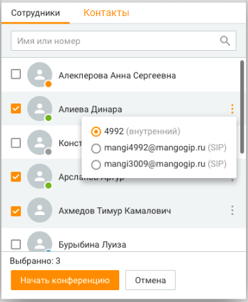
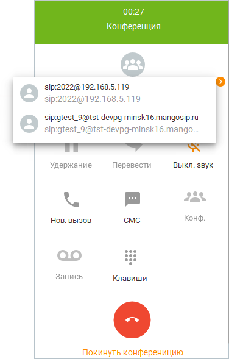

# 2.5.7. Организация конференций

> Трассировка: PDF §2.5.7 · сквозные стр. 107-110 · источники: ч.2 `kb/mango-product-docs/sources/mango-cc-manual/CC_manual_1.26.23-part-2.pdf` с.6-9.

Конференции обеспечивают возможность участия в разговоре трех и более абонентов. Эта функция Контакт-центра MANGO OFFICE наиболее востребована при проведении корпоративных совещаний, одновременном взаимодействии с несколькими заказчиками или удаленными партнерами. В качестве участников конференции могут выступать сотрудники Виртуальной АТС, контакты из адресной книги и другие внешние абоненты. Максимальное количество участников конференции, а также стоимость подключения дополнительных участников, зависит от тарифного плана ВАТС. Количество участников можно изменить в инструментах ВАТС на странице "Конференция". Информацию о стоимости услуги на разных тарифных планах вы можете получить, посетив эту страницу. С помощью панели управления телефонией вы можете создавать конференции и управлять ими.

Чтобы начать конференцию, нажмите кнопку Конф. и выберите тип участников конференции.

После выбора собеседника нажмите Начать конференцию. В случае успешного дозвона собеседнику разговор переходит в режим конференции.

Чтобы добавить участника в конференцию, нажмите "Добавить в конференцию" и выберите собеседника.

Для просмотра участников конференции нажмите . В результате на панели управления отобразится список участников.

Чтобы удалить участника из конференции, откройте список участников, наведите курсор на номер и нажмите "Х".

| Пользователь с ролью Оператор может удалять участников только из конференции, |  |  |
| --- | --- | --- |
|  | созданной им самим. Супервизор может удалять участников только из конференций, |  |
|  | созданных операторами в группах, в которых он является супервизором. Администратор |  |
| может удалять участников из любых конференций. |  |  |

Чтобы завершить конференцию, нажмите .

| Пользователь с ролью Оператор может завершать только конференцию, созданную им |  |  |
| --- | --- | --- |
|  | самим. Супервизор может завершать только конференции, созданные операторами в |  |
|  | группах, в которых он является супервизором. Администратор может завершать любые |  |
| конференции. |  |  |

<!-- изображение на стр. 110: байты не извлечены (PyMuPDF недоступен) -->
