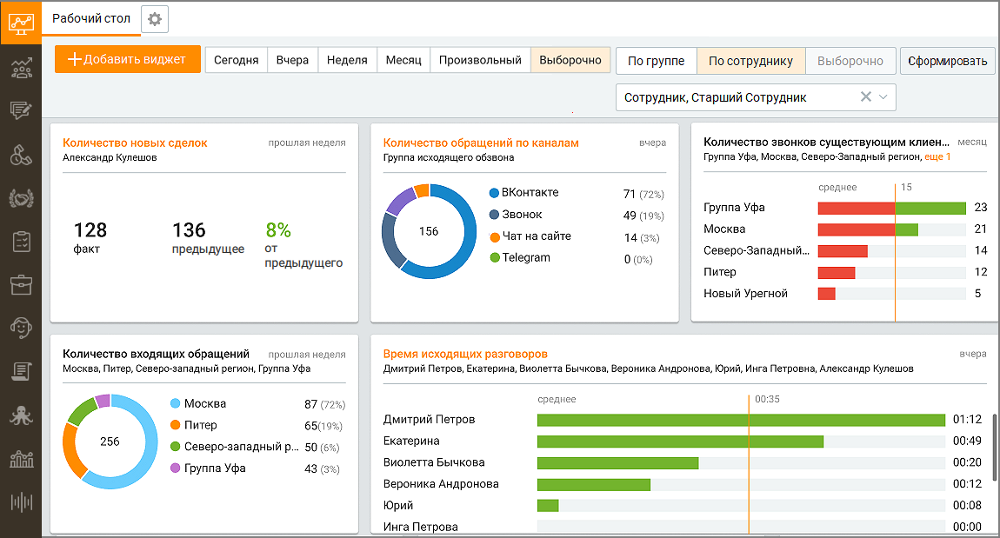
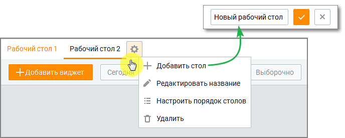

# 3. Dashboard

> Трассировка: PDF §3 · сквозные стр. 117-119 · источники: ч.2 `kb/mango-product-docs/sources/mango-cc-manual/CC_manual_1.26.23-part-2.pdf` с.16-18.

Вкладка Dashboard - элемент пользовательского интерфейса, отображается в главном окне программы. Вкладка доступна при наличии оплаченного подключения услуги. На вкладке располагается набор виджетов, создаваемых пользователем, для быстрого просмотра отчетов по выбранным показателям для каждой из воронок продаж. В отчете учитываются все каналы коммуникации – текстовые и звонковые, которые подключены в Личном кабинете пользователя ВАТС. На вкладке Dashboard пользователь может производить следующие действия: • создание, редактирование и удаление рабочих столов • фильтрацию отображаемых виджетов по периоду и участникам • создание нового виджета • дублирование существующего виджета

• перемещение виджета в окне вкладки • удаление виджета • переходить в соответствующий отчет в Контакт- Центре

Количество добавляемых на вкладку виджетов не ограничено. Чтобы обновить данные для всех виджетов, нажмите клавишу F5.

| Если у пользователя недостаточно прав для просмотра данных по группе/сотрудникам, |  |  |
| --- | --- | --- |
|  | установленных в виджете, то виджет отображается без выбранных групп/сотрудников. Если |  |
|  | у пользователя недостаточно прав для просмотра всех групп/сотрудников, установленных в |  |
|  | виджете, то на экране отображается текст уведомления Недостаточно данных для |  |
| построения отчета. |  |  |

Доступны следующие общие фильтры: сегодня, вчера, последние 2 дня, текущая неделя, текущий месяц, произвольный.

| Показатели, у которых выбор произвольного периода недоступен: Пропущенные вызовы, |
| --- |
| Успешно перезвонили, Скорость перезвона (средняя), попыток дозвона (среднее). |

• Выборочно – доступен для выбора в случае, если хотя бы один имеющийся виджет отличается по выбранному периоду от остальных виджетов; • По сотруднику – выбор сотрудников из списка. Доступ к группам и сотрудникам согласно роли пользователя ВАТС; • По группе – выбор групп из списка. доступ к группам и сотрудникам согласно роли пользователя ВАТС; • Выборочно – доступен для выбора в случае, если хотя бы один имеющийся виджет отличается по выбранным группам или сотрудникам от остальных виджетов. Клик по виджету открывает окно отчета, который является источником данных для показателей.

| Это правило действует, если заголовок виджета выделен оранжевым цветом. Если |
| --- |
| переход из виджета в отчет возможен, но у сотрудника нет доступа к соответствующему |
| разделу Контакт-центра, переход по ссылке не осуществляется. |

Клик по пиктограмме открывает окно дополнительных действий с Dashboard.

Добавить стол - пользователь может добавить до 10 рабочих столов. Редактировать название – название рабочего стола может содержать не более 30 символов. Настроить порядок столов – для изменения порядка рабочих столов на панели установите

<!-- изображение на стр. 119: байты не извлечены (PyMuPDF недоступен) -->

курсор на пиктограмме и, удерживая левую кнопку мыши в нажатом состоянии, переместите стол вверх или вниз по списку. Удалить – удаление рабочего стола без возможности восстановления. Если удаляемый рабочий стол содержит виджеты, то он удаляется вместе с виджетами. Последний рабочий стол удалить невозможно.
