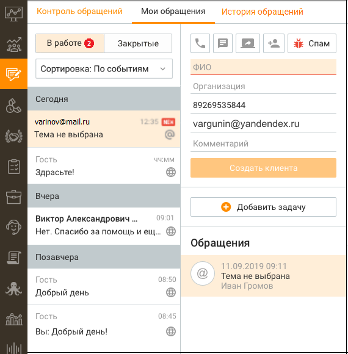
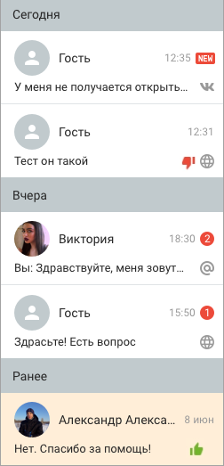

# 4.3. Мои обращения

> Трассировка: PDF §4.3 · сквозные стр. 133-136 · источники: ч.2 `kb/mango-product-docs/sources/mango-cc-manual/CC_manual_1.26.23-part-2.pdf` с.32-35.

Инструмент Мои обращения предназначен для обработки обращений, поступающих в Контакт-центр MANGO OFFICE посредством голосовых и текстовых обращений, получаемых при помощи мультиканальных виджетов, а также обратных звонков. Также сотрудник может создать входящее обращение вручную, и заполнить его необходимой информацией. Каждое обращение может быть связано: • с одной сделкой • с одним клиентом • с одной организацией Приём обращений в обработку осуществляется при помощи панели очереди обращений.

| Помимо входящих обращений, в этом разделе создаются и обрабатываются исходящие |
| --- |
| обращения сотрудника. |
| Функции инструмента: |

• Создавать исходящие обращения; • Обрабатывать обращение клиента; • Создавать новый контакт клиента в адресной книге; • Присваивать обращение существующему контакту; • Получать и отправлять во всех текстовых каналах присоединенные к обращению файлы, включая аудио/видео/изображения; • Просматривать открытые обращения контакта (при их наличии); • Приглашать контакт к участию в видеоконференции; • Указывать тему обращения, используя справочник тематик обращений (для быстрого выбора доступен поиск по тематикам Справочника); • Переводить обращение на другого сотрудника Контакт-центра MANGO OFFICE;

• Возвращать обращение в Исходящий обзвон; • Переносить задание на обзвон вручную оператором на конкретное время; • Добавлять задачу или сделку, закрепляя их за контактом; • Отправлять ссылку на оплату сделки, просматривать статус платежа (если подключена интеграция с ЮKassa); • Отправлять клиенту форму для сбора контактов; • Присваивать обращению статус СПАМ; • Закреплять обращение за сделкой.

В левой части отображается список входящих и исходящих обращений (текстовых и звонковых), распределенных по группам: В работе и Закрытые. Обращения отсортированы по времени последнего действия с обращением, и делятся на подгруппы: Сегодня, Вчера, Позавчера, Ранее.

| Клик по ссылке "История обращений" переводит в подраздел |
| --- |
| установленным фильтром по сотруднику. |

Для каждой записи указывается следующая информация: Для звонков: • Аватар в виде стрелки: o зеленая стрелка вверх для исходящих вызовов; o зеленая стрелка вниз для входящих вызовов; o синяя стрелка вверх для исходящего обзвона. • номер телефона с которого поступил вызов или СМС. При поступлении вызова с

| признаком сокрытия номера вместо номера отображается "Номер скрыт"; |
| --- |
| Время поступления вызова. |

Для текстовых обращений:

| Аватар. В случае, когда обращение поступает от контакта адресной книги, запись |
| --- |
| содержит аватар с инициалами контакта и его ФИО. При получении обращения из |
| социальной сети или мессенджера (Telegram, Max, VK, WhatsApp, |

в качестве имени отображается имя аккаунта контакта. При отсутствии имени аккаунта отображается аватар серого цвета с именем "Гость"; • Статус собеседника в чате на сайте – отображается в случае присутствия собеседника в чате на сайте в статусе Online;

• Последнее сообщение в обращении; • Время последнего сообщения; • Счетчик не просмотренных сообщений. При переключении на данное обращение счетчик обнуляется; • Иконка, соответствующая каналу поступления обращения. • Иконка оценки обращения клиентом. Отображается, если проставлена.

| Любая часть сообщения может быть выделена и скопирована в буфер обмена стандартными |
| --- |
| средствами копирования/выделения Windows. |

В Контакт-центре MANGO OFFICE отображаются все сообщения, получаемые при помощи омниканальных виджетов, подключенных социальных сетей или мессенджеров (Telegram, VK, WhatsApp, Авито, Авито Работа, Клиентское приложение, Max). При этом если сотрудник отвечает на сообщение непосредственно в мессенджере и социальной сети, ответ сотрудника в Контакт-центре не сохраняется. В Контакт-центре MANGO OFFICE предусмотрена функция изменения размера шрифта для повышения удобства чтения и написания сообщений. Размер шрифта регулируется путем зажатия клавиши Ctrl и прокрутки колесика мыши. Настройки сохраняются для всех новых сообщений и остаются активными при переключении между диалогами.

| При использовании данной функции имеется следующее ограничение: чтобы изменить |
| --- |
| шрифт, сначала необходимо нажать левой кнопкой мыши на область сообщений чата, чтобы |
| данная область стала активной для ввода. |

Функция направлена на улучшение условий работы операторов, позволяя снизить нагрузку на зрение и поддерживать продуктивность в течение рабочего дня. Общее количество обращений, содержащих не просмотренные сообщения, указывается на переключателе модуля.

| В окне обращения сотрудник может пригласить абонента к участию в видеоконференции, |
| --- |
| сгенерировав ссылку-приглашение кнопкой . |

<!-- изображение на стр. 136: байты не извлечены (PyMuPDF недоступен) -->

Далее: • Исходящие обращения; • Обработка обращения, • Перевод обращения, • Завершение обработки.
