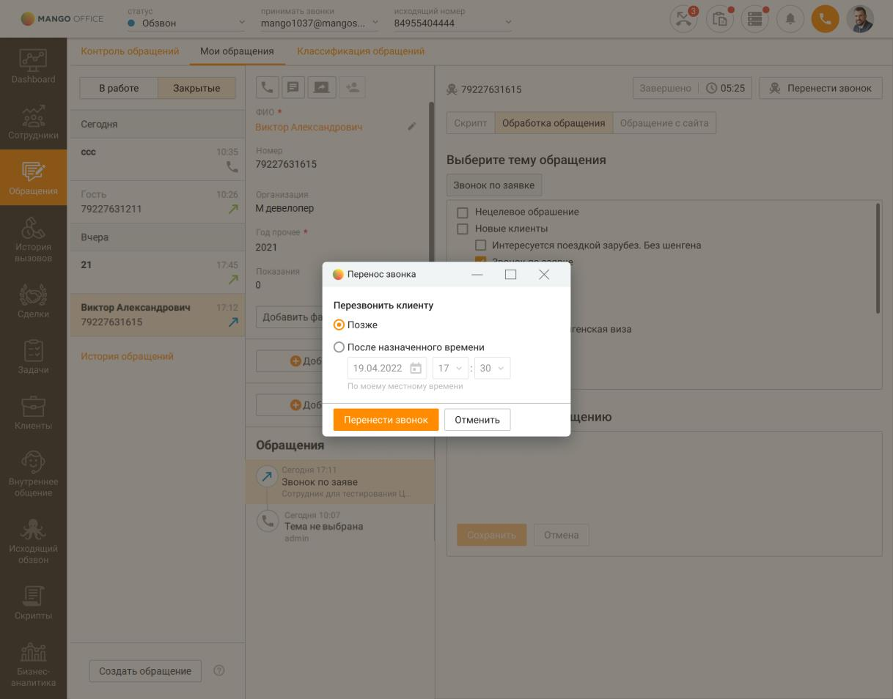

# 4.3.4. Перенос задания на обзвон

> Трассировка: PDF §4.3.4 · сквозные стр. 156-157 · источники: ч.2 `kb/mango-product-docs/sources/mango-cc-manual/CC_manual_1.26.23-part-2.pdf` с.55-56.

Оператор Контакт-центра, обрабатывающий звонки Исходящего обзвона, при общении с клиентом может вручную назначить перезвон клиенту на конкретное, удобное клиенту время. Звонок вернется в кампанию Исходящего обзвона, и будет выполнен в заданное оператором время. Чтобы задать время перезвона после завершения разговора с клиентом в карточке завершенного вызова кликните по кнопке "Перенести звонок". В открывшемся окне выберите вариант "Позже", либо задайте точную дату и время перезвона.

Сохраните изменения кнопкой "Перенести звонок". В правом нижнем углу экрана отобразится системное уведомление о времени повторного звонка клиенту в рамках кампании Исходящего обзвона.

