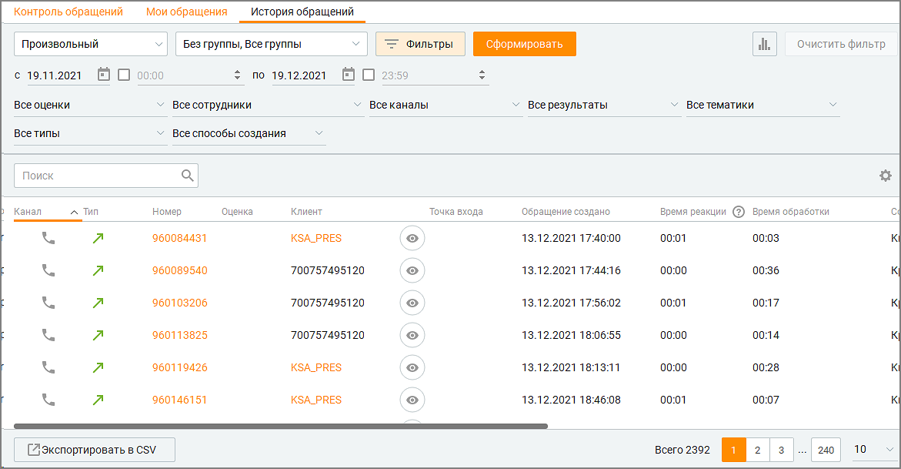
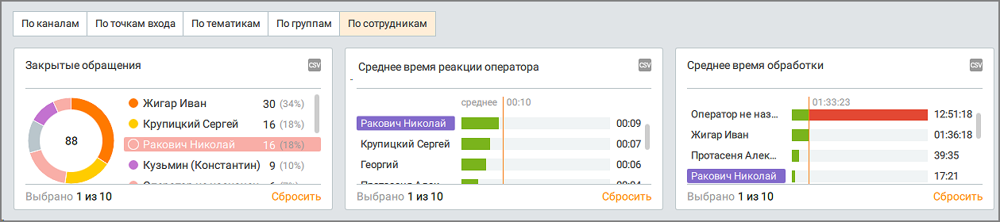

# 4.5. История обращений

> Трассировка: PDF §4.5 · сквозные стр. 161-166 · источники: ч.2 `kb/mango-product-docs/sources/mango-cc-manual/CC_manual_1.26.23-part-2.pdf` с.60-65.

Для просмотра аналитической информации по обращениям клиентов следует отобрать обращения по периоду времени. Для этого выберите нужный период времени. При выборе варианта Произвольный становятся доступными поля с и по, где вы можете ввести нужную

дату или выбрать ее, нажав на значок календаря. Вы также можете дополнительно указать время суток для полей с и по. Для этого включите соответствующие настройки и укажите время. Затем выберите группу(ы), по которым необходимо получить аналитические данные. Для более детальной настройки нажмите кнопку Фильтры. В результате развернется дополнительная панель, содержащая фильтры по: • оценке клиента; • типу обращения; • сотруднику; • каналу; • результату обращения; • тематике обращения; • способу создания обращения. После завершения выбора критериев нажмите кнопку Сформировать. После этого Контакт- центр MANGO OFFICE отобразит отчет по обращениям, сформированный в соответствии с критериями выбора, указанными вами выше.

Клик по кнопке "Очистить фильтр" удаляет заданные параметры фильтрации.

Клик по пиктограмме открывает блок графиков отчета. Отчет содержит три графика: • Закрытые обращения – общее количество закрытых обращений, соответствующее

|  | "Закрытые обращения" (представление по |
| --- | --- |
| сотрудникам) все обращения, обработанные удаленным оператором, и все обращения, |  |
| которые не были распределены на оператора, отображаются под единым значением – |  |
| "Оператор удален или Оператор не назначен". |  |

• Среднее время реакции оператора – среднее время ожидания ответа оператора в каждом обращении, соответствующего выбранным значениям фильтров для выбранного способа представления, а также среднее время ожидания ответа оператора по всем обращениям согласно фильтрам;

• Среднее время обработки – среднее времени обработки каждого обращения, соответствующего выбранным значениям фильтров для выбранного способа представления, а также среднее время обработки по всем обращениям согласно фильтрам. Внешний вид графиков меняется в зависимости от группировки данных по: • каналам; • точкам входа; • тематикам; • группам; • сотрудникам. Клик по области графика (тексту либо изображению) приводит к фильтрации списка в таблице соответственно выбранному значению. Повторный клик по этой области приводит к отмене фильтрации. Клик по кнопке Сбросить очищает фильтр графика. При выборе каких-либо значений на графиках в фильтрах заполняются соответствующие комбобоксы, при снятии значений – значения в фильтре также снимаются.

Клик по кнопке F5 обновляет данные в отчетах. При переключении способа представления данные в графиках пересчитываются автоматически.

Клик по кнопке приводит к открытию стандартного окна экспорта данных в CSV. Экспорт производится с учетом выбранных в фильтрах или с помощью поисковой строки значений. В нижней части отчета отображаются сведения по каждому обращению в виде таблицы. Вы можете самостоятельно выбрать, какие столбцы будут отображаться на панели. Для этого

щелкните левой кнопкой мыши по пиктограмме и установите/снимите флаги напротив наименований столбцов. По умолчанию отображается весь набор столбцов. Таблица включает следующие столбцы:

• Пиктограмма для перехода к просмотру обращения; • Канал: ВКонтакте, Чат на сайте, Звонковое обращение, Telegram, Max, E-mail, СМС, WhatsApp, Авито, Авито Работа, Клиентское приложение, Другое; • Тип: тип обращения (входящий, исходящий, проактивный чат); • Номер обращения (в виде ссылки на вкладку "История обращений" с открытым соответствующим обращением). Содержимое поля копируется в буфер обмена

кликом на пиктограмму ; • Оценка обращения (текстовое и числовое значение). Если в Личном кабинете ВАТС подключена услуга "Контроль качества (Омниканальная оценка диалогов)", то в таблице отображаются столбцы согласно всем настроенным в модуле Контроль качества оценкам: Оценка 1, Оценка 2, Оценка 3, Средняя оценка. Если услуга "Омниканальная оценка диалогов" включена Допустима фильтрация отчета по оценке обращений – выбор из списка со следующими значениями: Все оценки (отлично, хорошо, нормально, плохо, очень плохо), Без оценки.

✓ При выборе значений оценки "Хорошо", "Плохо", "Без оценки" в фильтре по оценке, в таблице выводятся и текстовые, и звонковые обращения (если это не противоречит условиям остальных фильтров). ✓ При выборе в фильтре оценки значений, относящихся только к звонковым обращениям ("Отлично", "Нормально", "Очень плохо"), в таблице выводятся только звонковые обращения (если это не противоречит условиям остальных фильтров). ✓ При выборе в фильтре оценки значений, относящихся одновременно к звонковым и текстовым обращениям, в таблице выводятся все удовлетворяющие условиям результаты.

| ПРИМЕР |
| --- |
| В фильтре "Оценка" выбраны значения "Отлично", "Хорошо", "Плохо". В таблице будут |
| выведены все звонковые обращения с оценками "Отлично", "Хорошо", "Плохо" и все |
| текстовые обращения с оценками "Хорошо", "Плохо" (если это не противоречит |
| условиям остальных фильтров). |

Ссылка на настройку омниканальной оценки диалогов https://qm.mango-office.ru Если услуга "Омниканальная оценка диалогов" отключена Допустима фильтрация отчета по оценке обращений – выбор из списка со следующими значениями: Все оценки (хорошо, плохо), Без оценки. ✓ При выборе в фильтре значений "Хорошо" и/или "Плохо", в таблице НЕ выводятся звонковые обращения. Обращения по всем остальным каналам выводятся в соответствии с выбранной в фильтре оценкой. ✓ При выборе в фильтре значения "Без оценки", в таблице выводятся все звонковые обращения, а также обращения по остальным каналам, по которым не выставлена оценка. ✓ Значения поля "Оценка" для звонковых обращений не выводятся в таблице. • Клиент: при наличии клиента среди контактов адресной книги поле содержит кликабельное имя клиента. Нажатие на ссылку приводит к открытию карточки контакта. Если клиент обращается по Telegram, Max, VK или Авито и получено имя аккаунта клиента, то отображается Имя аккаунта. Если обращение создано на основе вызова от абонента, которого нет в адресной книге, то отображается номер телефона абонента. Если клиент обращается по каналу WhatsApp, имя заполняется на основе информации из профиля WhatsApp. Иначе – отображается текст "Гость". • ID Клиента: идентификационный номер клиента из канала обращения. Если клиент обращается по каналу WhatsApp, отсутствует в адресной книге и иная его идентификация невозможна, в отчете "История обращений" в параметре "ID клиента" автоматически проставляется его номер телефона. • Точка входа: номер телефона, email и т.д. Если точка входа "номер телефона", то номер отображается в таблице и виджете (при наличии комментария к номеру в виджете отображается комментарий); • О номере: комментарий к входящему номеру телефона из ЛК ВАТКС (если есть); • Обращение создано; • Время реакции; • Время обработки: время, которое потребовалось оператору на обработку обращения с момента взятия в работу до закрытия обращения; • Время ожидания в очереди: время, в течение которого обращение находилось в очереди до распределения на оператора • Время ожидания ответа оператора: время, которое потребовалось оператору на ответ с момента взятия в работу обращения; • Сотрудник; • Группа, на которую было распределено обращение; • Тема;

• Результат; • Текст SMS; • Статус SMS: отправлено, не отправлено, доставлено, не доставлено; • Комментарий: содержимое поля копируется в буфер обмена кликом на

пиктограмму ; • Организация: организация, к которой привязан контакт (при наличии).

| В зависимости от роли пользователя в Контакт-центре некоторые столбцы могут быть |
| --- |
| недоступны для просмотра. |

Поисковая строка допускает поиск по следующим полям: • Номер обращения; • Клиент (если существует контакт с соответствующими контактными данными, то поиск ведется по его имени; иначе – поиск ведется по номеру телефона, если обращение создано на основе вызова); • Органзация; • Точка входа. Для экспорта отчета в формате CSV нажмите кнопку Экспорт в CSV. В результате на экране отобразится форма настройки экспорта. В выгрузке отчета обращений имеется идентификатора звонка (поле "Контекст") по которому создано это обращение. Это помогает сопоставлять сделку с звонком в котором была создана сделка инструментами excel.

| Если для экспорта выбрано поле "Текст SMS", то в файле данных будут экспортированы |
| --- |
| тексты из СМС-обращений. |

