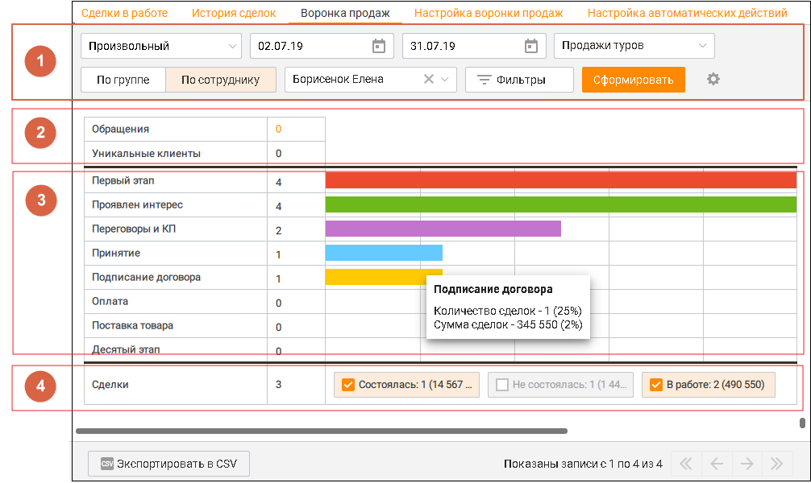
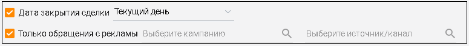
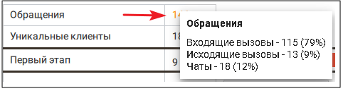
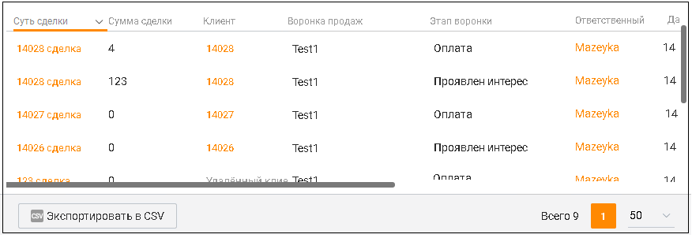

# 5.3. Воронка продаж

> Трассировка: PDF §5.3 · сквозные стр. 182-185 · источники: ч.2 `kb/mango-product-docs/sources/mango-cc-manual/CC_manual_1.26.23-part-2.pdf` с.81-84.

Вкладка Воронка продаж содержит визуально-графическую информацию о соответствующих этапах работы со сделками.

Воронка продаж можно условно разделить на следующие блоки: 1. Блок фильтров Блок фильтров содержит ряд параметров, задаваемых пользователем Период - временной период поиска. Доступны варианты: сегодня, вчера, последние 2 дня, текущая неделя, текущий месяц, произвольный (с максимальной длительностью 31 день); По группе/сотруднику – поиск по группе или сотруднику. Внутри среза доступны варианты: без группы, все группы, конкретная группа, все сотрудники, конкретный сотрудник, удаленный сотрудник; Воронка продаж – отчет будет сформирован по выбранной воронке продаж.

| Переключатель По группе/По сотруднику доступен, если у пользователя в подчинении |
| --- |
| имеются группы или сотрудники. |

По клику на кнопке "Фильтры" открываются дополнительные параметры фильтрации поиска:

• Дата закрытия сделки – доступны варианты: сегодня, вчера, последние 2 дня, текущая неделя, текущий месяц, произвольный период (с максимальной длительностью 365 дней); • Только обращения с рекламы – поиск по кампании или источнику рекламы. Также дополнительная фильтрация поиска осуществляется в блоке 4. Статусы сделки. 2. Блок Обращения и Клиенты Блок содержит данные по количеству обращений и уникальных клиентов (с целевыми

| обращениями более 30 секунд), относящихся к найденным сделкам. |
| --- |
| По клику на число сообщений всплывает информационное окно, содержащее данные о |
| количестве обращений различных типов |

общего количества обращений.

Группировка по воронке не учитывает связь обращений со сделками. 3. Блок Этапы сделки Блок этапов сделки представляет собой горизонтальную гистограмму, отображающую количество сделок на каждом из этапов, заданных во вкладке Настройка воронки продаж. При клике на столбец гистограммы всплывает информационное окно со следующими данными: • наименование этапа; • количество сделок на данном этапе – в числовом виде и процентном соотношении от общего (без учета фильтрации) количества сделок на этапе; • сумма сделок данного этапа – в числовом виде и процентном соотношении от общего (без учета фильтрации) количества сделок на этапе. Щелчок по названию этапа фильтрует сделки, которые находятся в данный момент на этом и последующих этапах. Таким образом количество сделок, отображаемое справа от названия этапа, равно количеству сделок, отображаемых в таблице (см. этап 5.Таблица). 4. Блок Статусы сделки Блок статусов содержит чек-боксы для фильтрации по статусам сделок. Устанавливая галочку в соответствующем чек-боксе, пользователь включает в гистограмму данные о количестве сделок по статусам Состоялась, Не состоялась, В работе. Если не отмечен ни один чек-бокс, на гистограмме отображаются сделки, находящиеся во всех трех статусах. Также блок содержит суммарное число сделок, отображенных на гистограмме. 5. Таблица В нижней части отчета отображаются сведения по каждой сделке в виде таблицы. Вы можете самостоятельно выбрать, какие столбцы будут отображаться на панели. Для этого щелкните

левой кнопкой мыши по пиктограмме и установите/снимите флаги напротив наименований столбцов. По умолчанию отображается весь набор столбцов (выделенные красным цветом столбцы недоступны для сортировки): • название; • сумма сделки; • клиент – имя клиента со сделкой; • воронка продаж; • этап воронки • ответственный – сотрудник, ответственный за сделку; • дата создания • обращений; • ID;

Для экспорта отчета в формате CSV нажмите кнопку Экспорт в CSV. В результате на экране отобразится форма настройки экспорта. Выберите необходимые поля и сохраните файл экспорта, используя стандартные средства операционной системы.
