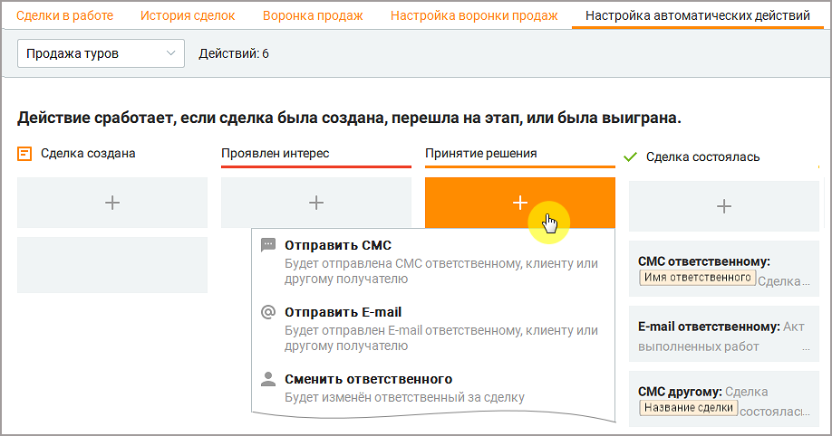
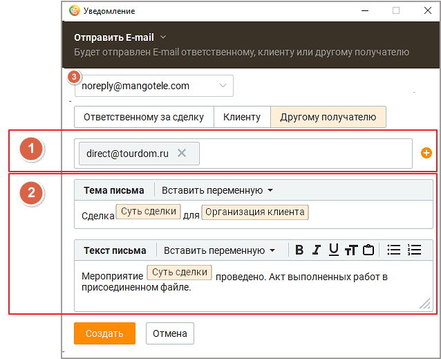
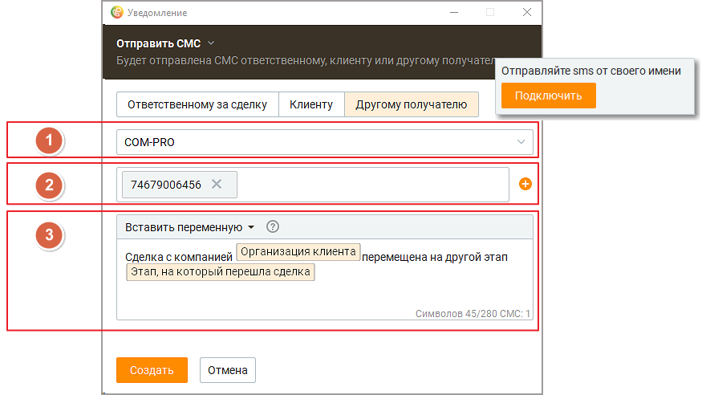
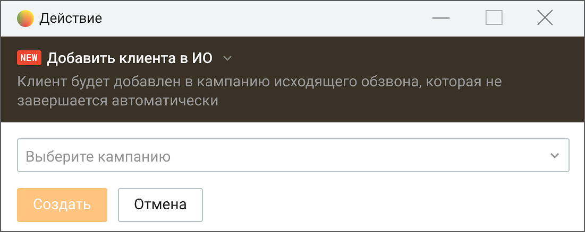
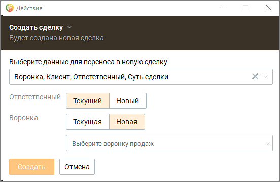
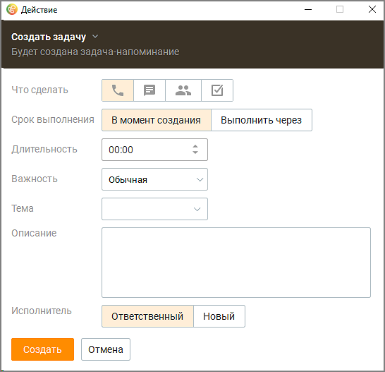
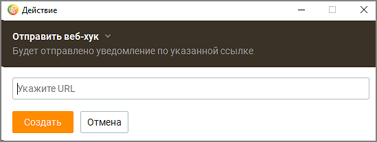
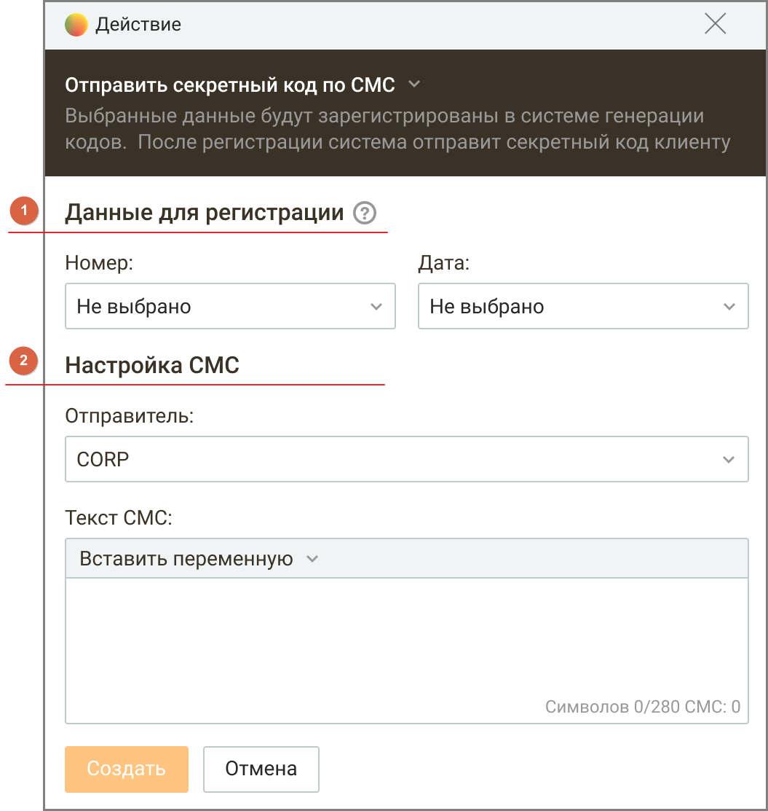
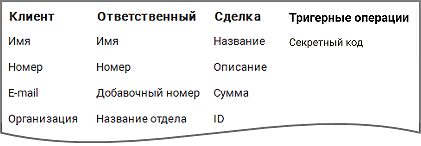

# 5.5. Настройка автоматических действий

> Трассировка: PDF §5.5 · сквозные стр. 187-196 · источники: ч.2 `kb/mango-product-docs/sources/mango-cc-manual/CC_manual_1.26.23-part-2.pdf` с.86-95.

| Вкладка доступна для пользователей, обладающих соответствующими правами. См. |
| --- |
| Приложение 2, подраздел "Разрешения, применяемые при работе с модулем "Сделки". |

Вкладка предназначена для настройки автоматических действий: • отправки СМС и E-mail по изменению состояния сделок • смены ответственного за сделку • создания сделки • создания задачи • отправки веб-хука • отправки секретного кода (в СМС-сообщении) • добавить клиента в кампанию Исходящего обзвона Выпадающий список "Воронка продаж" отображается, если в Контакт-центре настроено несколько воронок продаж. Все действия настраиваются для выбранной воронки.

Автоматические уведомления могут быть настроены для следующих категорий получателей: • ответственному за сделку – ответственный сотрудник получает уведомления на номер мобильного телефона либо адрес электронной почты, указанный в карточке сотрудника; • клиенту – клиент, к которому привязана сделка, получит уведомление на номер мобильного телефона либо адрес электронной почты, указанный в карточке клиента; • другому получателю – уведомление будет отправлено на номер мобильного телефона либо адрес электронной почты, указанный в настройках уведомлений.

| Для другого получателя может быть добавлено несколько номеров телефона/адресов |
| --- |
| электронной почты, кликом по пиктограмме |

Уведомления отправляются: ✓ при создании или переоткрытии сделки

| при переводе сделки на другой этап |
| --- |
| при переводе сделки переведена в статус "Состоялась", "Не состоялась", "Удалена" |

| Ответственные за сделку и клиенты получают уведомления только по своим сделкам, другие |
| --- |
| получатели по всем сделкам. |
| Уведомления не отправляются: |

✓ при переводе сделки в статус "В работе" ✓ если по причине удаления этапа закрытая сделка была перенесена на другой этап Создание уведомлений Уведомления создаются для этапов сделок выбранной воронки. Типы создаваемых уведомлений: Отправка письма с заданным текстом и переменными на E-mail: • произвольный E-mail (другой получатель) • ответственного за сделку • клиента, связанного со сделкой При создании уведомления адрес отправителя указан по умолчанию – это авторизованный электронный адрес компании. Также сотрудник может выбрать e-mail отправителя (поле 3) из авторизованных на вкладке Телефония и E-mail. Пользователь может выбрать из списка только авторизованные адреса компании.

Блок 1: Дополнительный блок для контактных данных при создании e-mail-уведомления другому получателю. Блок 2: Блок данных для создания e-mail-уведомления. Отправка СМС сообщения с заданным текстом и переменными на номер телефона: • произвольный номер телефона (другой получатель) • ответственного за сделку • клиента, связанного со сделкой Формат номера телефона 7XXXXXXXXXX или 8XXXXXXXXXX.

Блок 1: Блок выбора имени отправителя. Доступен при подключении услуги "Отраслевое имя отправителя СМС" или "Индивидуальное имя отправителя СМС" в Личном кабинете ВАТС. Блок 2: Дополнительный блок для контактных данных при создании СМС-уведомления другому получателю. Блок 3: Блок данных для создания СМС-уведомления, с информацией об атрибутах создаваемого СМС-сообщения При создании уведомления доступны следующие переменные: • Имя клиента • Номер телефона клиента (приоритет мобильному номеру телефона) – Номер клиента • E-mail клиента • Организация клиента • Должность клиента • Сайт клиента • Имя ответственного за сделку сотрудника – Имя ответственного • Мобильный номер ответственного за сделку сотрудника – Номер телефона ответственного • Добавочный номер ответственного за сделку сотрудника – Добавочный номер ответственного • Отдел ответственного за сделку сотрудника – Название отдела ответственного • Должность ответственного за сделку сотрудника – Должность ответственного • E-mail ответственного за сделку сотрудника – E-mail ответственного • Количество открытых сделок у ответственного за сделку сотрудника – Открытых сделок у ответственного • Суть сделки • Описание • Сумма сделки • ID сделки • Название этапа, на который перешла сделка – Этап, на который перешла сделка • Название этапа, с которого перешла сделка – Этап, с которого перешла сделка • Дней в работе сделка – Длительность сделки

• Причина, по которой сделка не состоялась (доступно только для этапа "Сделка не состоялась") – Причина, по которой сделка не состоялась • Комментарий к причине, по которой сделка не состоялась (доступно только для этапа "Сделка не состоялась") -Комментарий к причине, по которой сделка не состоялась • Комментарий клиента; • Дата создания сделки. При наличии пользовательских полей они также могут быть использованы в качестве переменных. Изменить ответственного за сделку + Чтобы изменить ответственного за сделку кликните по пиктограмме добавления действия и выберите в выпадающем списке пункт меню "Сменить ответственного". Выберите сотрудника, который назначается ответственным за сделку. Чекбокс "Сделать ответственным в связанных сущностях" – если проставлен, при наступлении события, также меняется Ответственный в связанных со сделкой задачах, находящихся в статусе "Запланирована". При этом задачи с выбранным параметром "автоматический набор" игнорируются. Сохраните внесенные изменения кнопкой Сохранить. Добавление контакта в Исходящий обзвон Пользователь может выбрать добавление клиента в кампанию Исходящего обзвона для любого этапа сделки.

Выберите кампанию – для выбора кампании Исходящего обзвона доступны только кампании, которые не завершаются автоматически. Создание сделки При автоматическом создании сделки имеется возможность выбрать какие данные переносить из сделки-источника, а также настроить параметры для создаваемой сделки – ответственного, воронки и этапа.

В окне настроек создания сделки укажите: • данные, которые будут перенесены в новую сделку – для выбора доступны все поля сделки, включая пользовательские; • ответственного за сделку – текущего или нового сотрудника (из выпадающего списка всех сотрудников). Если удален сотрудник, на которого автоматическое действие изменяет ответственного, то в сделке будет отображаться "Удаленный сотрудник"; • воронку продаж, в которой создается новая сделка – текущую или другую воронку (из выпадающего списка всех доступных пользователю воронок продаж). Сохраните внесенные изменения кликом по кнопке Сохранить.

| ПРИМЕР |
| --- |
| У пользователя процесс продажи услуги подразумевает оказание двух услуг в разных отделах. |
| Например, регистрация товарного знака. |
| Первым этапом специалист-1 исследует, возможна ли регистрация товарного знака, который хочет |
| клиент. После завершения исследования регистрация знака передается специалисту-2 в |
| юридический департамент. |
| При этом конверсия по сделкам у каждого из специалистов/отделов своя. Поэтому логически верно |
| одну продажу разделить на две связанные сделки, чтобы впоследствии правильно оценить |
| конверсию. В каждую новую сделку их сделки-источника могут быть перенесены различные поля. |

Создание задачи При автоматическом создании задачи на выбранного исполнителя имеется возможность настраивать некоторые дополнительные параметры и изменять ответственного в связанных со сделкой задачах. Такая задача автоматически привязывается к сделке, инициировавшей её создание.

В окне настроек создания задачи укажите: • Что сделать – целевое действие задачи. Доступны варианты: Позвонить, Написать, Встретиться, Сделать; • Срок выполнения – в момент создания или с отложенным временем выполнения. При выборе второго варианта открываются поля для указания даты и времени выполнения задачи; • Длительность – длительность задачи. После завершения указанного времени задача считается просроченной; • Важность – важность задачи. Доступны варианты "Обычная", "Неважно", "Важно"; • Тема – тема задачи. Доступен выбор из имеющихся вариантов, или создание новой темы; • Исполнитель – ответственный за сделку. Доступен выбор текущего или нового сотрудника (из выпадающего списка всех сотрудников). Если удален сотрудник, на которого автоматическое действие изменяет ответственного, смена ответственного выполняться не будет. Сохраните внесенные изменения кликом по кнопке Сохранить.

| Пример использования: |
| --- |
| Пользователь Контакт-центра продает программный продукт. При этом у пользователя в процессе |
| есть обязательный важный этап – демонстрация продукта. Так как менеджеры часто забывают |
| связаться с клиентом на этом этапе (человеческий фактор), пользователю необходимо для всех |
| сделок настроить автоматическое создание задач на менеджеров при переходе на определенный |
| этап. |

Отправка веб-хука В Контакт-центре MANGO OFFICE имеется возможность отправить информацию о сделке на указанный пользователем URL.

В окне настроек отправки веб-хука укажите URL, на который должен быть автоматически отправлен веб-хук. Сохраните внесенные изменения кликом по кнопке Сохранить.

| Пример использования: |
| --- |
| У пользователя есть стороннее приложение, которое управляет прогнозом продаж, и настроено на |
| прием событий, по определенному URL. При переходе сделки на любой из этапов воронки, |
| сторонняя система должна узнать об этом, изменить прогноз и оповестить руководителей об |
| обновлении данных в виде графика. |

Отправка секретного кода по СМС Для подтверждения ряда операций возможна генерация и отправка секретного кода клиенту в СМС-сообщении. Выбранные в окне настроек данные регистрируются в системе генерации секретных кодов.

| Автоматическое действие доступно только при подключенной услуге "Автоматическое |
| --- |
| действие: Отправить секретный код по СМС". |

Автоматическое действие состоит из следующих этапов: • регистрация данных в системе (блок 1. "Данные для регистрации") и генерация секретного кода • отправка СМС сообщения на номер телефона Клиента (блок 2. "Настройка СМС")

В окне настроек укажите: Номер/Дата – выбор атрибутов сделки, на основании которых будет сгенерирован секретный код. Для выбора пользователю доступны все поля сделок (основные и пользовательские). Как правило, атрибутами выступают номер и дата документа, проходящего по сделке (договор, накладная и др.). Нельзя выбрать один атрибут более одного раза. Далее система формирует уникальный секретный код, где идентификаторы кода – переданные атрибуты. Если пользовательское поле, выбранное в настройках данной операции, было удалено, автоматическое действие не сработает. Отправитель – выбор имени отправителя. Доступен при подключении услуги "Отраслевое имя отправителя СМС" или "Индивидуальное имя отправителя СМС" в Личном кабинете ВАТС; Текст СМС (с переменными) – текст СМС-уведомления, с информацией об атрибутах создаваемого СМС-сообщения. При создании уведомления доступны переменные, аналогичные п."Создание уведомлений/СМС"

Сохраните внесенные изменения кликом по кнопке Сохранить.

| Пример использования |
| --- |
| Клиент заказывает доставку товара, оплачивая его online. После оплаты клиенту приходит СМС- |
| уведомление с секретным кодом. Для получения товара клиент должен сообщить секретный код |
| курьеру, доставившему товар. |

Просмотр, редактирование и удаление автоматических действий В столбцах этапов отображается: • ФИО нового ответственного • часть текста сообщения, если тип уведомления – СМС • часть текста письма, если тип уведомления – E-mail Для редактирования автоматического действия кликните на него и внесите необходимые изменения в открывшемся окне действия. Сохраните изменения кнопкой Применить. Для удаления автоматического действия кликните на него и нажмите кнопку Удалить в открывшемся окне действия. Пользователь не может создать два абсолютно одинаковых условия (триггера) для выполнения автоматического действия. Разные типы автоматических действий дополняют друг друга и могут пересекаться для этапов или статусов сделки. Примеры использования автоматических действий

| ПРИМЕР 1 |
| --- |
| Пользователь создает автоматическое действие "Создать задачу" для статуса "Сделка создана". Ни |
| на одном из этапов воронки пользователь больше не создает автоматическое действие такого типа |
| (могут быть созданы автоматические действие другого типа, например "Сменить ответственного"). В |
| данном случае, при создании или пере-открытии сделки на любом из этапов воронки, будет |
| создаваться задача согласно настройкам автоматического действия "Создать задачу" для статуса |
| "Сделка создана". |
| ПРИМЕР 2 |
| Пользователь создает автоматическое действие "Создать задачу" для статуса "Сделка создана" и для |
| этапа воронки "Презентация демо-версии". Для этапа воронки "Выставить счет" данный тип |
| автоматического действия не создан. В данном случае, при создании или пере-открытии сделки на |
| этапе "Презентация демо-версии", используется автоматическое действие "Создать задачу" именно |
| данного этапа. В случае, если сделка создается или пере-открывается на этапе "Выставить счет", |
| используется автоматическое действие "Создать задачу" настроенное для статуса "Сделка создана". |
| ПРИМЕР 3 |
| Пользователь создает автоматическое действие "Создать задачу" для этапов "Презентация демо- |
| версии" и "Выставить счет". Для статуса "Сделка создана" данный тип автоматического действия не |
| создан. В данном случае при создании или пере-открытии сделки на этапах "Презентация демо- |
| версии" или "Выставить счет", будет использоваться автоматическое действие настроенное для этих |
| этапов. |
