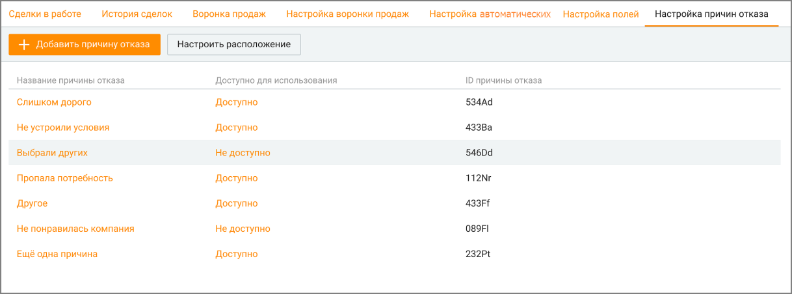
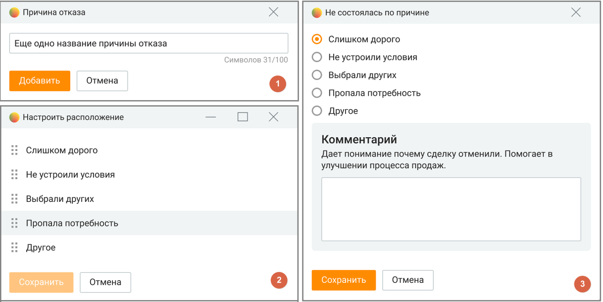

# 5.7. Настройка причин отказа

> Трассировка: PDF §5.7 · сквозные стр. 200-203 · источники: ч.2 `kb/mango-product-docs/sources/mango-cc-manual/CC_manual_1.26.23-part-2.pdf` с.99-101; ч.3 `kb/mango-product-docs/sources/mango-cc-manual/CC_manual_1.26.23-part-3.pdf` с.1.

Вкладка доступна пользователю при наличии права "Настраивать причины отказа в сделках", установленного для роли пользователя в ЛК ВАТС. Для отображения вкладки отметьте ее в Настройки/Видимость разделов. Создаваемые причины отказа доступны как для новых, так и для существующих сделок.

На вкладке пользователь может производить следующие действия: 1. Добавить причину отказа кликом по кнопке "Добавить причину отказа" (рис.1). Максимальное количество вариантов – 20. Предустановленные элементы списка: • Слишком дорого • Не устроили условия • Выбрали других • Пропала потребность • Другое 2. Настроить порядок причин отказа, кликом по кнопке "Настроить расположение". От настроек (рис.2) зависит в каком порядке причины отказа будут отображаться пользователю (рис.3). Для изменения порядка причин отказа установите курсор на

пиктограмме и, удерживая левую кнопку мыши в нажатом состоянии, переместите причину вверх или вниз по списку. 3. Удалить причину отказа. Для этого следует кликнуть по выбранной причине и в открывшемся окне нажать кнопку "Удалить". Если после удаления последней доступной причины отказа все остальные остаются не доступными, то первая недоступная причина отказа автоматически переводится в доступную. 4. Отредактировать причину отказа. Для этого следует кликнуть по выбранной причине и в открывшемся окне произвести изменения. Далее нажать кнопку "Сохранить". 5. Скрыть или отобразить причину отказа из доступного сотрудникам списка. Для этого следует кликнуть по строке Доступно или Недоступно в столбце "Доступно для использования".

Статистика по причинам отказа отображается в блоке визуализаций вкладки История сделок. В табличной части вкладки доступен для отображения столбец "Не состоялась по причине".

| Созданные пользователем причины отказа доступны для сохранения в файл импорта при |
| --- |
| импорте сделок. |

