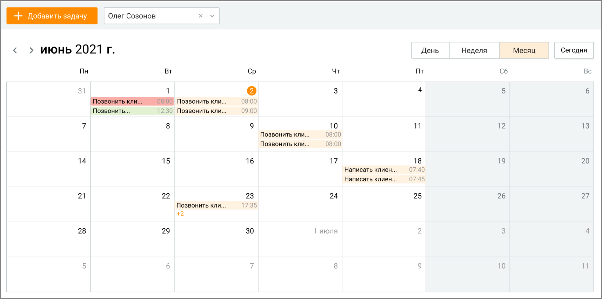
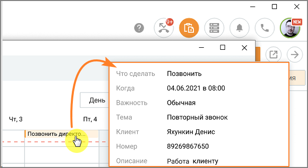

# 6.1. Календарь задач

> Трассировка: PDF §6.1 · сквозные стр. 203-205 · источники: ч.3 `kb/mango-product-docs/sources/mango-cc-manual/CC_manual_1.26.23-part-3.pdf` с.1-3.

Подраздел Календарь задач открывает окно календаря с кнопкой добавления задачи и выпадающим списком для выбора исполнителя задачи:

В выпадающем списке доступны все сотрудники из подконтрольных и своих групп пользователя, включая самого пользователя. В календаре отображаются задачи выбранного сотрудника, в которых он назначен исполнителем. Пользователь может просматривать календарь в периодах: за день, за неделю, за месяц. При наведении курсора на задачу всплывает окно, содержащее основную информацию о задаче из карточки задачи: • Что сделать • Когда • Важность • Тема • Клиент • Номер • Описание Временной интервал размещения задачи в календаре соответствует временному интервалу, установленному в карточке задачи. Задачи в календаре отображаются в виде цветных блоков: • красный – задача в статусе "Просрочена"; • зеленый – в статусе "Завершена"; • голубой – в статусе "Подтверждена"; • светло-оранжевый – задачи в прочих статусах. Создание задачи

| Пользователь с ролью Руководитель может создавать, редактировать и просматривать все |  |  |
| --- | --- | --- |
|  | задачи сотрудников из своей или подконтрольной группы. Пользователь с ролью Сотрудник |  |
|  | может создавать задачи на других сотрудников, состоящих с ним в одной группе, |  |
| редактировать и просматривать задачи, назначенные им на других сотрудников. |  |  |

Чтобы создать новую задачу, нажмите на кнопку Добавить задачу, либо кликните левой кнопкой мыши по ячейке календаря. Откроется карточка создания задачи. Заполните карточку в соответствии с инструкцией из раздела Создание задачи.

Просмотр и редактирование задачи

| Пользователь с ролью Сотрудник не может просматривать и редактировать задачи других |
| --- |
| сотрудников, назначенные другим пользователем. |

При наведении курсора на блок задачи всплывает окно, содержащее краткую информацию о задаче.

Для просмотра или редактирования задачи кликните по блоку задачи в календаре, откорректируйте карточку и сохраните внесенные изменения.
