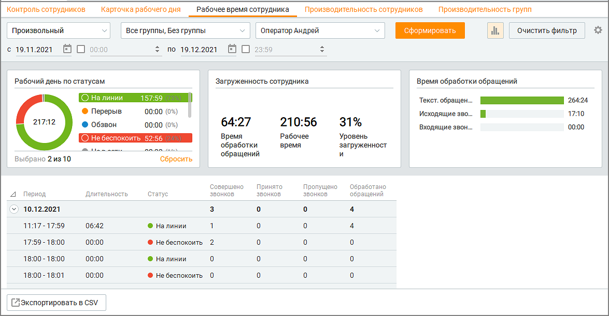
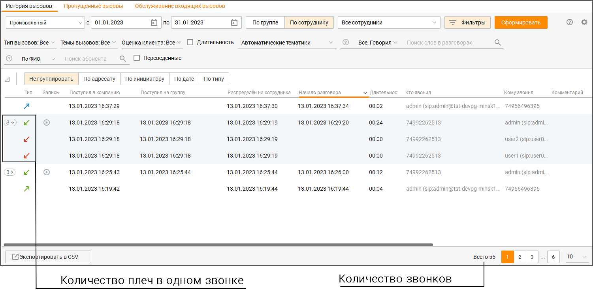

# 7.3. Рабочее время сотрудника

> Трассировка: PDF §7.3 · сквозные стр. 220-223 · источники: ч.3 `kb/mango-product-docs/sources/mango-cc-manual/CC_manual_1.26.23-part-3.pdf` с.18-21.

На вкладке можно получать аналитические данные о времени работы сотрудников Контакт- центра за выбранный период в разрезе их статусов. Для получения отчета об истории работы сотрудников отберите вызовы по периоду. Для этого выберите нужный период времени из списка Период.

При выборе варианта Произвольный становятся доступными поля с и по, где вы можете ввести нужную дату или выбрать ее, нажав на значок календаря. Вы также можете дополнительно указать время суток для полей с и по. Для этого включите соответствующие настройки и укажите время. Затем следует выбрать группу и её сотрудника, по которому необходимо получить аналитические данные. Для этого используйте раскрывающиеся списки Группы и Сотрудники.

| При выборе варианта Без группы в списке Сотрудники также будут доступны |  |  |
| --- | --- | --- |
|  | сотрудники, не входящие ни в одну группу. При выборе определенной группы в списке |  |
| Сотрудники доступны для выбора только сотрудники этой группы. |  |  |

После завершения выбора критериев нажмите кнопку Сформировать. После этого создается отчет об истории работы операторов, сформированный в соответствии с критериями выбора, указанными вами выше. Клик по кнопке "Очистить фильтр" удаляет заданные параметры фильтрации.

Отчет отображается в виде трех графиков и табличной формы. Клик по пиктограмме открывает блок графиков отчета. Предусмотрены следующие графики: • Рабочий день по статусам — длительность рабочего дня по каждому дню отдельно за выбранный период (включая статус "Не в сети", если пользователь пребывал в этом статусе во время рабочего дня. Рабочим днем считается время с момента первой авторизации до последней деавторизации пользователя в Контакт-центре.

В скобках приводится значение в процентах пребывания сотрудника во всех статусах в течение рабочего дня (в том числе в статусе "Не в сети") с округлением до целых процентов. Щелчок по области графика (легенде либо изображению) приводит к фильтрации списка периодов в таблице соответственно выбранному значению. Отображение показателей определяется условием "ИЛИ", например: На линии "ИЛИ" Перерыв. Повторный щелчок по выделенной области отменяет фильтрацию. • Загруженность сотрудника — данный график приводит значения трех показателей: o Время обработки обращений — время, в течение которого пользователь обрабатывал внешние вызовы и/или текстовые обращения в период с момента первой авторизации до последней деавторизации по каждому дню отдельно за выбранный период; o Рабочее время — длительность рабочего дня за исключением длительности периодов пребывания сотрудника в статусе "Не в сети" и в статусе "Перерыв" с момента первой авторизации до последней деавторизации по каждому дню отдельно за выбранный период); o Уровень загруженности — отношение времени обработки обращения к рабочему времени в процентах. • Время обработки обращений — данный график приводит значения трех показателей: o Входящие звонки — суммарная длительность входящих внешних вызовов, обработанных текущим пользователем в течение выбранного рабочего дня; o Исходящие звонки — суммарная длительность исходящих внешних вызовов, обработанных текущим пользователем в течение выбранного рабочего дня; o Текстовые обращения — время обработки обращений без суммы времени обработки входящих вызовов и исходящих вызовов.

| Клик по области графика (тексту либо изображению) приводит к фильтрации списка в таблице |
| --- |
| соответственно выбранному значению. Повторный клик по этой области приводит к отмене |
| фильтрации. |

В табличной части отчета отображаются периоды, в которых статус пользователя не менялся, с приведением суммарных данных по приему и обработке вызовов и обращений. Для того,

чтобы отобразить/скрыть колонку таблицы, щелкните по пиктограмме и выберите нужные колонки. Описание расчета показателей рабочего времени сотрудника:

|  | Наименование | Описание | Источник |
| --- | --- | --- | --- |
|  | колонки |  |  |
| 1 | Дата | Отображаются отдельно даты в течение выбранного в фильтре периода | - |
| 2 | Период | Отображаются начало и конец каждого периода каждого дня отдельно, в течение которых пользователь непрерывно находился в одном статусе | - |
| 3 | Длительность | Длительность периода, в течение которого статус пользователя не менялся | - |
| 4 | Статус | Длительность периода, в течение которого статус пользователя не менялся | Указан в том числе по пользовательским статусам, существовавшим в выбранный период |

| 5 | Совершено звонков | Количество исходящих вызовов, совершенных выбранным оператором в выбранный день в выбранный период в выбранном статусе | Отчет "История вызовов", разрез по сотруднику: Исходящие вызовы и Автоперезвоны . Соответствует количеству плеч* в отчете "История вызовов" |
| --- | --- | --- | --- |
| 6 | Принято звонков | Количество принятых внешних групповых и персональных вызовов выбранным оператором в выбранный день в выбранный период в выбранном статусе | Отчет "История вызовов", разрез по сотруднику: Входящие вызовы. Принятые вызовы, Автоперезвоны. Соответствует количеству плеч* в отчете "История вызовов" |
| 7 | Пропущено звонков | Количество пропущенных выбранным оператором плеч* во внешних персональных и групповых вызовах в выбранный день в выбранный период в выбранном статусе | Отчет "История вызовов", разрез по сотруднику: Пропущенные вызовы, Входящие вызовы. Соответствует количеству плеч* в отчете "История вызовов" |
| 8 | Принято персональных звонков | Количество принятых внешних персональных вызовов выбранным оператором в выбранный день в выбранный период в выбранном статусе | Отчет "История вызовов", разрез по сотруднику: Персональные вызовы, Входящие вызовы, Принятые вызовы. Соответствует количеству плеч* в отчете "История вызовов" |
| 9 | Пропущено персональных звонков | Количество пропущенных выбранным оператором плеч* во внешних персональных вызовах в выбранный день в выбранный период в выбранном статусе | Отчет "История вызовов", разрез по сотруднику: Входящие вызовы. Пропущенные вызовы. Соответствует количеству плеч* в отчете "История вызовов |
| 10 | Обработано обращений | Суммарное количество текстовых обращений (все каналы, кроме голосового), закрытых текущим пользователем за выбранный период в выбранный день в выбранном статусе с одним из следующих результатов: "Обработано", "Переведено" | Отчет "История обращений", разрез по сотруднику: Текстовые каналы (Результаты: "Обработано", "Переведено") |

Примечание: Данные в таблице могут не совпадать с данными в отчете "История вызовов", так как в текущей версии Контакт-центра в отчете "История вызовов" суммируется количество звонков, а при расчете показателей таблицы используется количество плеч* звонка. * Плечо - событие, инициированное в Контакт-центре поступлением звонка.

ПРИМЕР Поступил звонок, который был распределен на группу А из пяти сотрудников. Никто из сотрудников не ответил на звонок. Далее звонок был распределен на группу B из следующих пяти сотрудников. На звонок ответил один из сотрудников группы. Таким образом один звонок содержит 11 плеч: поступление (1 плечо), распределение на группу A (5 плеч), распределение на группу B (5 плеч). Если необходимо вручную перепроверить данные, приведенные в таблице, перейдите на вкладку История вызовов/История вызовов, отфильтруйте необходимые данные по сотруднику и посчитайте количество плеч вызовов.

