# 7.4.2. Текст

> Трассировка: PDF §7.4.2 · сквозные стр. 228-235 · источники: ч.3 `kb/mango-product-docs/sources/mango-cc-manual/CC_manual_1.26.23-part-3.pdf` с.26-33.

Данный функционал позволяет получать расширенную аналитику по текстовым каналам. На основе предоставленных агрегированных табличных данных руководитель компании может

принимать обоснованные решения, выплачивать KPI операторам и оптимизировать процессы взаимодействия с пользователями.

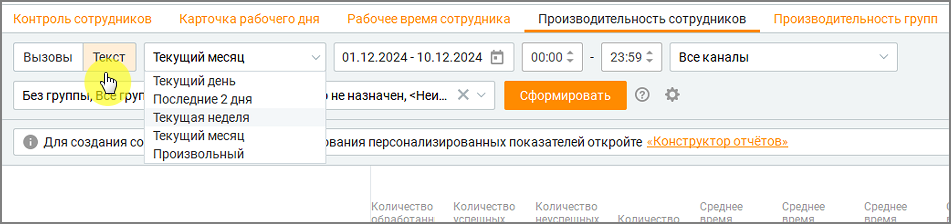

Возможности фильтрации: 1. Выбор периода – укажите конкретный период для анализа, а также временной интервал в пределах одного дня. 2. Фильтрация по каналам связи – аналитика охватывает следующие каналы: Telegram, WhatsApp, Max, Чат на сайте, Авито, Авито Работа, Email, VK, Клиентское приложение. 3. Фильтрация по группам сотрудников – выберите определенную группу сотрудников для анализа показателей внутри конкретной команды. 4. Фильтрация по сотрудникам – таблица может быть настроена для отображения данных только по конкретным сотрудникам или для всех сотрудников одновременно. 5. Выбор отображаемых показателей – в меню фильтров пользователь может выбрать, какие показатели будут отображаться в таблице.

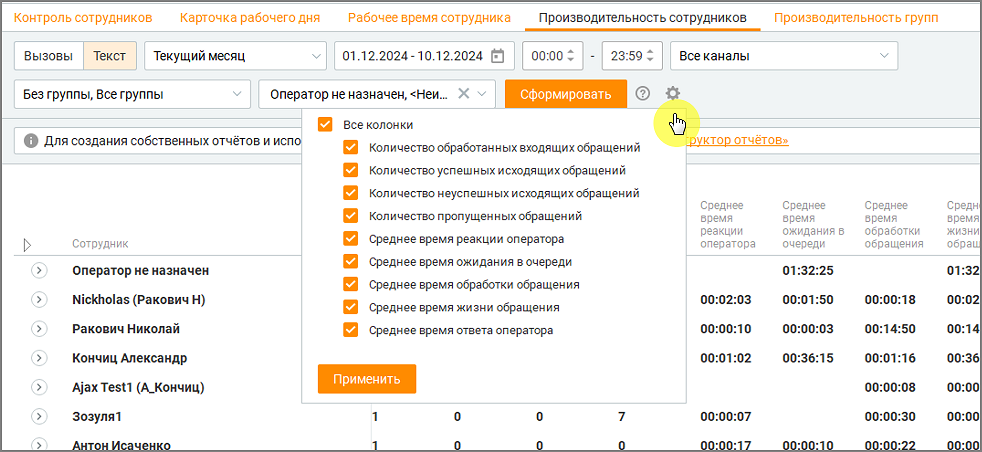

Общая структура и логика формирования отчетов В разделе «Производительность сотрудников» реализована иерархическая структура отчетов, которая позволяет пользователям глубоко анализировать данные. В системе предусмотрены три уровня детализации: 1. Первый уровень — Сотрудники. o На этом уровне отображаются ключевые показатели для каждого сотрудника. Например, общее количество обработанных обращений, среднее время обработки и прочие метрики. 2. Второй уровень — Каналы.

o Второй уровень детализации включает разбивку данных по используемым каналам связи, таким как Telegram, Max, WhatsApp, Чат на сайте и другие. Это позволяет анализировать эффективность работы сотрудника в каждом из каналов. 3. Третий уровень — Дни. o На самом детализированном уровне показатели распределяются по дням, что позволяет отслеживать изменения и выявлять тренды в производительности.

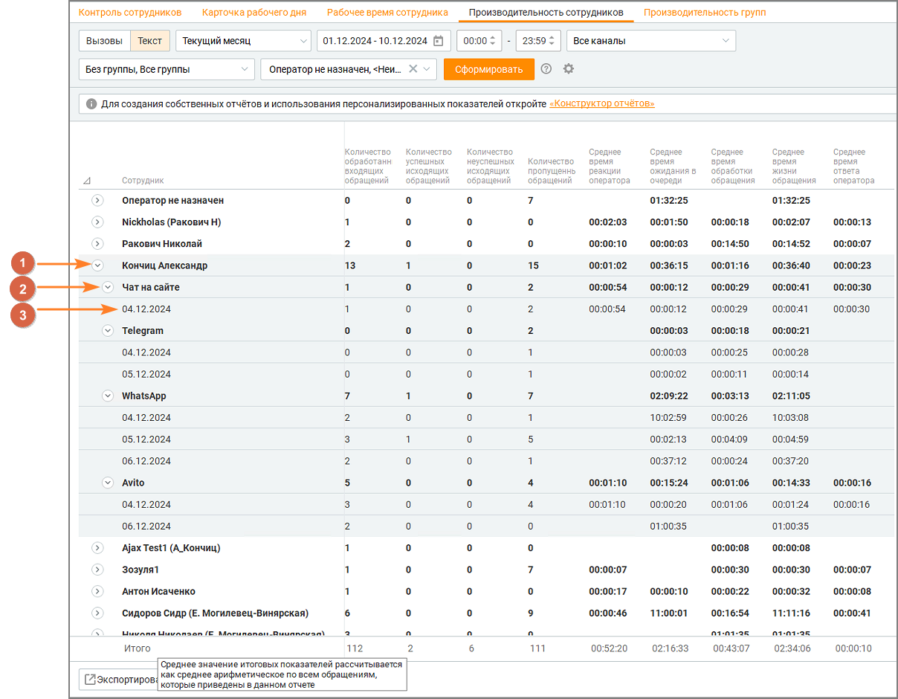

Важные особенности • Показатели рассчитываются на основе данных, имеющихся в системе, с учетом особенностей обработки каждого канала. • Система не учитывает нулевые значения, что обеспечивает точность и надежность расчетов. • При подсчете среднего времени учитываются данные всех обращений, а не только отдельные выборки. Практические рекомендации • Для анализа данных за длительный период рекомендуется использовать фильтры по каналам и сотрудникам, чтобы минимизировать объем отображаемой информации. • Для корректного расчета средних показателей рекомендуется исключать периоды с минимальной активностью или использовать только рабочие часы. Эти показатели детализируют процессы обслуживания в Контакт-центре, обеспечивая мониторинг качества работы операторов и эффективности процессов. Параметры отчетов и расчёт показателей Для формирования отчетов используется суммарный, процентный или средний расчет показателей:

• Суммарные показатели. Для подсчета общего количества каких-либо данных, система суммирует соответствующие данные за выбранный период. • Процентные показатели. Эти показатели демонстрируют долю определённых событий, относительно общего числа обработанных обращений за период. • Средние показатели. Рассчитываются путем деления суммы значений данных на количество обращений за период. Пример расчета суммарного показателя Рассчитываем показатель "Общее количество закрытых обращений". В систему поступило 3 типа обращений: обращения, закрытые вручную, закрытые по тайм- ауту и помеченные как СПАМ. 1. Закрытые вручную – 50 штук. 2. Закрытые по тайм-ауту – 30 штук. 3. СПАМ – 20 штук. Общее количество закрытых обращений: 50+30+20=100

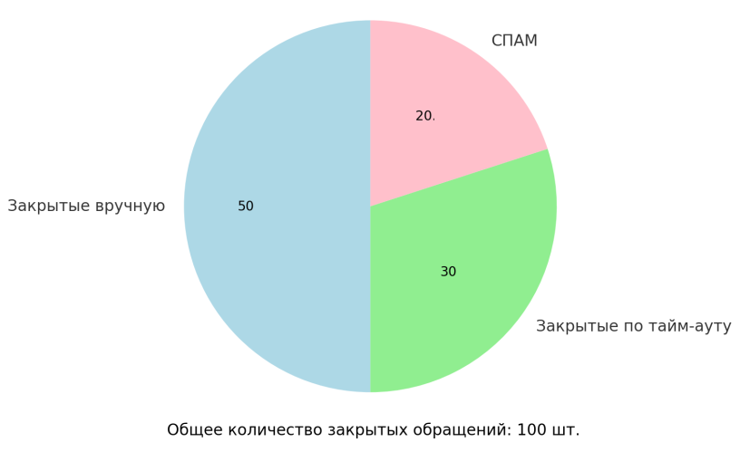

Пример расчета среднего показателя Рассчитываем показатель "Среднее время обработки чата" В чат поступило четыре обращения • Обращение 1: Этапы создания (09:00:00), распределения на группу (09:12:00), распределения на оператора (09:21:00), и закрытия (09:36:00). • Обращение 2: Этапы создания (09:00:00), распределения на группу (09:05:00), распределения на оператора (09:12:00), и закрытия (09:36:00). • Обращение 3: Этапы создания (09:20:00), распределения на группу (09:25:00), распределения на оператора (09:34:00), и закрытия (09:45:00). • Обращение 4: Поступило в (09:25:00), не обработано, автоматически закрыто в (09:55:00).

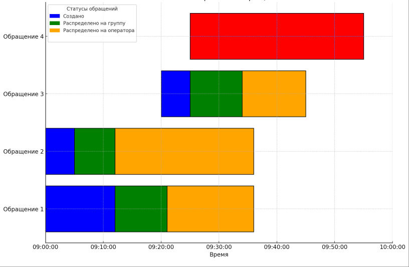

Расчет: 1. Обращение 1: o Время взятия в работу: 09:00:00 (в секундах: 9 * 3600 = 32400 секунд). o Время закрытия: 09:36:00 (в секундах: 9 * 3600 + 36 * 60 = 34560 секунд). o Разница: 34560−32400=2160 секунд. 2. Обращение 2: o Время взятия в работу: 09:00:00 (32400 секунд). o Время закрытия: 09:36:00 (34560 секунд). o Разница: 34560−32400=2160 секунд. 3. Обращение 3: o Время взятия в работу: 09:20:00 (в секундах: 9 * 3600 + 20 * 60 = 33600 секунд). o Время закрытия: 09:45:00 (в секундах: 9 * 3600 + 45 * 60 = 35100 секунд). o Разница: 35100−33600=1500 секунд. 4. Обращение 4: o Не учитывается, так как не было взято в работу. Суммарное время обработки: 2160+2160+1500=5820 секунд. Количество обращений, взятых в работу: 3. Среднее время: 5820÷3=940 секунд. Итого: Среднее время обработки чата — 32 минуты 20 секунд. Список доступных показателей и формулы расчета 1. Количество обработанных входящих обращений – это общее число закрытых и обработанных оператором обращений (шт.). Как считается: Количество обработанных входящих обращений = Обращения, закрытые вручную после ответа + Обращения, автоматически закрытые по истечении тайм-аута после ответа + Обращения, помеченные как СПАМ + Обращения, перенаправленные другому оператору и закрытые. 2. Количество успешных исходящих обращений – это количество исходящих обращений (шт.), которые были успешно доставлены клиенту. Как считается: Количество обращений со статусом "Обработано" и типом "Исходящее". 3. Количество неуспешных исходящих обращений - количество исходящих обращений (шт.), которые не удалось отправить. Как считается: Количество обращений со статусом "Запрещена отправка" и типом "Исходящее".

4. Количество пропущенных обращений – количество обращений (шт.), которые не были обработаны оператором. Как считается: Количество пропущенных обращений = Обращения, закрытые по тайм-ауту без ответа оператора + Обращения, закрытые вручную без ответа + Обращения, отправленные обратно в очередь при автоматическом распределении. 5. Среднее время реакции оператора - среднее время (мм:сс) от момента создания обращения до первого ответа оператора. Как считается:

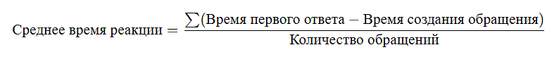

6. Среднее время ожидания в очереди - среднее время (мм:сс), в течение которого обращение находилось в очереди с момента создания до назначения на оператора. Как считается:

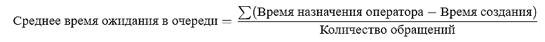

7. Среднее время обработки обращения – среднее время (мм:сс), затраченное оператором на обработку обращения с момента взятия в работу до его закрытия. Как считается:

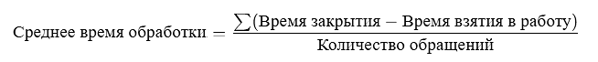

8. Среднее время ответа оператора – среднее время (мм:сс) от взятия обращения в работу до первого ответа клиенту. Как считается:

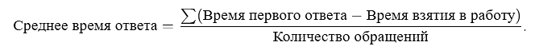

9. Среднее время жизни обращения – среднее время (мм:сс) от создания обращения до его закрытия.

На схеме отражено время жизни обращения, от его создания до закрытия:

10. Уровень сервиса (SL) по времени ожидания в очереди (%) - процент входящих обращений, которые были распределены на оператора и взяты в работу в пределах установленного в Личном кабинете значения SL по времени ожидания в очереди. Учитываются обращения, распределенные как напрямую на оператора (персонально), так и через группу.

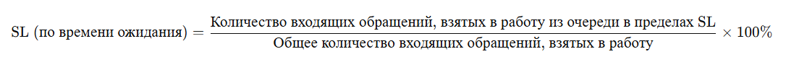

Где • SL — целевое значение времени ожидания (например, 30 секунд). • Числитель — количество входящих обращений, которые были назначены оператору в течение времени, не превышающего SL. • Знаменатель — общее количество входящих обращений, которые были взяты в работу оператором (исключаются пропущенные .и нераспределенные). 11. Уровень сервиса (SL) по времени первого ответа (%) - процент входящих обращений, на которые оператор дал первый ответ в пределах установленного в личном кабинете значения SL по времени ответа. Учитываются обращения, распределенные как персонально, так и через группу, при условии, что они были взяты в работу конкретным сотрудником

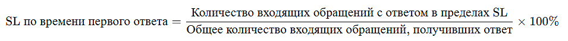

12. Уровень сервиса (SL) по времени реакции оператора (%) - процент входящих обращений, на которые оператор дал первый ответ в пределах установленного в личном кабинете значения SL, отсчитываемого с момента поступления обращения в систему. Учитываются обращения, распределенные на конкретного сотрудника — как напрямую (персонально), так и через группу.

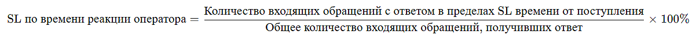

| Для показателей 10-12 в расчёт включаются только входящие обращения, получившие |
| --- |
| первый ответ от оператора. Пропущенные и необработанные обращения не учитываются. |

