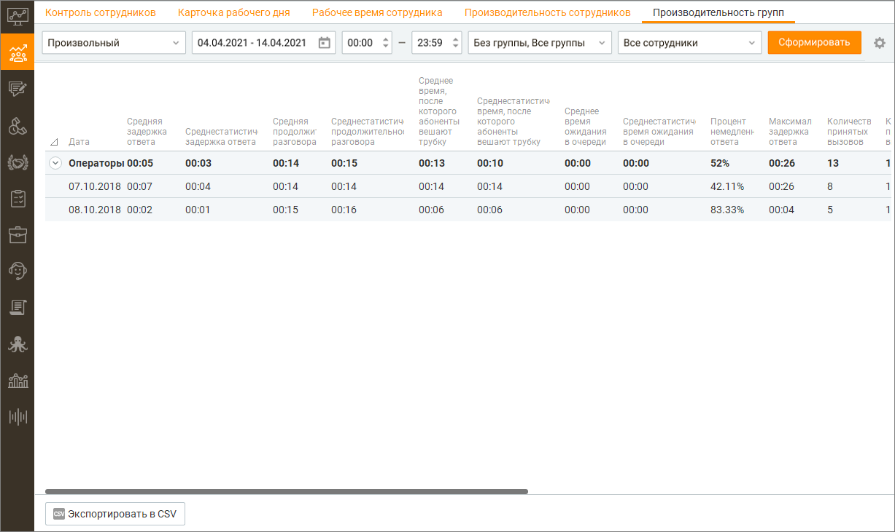

# 7.5.1. Вызовы

> Трассировка: PDF §7.5.1 · сквозные стр. 235-239 · источники: ч.3 `kb/mango-product-docs/sources/mango-cc-manual/CC_manual_1.26.23-part-3.pdf` с.33-37.

Отчёт «Вызовы» предназначен для анализа входящих и исходящих телефонных звонков. Он позволяет оценить эффективность обработки вызовов, работу групп сотрудников, а также отслеживать динамику ключевых показателей производительности групп за выбранный период.

Чтобы получить отчет о показателях производительности групп, вначале следует отобрать вызовы по периоду времени. Для этого выберите нужный период времени из списка Период. При выборе поля с и по, где вы можете ввести нужную дату или выбрать ее, нажав на значок календаря, период автоматически изменится на Произвольный. Вы также можете дополнительно указать время суток для полей с и по. Для этого установите соответствующие флажки и введите или укажите время. Затем вы можете выбрать группу(ы) для получения аналитические данные. Для этого используйте раскрывающийся список Группы.

При необходимости вы также можете выбрать нужные столбцы отчета. Для этого нажмите на

значок и выберите необходимые столбцы. После завершения выбора критериев нажмите кнопку Сформировать. После этого создается отчет о показателях производительности групп сотрудников, сформированный в соответствии с критериями выбора, указанными вами выше. Отчет отображается на странице в табличном виде и включает выбранные вами столбцы. Чтобы экспортировать отчет в формате CSV, нажмите соответствующую кнопку. После этого на экране отображается окно Сохранить отчет. Сохраните файл отчета, используя стандартные средства операционной системы. Подробнее о показателях производительности групп сотрудников Средняя задержка ответа Среднее арифметическое значение, рассчитанное на основе выборки из отчета Обслуживание входящих вызовов, показатель Общее время ожидания. Единица измерения: мм:сс. Не отображается по умолчанию в списке Текущие столбцы отчета. Среднестатистическая задержка ответа Медиана, рассчитанная на основе выборки из отчета Обслуживание входящих вызовов, показатель Общее время ожидания. Единица измерения: мм:сс. Отображается по умолчанию в списке Текущие столбцы отчета. Средняя продолжительность разговора Среднее арифметическое значение, рассчитанное на основе выборки из отчета Обслуживание входящих вызовов, показатель Время разговора. Единица измерения: мм:сс. Не отображается по умолчанию в списке Текущие столбцы отчета. Среднестатистическая продолжительность разговора Медиана, рассчитанная на основе выборки из отчета Обслуживание входящих вызовов, показатель Время разговора. Единица измерения: мм:сс. Отображается по умолчанию в списке Текущие столбцы отчета. Среднее время, после которого абоненты вешают трубку Среднее арифметическое значение, рассчитанное на основе выборки из отчета Обслуживание входящих вызовов, показатель Время ожидания вызова в очереди. Единица измерения: мм:сс. Не отображается по умолчанию в списке Текущие столбцы отчета. Среднестатистическое время, после которого абоненты вешают трубку ) Медиана, рассчитанная на основе выборки из отчета Обслуживание входящих вызовов, показатель Время ожидания вызова в очереди. Единица измерения: мм:сс. Отображается по умолчанию в списке Текущие столбцы отчета. Среднее время ожидания в очереди Среднее арифметическое значение, рассчитанное на основе выборки из отчета Обслуживание входящих вызовов, показатель Время ожидания вызова в очереди. Единица измерения: мм:сс. Не отображается по умолчанию в списке Текущие столбцы отчета. Среднестатистическое время ожидания в очереди Медиана, рассчитанная на основе выборки из отчета Обслуживание входящих вызовов, показатель Время ожидания вызова в очереди. Единица измерения: мм:сс. Отображается по умолчанию в списке Текущие столбцы отчета. Суммарное время входящих разговоров Суммарное время групповых внешних входящих разговоров на выбранную группу за выбранный период. Количество принятых вызовов Количество входящих принятых вызовов, рассчитанное на основе выборки из отчета Обслуживание входящих вызовов, показатель Количество вызовов. Единица измерения: шт. Отображается по умолчанию в списке Текущие столбцы отчета. Общее количество принятых эффективных вызовов

Количество принятых групповых вызовов длительностью больше 30 секунд, на основе выборки из отчета "История вызовов" в разрезе по сотруднику. (Внутренние вызовы исключаются). Общее количество принятых персональных вызовов Количество принятых персональных вызовов всех сотрудников группы, на основе выборки из отчета "История вызовов" в разрезе по сотруднику. (Внутренние вызовы исключаются). Общее количество пропущенных персональных вызовов Количество пропущенных персональных вызовов всех сотрудников группы, на основе выборки из отчета "История вызовов" в разрезе по сотруднику. (Внутренние вызовы исключаются). Количество пропущенных вызовов Количество входящих пропущенных вызовов, рассчитанное на основе выборки из отчета Обслуживание входящих вызовов, показатель Количество вызовов. Единица измерения: шт. Отображается по умолчанию в списке Текущие столбцы отчета. Если вызов завершается во время проигрывания служебных сообщений (приветствия и т.д.), он считается пропущенным. Количество поступивших вызовов Количество входящих вызовов, рассчитанное на основе выборки из отчета Обслуживание входящих вызовов, показатель Количество вызовов. Единица измерения: шт. Не отображается по умолчанию в списке Текущие столбцы отчета. Количество вызовов, получивших немедленный ответ Количество входящих вызовов с показателем Время ожидания вызова в очереди = 0, рассчитанное на основе выборки из отчета Обслуживание входящих вызовов, показатель Количество вызовов. Единица измерения: шт. Не отображается по умолчанию в списке Текущие столбцы отчета. Процент обслуженных вызовов Процент обслуженных вызовов = Количество принятых вызовов / Количество поступивших вызовов. Единица измерения: %. Не отображается по умолчанию в списке Текущие столбцы отчета. Процент пропущенных вызовов Процент пропущенных вызовов = Количество пропущенных вызовов / Количество поступивших вызовов. Единица измерения: %. Отображается по умолчанию в списке Текущие столбцы отчета. Процент немедленного ответа Процент немедленного ответа = Количество вызовов, получивших немедленный ответ / Количество поступивших вызовов. Единица измерения: %. Отображается по умолчанию в списке Текущие столбцы отчета. Максимальная задержка ответа Максимальное значение показателя Общее время ожидания для входящих принятых вызовов на основе выборки из отчета Обслуживание входящих вызовов. Единица измерения: мм:сс. Не отображается по умолчанию в списке Текущие столбцы отчета. Максимальная продолжительность разговора Максимальная продолжительность разговора среди показателей групп, попавших в отчет на основе выборки из отчета "История вызовов" в разрезе по сотруднику. Внутренние вызовы исключаются. Процент первичных вызовов Процент первичных вызовов = Количество вызовов Найденных в адресной книге / Количество вызовов. Из отчета Обслуживание входящих вызовов. Единица измерения: %. Отображается по умолчанию в списке Текущие столбцы отчета. Процент обслуженных первичных вызовов Процент обслуженных первичных вызовов = Количество принятых вызовов Найденных в адресной книге / Количество вызовов Найденных в адресной книге. Из отчета Обслуживание

входящих вызовов. Единица измерения: %. Отображается по умолчанию в списке Текущие столбцы отчета. Количество совершенных вызовов Общее количество исходящих вызовов из истории вызовов в разрезе по сотрудникам группы с типом "Исходящие вызовы" и "Исходящий обзвон", за исключением внутренних и несостоявшихся вызовов. Количество попыток дозвона Общее количество попыток дозвона, взятое из отчета "История вызовов" в разрезе по сотруднику группы. Источники: Исходящие вызовы (состоявшиеся и несостоявшиеся), Исходящий обзвон (состоявшиеся и несостоявшиеся), Автоперезвоны (принятые и пропущенные). Количество входящих вызовов с SL 10 секунд Количество внешних вызовов, поступивших на группу и получивших там обслуживание, время ожидания в очереди которых меньше заданного значения (10 секунд) за выбранный период. Количество входящих вызовов с SL 20 секунд Количество внешних вызовов, поступивших на группу и получивших там обслуживание, время ожидания в очереди которых меньше заданного значения (20 секунд) за выбранный период. Количество входящих вызовов с SL 30 секунд Количество внешних вызовов, поступивших на группу и получивших там обслуживание, время ожидания в очереди которых меньше заданного значения (30 секунд) за выбранный период. Уровень обслуживания SL 10 секунд Количество входящих вызовов с SL 10 секунд поделенное на Количество принятых групповых входящих вызовов по каждой группе. Уровень обслуживания SL 20 секунд Количество входящих вызовов с SL 20 секунд поделенное на Количество принятых групповых входящих вызовов по каждой группе. Уровень обслуживания SL 30 секунд Количество входящих вызовов с SL 30 секунд поделенное на Количество принятых групповых входящих вызовов по каждой группе. Количество принятых обратных звонков Общее количество принятых обратных звонков из истории вызовов в разрезе по группе с фильтрацией по сотруднику. Количество обратных звонков, пропущенных сотрудником Общее количество обратных звонков, пропущенных сотрудником, из истории вызовов в разрезе по группе с фильтрацией по сотруднику. Количество обратных звонков, пропущенных клиентом Общее количество обратных звонков, пропущенных клиентом, из истории вызовов в разрезе по группе с фильтрацией по сотруднику. Количество принятых автоперезвонов Общее время совершенных вызовов из истории вызовов в разрезе по группе и фильтрации по сотруднику с типом "Автоперезвон – Принятые". Количество автоперезвонов, пропущенных сотрудником Общее время совершенных вызовов из истории вызовов в разрезе по группе и фильтрации по сотруднику с типом "Автоперезвон – Пропущенные сотрудником". Количество автоперезвонов, пропущенных клиентом Общее время совершенных вызовов из истории вызовов в разрезе по группе и фильтрации по сотруднику с типом "Автоперезвон – Пропущенные клиентом". Средняя оценка клиента

Среднее арифметическое значение по полю "Оценка клиента" по всем оцененным вызовам с участием сотрудников группы. Показатель доступен только при подключении в Личном кабинете ВАТС соответствующей услуги. Среднее время поствызывной обработки (исходящий обзвон) Среднее арифметическое значение времени, затраченного на поствызывную обработку всех вызовов группы в рамках исходящей кампании. Среднее время поствызывной обработки (исходящие вызовы) Среднее арифметическое значение времени, затраченного на поствызывную обработку всех исходящих вызовов группы. Среднее время поствызывной обработки (входящие вызовы) Среднее арифметическое значение времени, затраченного на поствызывную обработку всех входящих вызовов группы. Загруженность операторов (Utilization) Общее суммарное рабочее время всех сотрудников группы, поделенное на общее оплачиваемое время всех сотрудников группы. Средний процент занятости операторов группы (Occupancy) Общее время, затраченное на обработку звонков всех сотрудников группы, поделенное на общее суммарное рабочее время всех сотрудников группы. Внутреннее общение в расчете показателя не учитывается.
