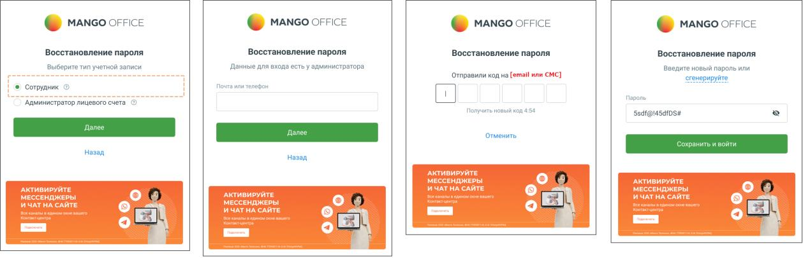
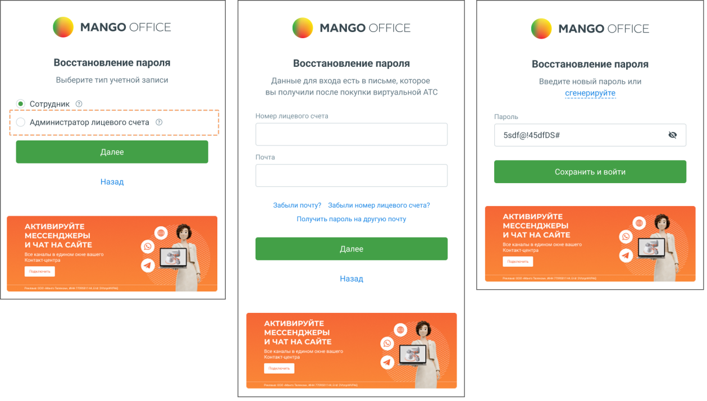

# 1.2. Восстановление пароля

> Трассировка: PDF §1.2 · сквозные стр. 8-10 · источники: ч.1 `kb/mango-product-docs/sources/mango-lk-manual/LK_manual_v-121часть-1.pdf` с.8-10.

ВАЖНО При авторизации проверяется статус в реестре ЕГРЮЛ (для юридических лиц), актуальность паспорта (для физических лиц). О необходимости перезаключить договор или предоставить актуальные данные паспорта напоминает системное уведомление. внимание После создания/восстановления пароля с указанием e-mail или номера телефона повторная возможность восстановления пароля для указанных e- mail или номера телефона блокируется на 1 час. Скачайте приложения Google Play и App Store, и используйте мобильную версию Личного кабинета.

1.2 ВОССТАНОВЛЕНИЕ ПАРОЛЯ Если утерян пароль к аккаунту сотрудника или Администратора Лицевого счета, воспользуйтесь функцией автоматического восстановления. Для этого нажмите на ссылку «Забыли пароль?». На экране восстановления пароля сначала нужно выбрать тип учетной записи: • Сотрудник Указать e-mail или телефон → Получить код → Ввести код → Задать новый пароль → Войти.

• Администратор лицевого счёта Указать номер лицевого счёта и e-mail → Получить письмо с инструкцией → Перейти по ссылке → Задать новый пароль.

совет Номер лицевого счета и зарегистрированный адрес указаны в договоре об оказании услуг связи. Если вы не смогли найти документы, напишите на mango@mango.ru или позвоните 8 800 555-55-22. При этом выполняется проверка на наличие указанного e-mail либо номера телефона в карточке сотрудника ВАТС. Проверка осуществляется по всем продуктам ВАТС кроме заблокированных и архивных. В случае, когда e-mail указан в карточках двух и более сотрудников, следует указать номер телефона. Аналогичный способ используется при обнаружении телефона в карточках нескольких сотрудников. Если вход по указанным e-mail и номеру телефона недоступен, следует обратиться к администратору ВАТС. При корректном вводе данных на указанный e-mail или номер телефона будет выслано текстовое или СМС-сообщение соответственно, содержащее код подтверждения. Код подтверждения следует указать в течение пяти минут. По истечению этого времени следует повторно указать e-mail или номер телефона для получения нового кода подтверждения. После ввода корректного кода подтверждения следует ввести новый пароль. Пароль должен содержать от 12 символов, включать цифры, заглавные и строчные латинские буквы и специальные символы.

