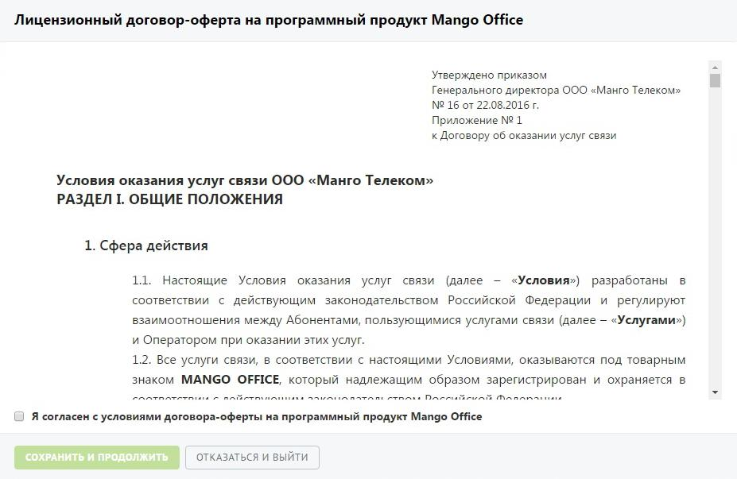

# 1.3. Договор оферты

> Трассировка: PDF §1.3 · сквозные стр. 10-11 · источники: ч.1 `kb/mango-product-docs/sources/mango-lk-manual/LK_manual_v-121часть-1.pdf` с.10-11.

После ввода корректного пароля и нажатия кнопки Сохранить и войти пользователь получает доступ к Личному кабинету. Указанный пароль сохраняется в карточке сотрудника и отображается на закладке «Карточка» в одноименном поле. Если данные указанные верно, на указанный E-mail отправляется письмо с уникальной одноразовой ссылкой для восстановления пароля и инструкцией. Ссылка действительна в течение 24 часов. Пароль по ссылке можно поменять только один раз. При щелчке по ссылке в браузере будет открыта страница с формой установки нового пароля. Укажите новый пароль, соблюдая указанные критерии надежности. После заполнения полей нажмите Сохранить. 1.3 ДОГОВОР ОФЕРТЫ При первом входе в Личный кабинет пользователя с ролью "Администратор лицевого счета" на экране отображается форма, содержащая текст договора оферты. При этом интерфейс Личного кабинета заблокирован.

Для продолжения работы ознакомьтесь с текстом договора оферты установите флаг «Я согласен с условиями…» и нажмите кнопку Сохранить и продолжить. При нажатии кнопки Отказаться и выйти выполняется выход из Личного кабинета и переход на страницу авторизации. Далее при входе в Личный кабинет пользователя с ролью "Администратор лицевого счета" или с ролью, у которой включен чек-бокс «Акцептировать оферты и другие юридические документы» на экране могут отображаться списки договоров и бланк- заказов по данному лицевому счету, требующих подтверждения. Для продолжения работы ознакомьтесь с текстом договора-оферты и нажмите кнопку Принять.

