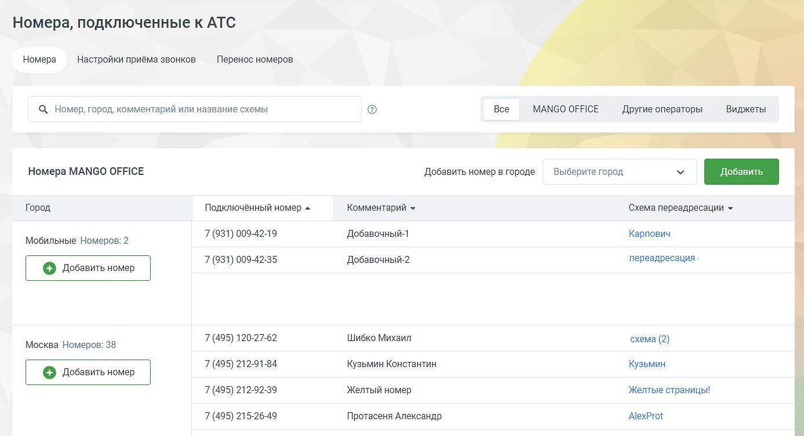
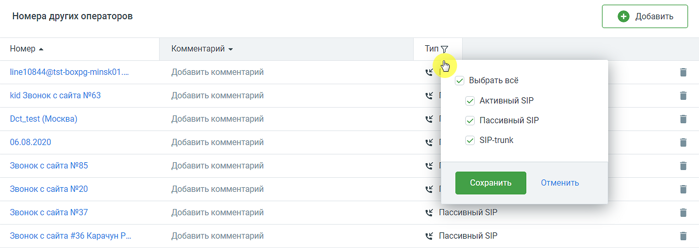
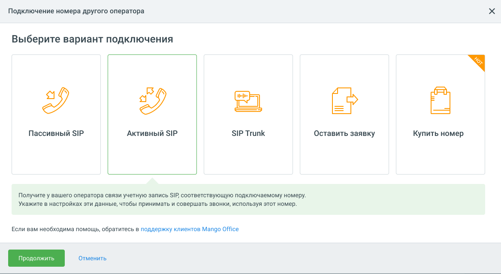

# 4.4.1.1. Закладка «Номера»

> Трассировка: PDF §4.4.1.1 · сквозные стр. 99-101 · источники: ч.1 `kb/mango-product-docs/sources/mango-lk-manual/LK_manual_v-121часть-1.pdf` с.99-101.

Номера MANGO OFFICE В этом блоке можно получить информацию об используемых с текущей Виртуальной АТС многоканальных номерах (телефонных линиях) MANGO OFFICE.

Чтобы приобрести новый многоканальный номер, выберите город в выпадающем списке и нажмите кнопку Добавить. В зависимости от настроек браузера в новой странице или вкладке откроется сайт интернет-магазина «Манго Телеком». Город список городов , в которых имеются подключенные номера. Подключенный номер – номера, относящиеся к данному городу. При клике на кнопку отображается полный список номеров, подключенных для данного города. Комментарий – в поле указывается комментарий в виде краткого текстового сообщения для номеров MANGO OFFICE и для номеров сторонних операторов. Комментарий отображается в выпадающем списке при выборе входящей линии в истории вызовов. Также комментарий указывается вместо номера при входящем звонке в Контакт-центр. Схема распределения – название схемы распределения, подключенной на данном номере. При клике по названию открывается раздел "Распределение звонков, приветствие, голосовое меню", на вкладке "Настройки для входящих линий" и отображается соответствующая схема. Если из конкретных городов на ВАТС поступило не менее 30-ти входящих звонков за последние 7 дней, при этом общая доля звонков не более 1%, система рекомендует пользователю приобрести номера телефонов в этих городах, с целью экономии средств на телефонию.

Номера других операторов В этом блоке можно получить информацию об используемых с этой Виртуальной АТС номерах других операторов и внешних SIP-линий. Для изменения номера нажмите на него. Не забудьте сохранить преобразования. Если нажать «Отменить», кнопку Esc на клавиатуре или кликнуть за пределами формы, изменения не будут внесены.

Клик по пиктограмме «воронка» открывает всплывающее окно фильтрации данных по типу номеров: активный SIP, пассивный SIP, SIP Trunk. Для подключения номера другого оператора нажмите на кнопку Добавить.

Выберите один из вариантов подключения: • Пассивный SIP • Активный SIP

• SIP Trunk • Оставить заявку • Купить номер Для удаления номера другого оператора нажмите иконку «корзина» и подтвердите операцию. Все настройки и статистика для данного номера также будут стерты. Для добавления номера воспользуйтесь кнопкой Добавить номер. При удалении проверяется - используется ли номер или SIP-линия в качестве исходящего номера абонента, хотя бы в одном виджете или кампании исходящего обзвона для данной ВАТС. О невозможности удаления пользователь уведомляется системным сообщением. «Виджеты для сайта» В этом блоке отображается информация о настроенных для этой Виртуальной АТС виджетах. Такие виджеты размещаются на любой странице сайта. Нажмите кнопку Добавить виджет, чтобы создать новый интерактивный элемент «Звонок с сайта», «Заказ обратного звонка» или «Манго Диалоги».
