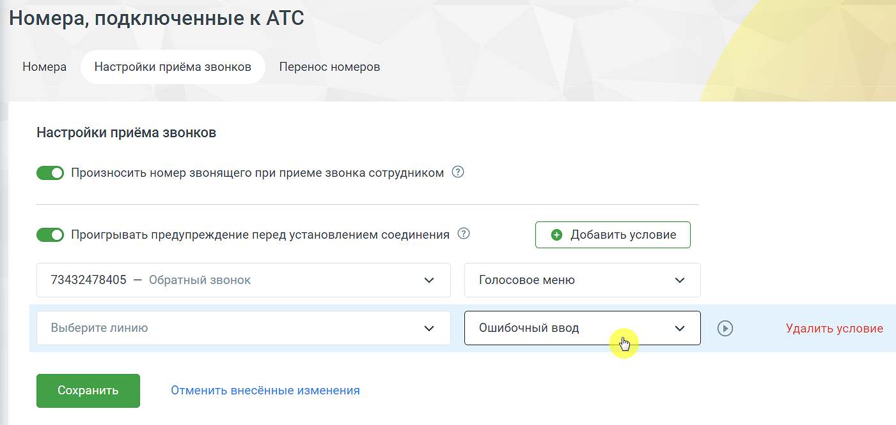

# 4.4.1.2. Закладка «Настройки приема звонков»

> Трассировка: PDF §4.4.1.2 · сквозные стр. 101-102 · источники: ч.1 `kb/mango-product-docs/sources/mango-lk-manual/LK_manual_v-121часть-1.pdf` с.101; ч.2 `kb/mango-product-docs/sources/mango-lk-manual/LK_manual_v-121часть-2.pdf` с.1.

Здесь можно настроить дополнительные опции обработки вызовов.

Произносить номер звонящего при приеме звонка сотрудником Если в этом пункте чекбокс включен, то до начала соединения будет проигрываться голосовое сообщение о номере звонящего. В случае, если звонок распределен на робота-оператора, информация о номере не проигрывается. Проигрывать предупреждение перед установлением соединения Если в этом пункте чекбокс включен, то можно указать индивидуальные предупреждения для каждой подключенной к текущей Виртуальной АТС линии в формате линия - предупреждение. Если чекбокс отключен, то опция недоступна. Для прослушивания предупреждения наведите на него курсор мыши и нажмите

пиктограмму . Для записи нового предупреждения пройдите по ссылке «Аудиофайлы». Для изменения настроек выберите для каждого условия из соответствующих списков нужные фрагменты. Подтвердите операцию нажатием кнопки «Сохранить». Для добавления условия нажмите «Добавить условие». Для удаления - кликните «Удалить». Зачем это нужно: Функция проигрывает предупреждение сотруднику перед установлением соединения, что позволяет сотруднику заранее узнать, с каким запросом может обратиться клиент, в зависимости от номера, на который поступил звонок. Это особенно полезно для компаний с несколькими телефонными номерами, где каждый номер может быть связан с различными услугами или рекламными акциями. Благодаря короткому предупреждению сотрудник может подготовиться и начать разговор с нужного предложения, что повышает качество обслуживания и снижает вероятность ошибок. совет Если для линии выбрано предупреждение «Нет», то перед установлением соединения сообщение не воспроизводится. В списке не отображаются стандартные мелодии («Бетховен», abba и т. д.). Выводятся только звуковые приветствия, загруженные в разделе «Аудиофайлы».
