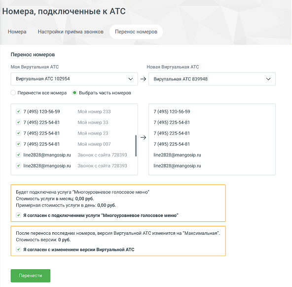
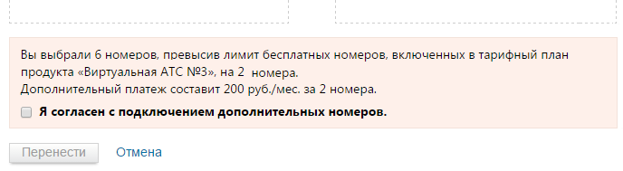

# 4.4.1.3. Закладка «Перенос номеров»

> Трассировка: PDF §4.4.1.3 · сквозные стр. 102-105 · источники: ч.2 `kb/mango-product-docs/sources/mango-lk-manual/LK_manual_v-121часть-2.pdf` с.1-4.

Здесь вы можете осуществить перенос номеров из одной ВАТС в другую. Закладка доступна пользователю, в пакете прав доступа которого включено право доступа "Выполнять перенос номеров между продуктами", и только при условии что на лицевом счету находится более одной ВАТС в статусе "В работе". Можно перенести все номера, или выбрать часть номеров. В последнем случае после проставления соответствующего чекбокса открываются окна выбора и переноса номеров.

внимание SIP транки не выводятся и не переносятся.

Номера, которые можно переносить: • многоканальные номера Mango Office; • номера сторонних операторов; o в том числе генеральные учетные записи SIP. В выпадающем списке слева выберите ВАТС, из которой вы хотите перенести номера, и отметьте эти номера галочками. ВАТС, в которую будут добавлены номера, выбирается из списка справа.

Номера в ВАТС-источнике выделяются серым цветом, если к ВАТС-получателю не подключена поддерживающая их услуга. Если в ВАТС-источнике выбраны номера, недоступные для переноса, отображается системное уведомление о недопустимости переноса номера. Если количество отмеченных номеров превышает оставшееся количество бесплатных номеров, доступных в другой ВАТС, то на экране отображается соответствующее сообщение и предложение подключить услугу «Дополнительный номер». В сообщении также указывается информация о стоимости услуги в месяц. Информация по количеству номеров и стоимости оплаты обновляется с каждой поставленной или убранной галочкой.

Если для перенесенного номера была изначально настроена схема переадресации, то она переносится в другую ВАТС в виде «скелета» - с сохранением всех пунктов по обработке вызова, но очищенными полями (адресаты переадресации, звуковые приветствия и т.д.) Услуги, связанные с перенесенными номерами, в ВАТС-источнике автоматически отключаются, если там не осталось номеров, где эти услуги используются. Если услуга основная, то она не отключается. Если в ВАТС-получателе недоступна (не подключена) какая-либо услуга, то соответствующие этой услуге меню, строки или настройки схем переаадресации не переносятся. Деактивируются все правила автоподстановки для переносимых номеров. Если в настройках правила был указан переносимый номер, то вместо номера выбирается доступный номер по алгоритму определения номера при удалении номера с ВАТС. Если переносимый номер указан в настройках • какой-либо схемы переадресации как исходящий номер при автоперезвоне по пропущенным в IVR • какой-либо кампании ИО • какой-либо группы в настройках автоперезвона по пропущенным звонкам, как исходящий номер то номер заменяется на другой номер ВАТС. Если из ВАТС были перенесены все номера, то в качестве исходящего номера для всех сотрудников этой ВАТС будет использован так называемый стандартный номер. С его

помощью можно совершать исходящие звонки, причем абонентская плата за такой номер не взимается. Но принимать звонки, поступающие на стандартный номер, вы не сможете.
