# 4.4.2.1. Настройки для входящих линий

> Трассировка: PDF §4.4.2.1 · сквозные стр. 105-121 · источники: ч.2 `kb/mango-product-docs/sources/mango-lk-manual/LK_manual_v-121часть-2.pdf` с.4-20.

Для управления логикой работы номера с помощью Виртуальной АТС можно настроить схемы переадресации. Количество доступных схем переадресации зависит от тарифа ВАТС. Каждую схему можно привязать к одному или нескольким используемым номерам. Кроме того, их можно сохранять под другими именами и вносить изменения, нужные для другого номера. Схема переадресации состоит из отдельных узлов или блоков. Те в свою очередь делятся на детали — пункты голосового меню, правила обработки и действия. Каждому пункту голосового меню присваивается номер, по которому абонент может к нему перейти. Также можно защитить любой из пунктов меню паролем, если необходимо ограничить доступ к действиям, осуществляемым при его выборе. Правила обработки могут действовать постоянно или по определенному расписанию. Создание и выбор схемы Для большей наглядности сначала рассмотрим все возможности настройки, а затем простой пример создания схем переадресации. Выберите из списка «Номер», для которого будет настраиваться схема. Если у вас только один подключенный номер, он выбран по умолчанию. Если вы пока не подключили к Виртуальной АТС ни одного номера, сделайте это. В одноименном списке в алфавитном порядке располагаются все схемы. Рядом находятся кнопки, выполняющие соответствующие действия: активировать, переименовать, создать копию, добавить, удалить. Ниже расположено поле для ввода внутреннего номера и описания текущей схемы.

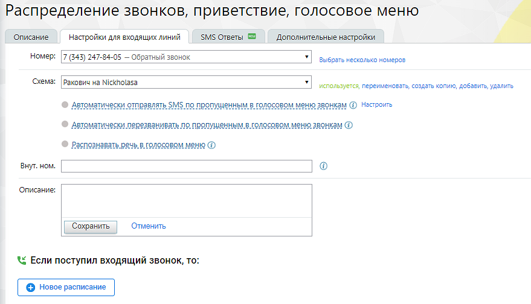

Для любого номера не может быть более одной активной схемы. Если схема активна для данного номера, напротив нее в списке отображается «Используется». Если необходимо применить иную, следует выбрать ее из списка, нажать кнопку «Активировать» и подтвердить действие. Если для продукта подключена любая из услуг Интеграции, то на форме настройки схем переадресаций отображается уведомление, о возможной обработке части звонков иначе чем указано в схеме. Выбрать несколько номеров Настройка множественного выбора номера на схему распределения. При клике на кнопку открывается всплывающее окно, в котором пользователь может назначить несколько номеров на схему переадресации. О наличии ограничений для назначения номеров пользователь уведомлется системным собщением. Чекбокс «Автоматически перезванивать по пропущенным в голосовом меню звонкам» При проставленном чекбоксе открывается окно настроек услуги автоматического перезвона на входящие звонки от клиентов, пропущенные в голосовом меню. Перезвон по внутренним звонкам и входящим звонкам от сотрудников не выполняется. Выберите группу операторов и исходящий номер для перезвона из выпадающих списков. Подтвердите согласие на подключение услуги.

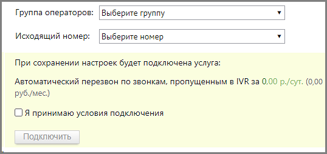

При перезвоне используются алгоритмы, настроенные в подразделе Автоперезвон Личного кабинета. Чекбокс «Распознавать речь в голосовом меню» При проставленном чекбоксе пользователь имеет возможность называть параметры для подключения голосом, вместо использования клавиатуры телефона. При этом доступны следующие варианты распознавания: • распознавать цифры - пункты голосового меню, пароли, внутренние номера сотрудников; • распознавать ФИО, отдел, должности сотрудников; • распознавать тематики обращений - распознавание произнесенных ключевых слов, заданных в голосовом меню.

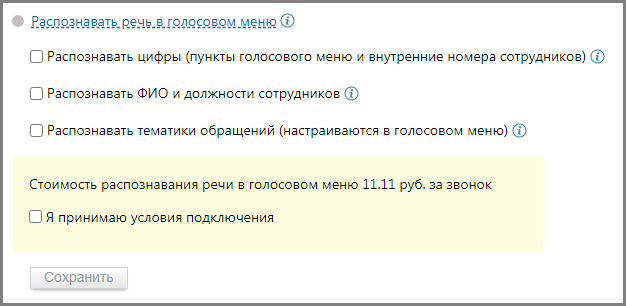

Выберите варианты распознавания. Нажав на пиктограмму «i», ознакомьтесь с пояснениями к каждому из вариантов. Подтвердите согласие на подключение услуги.

Если отмечен чекбокс «Распознавать тематики обращений», клик по пиктограмме в блоке Голосовое меню откроет окно настроек, где следует выбрать готовый шаблон и, при необходимости, дополнить его ключевыми словами.

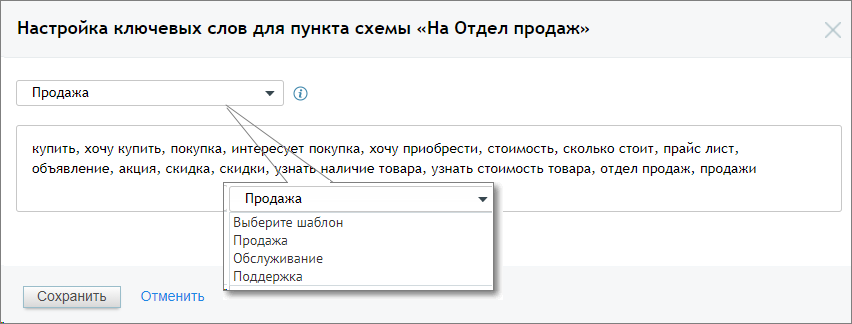

Пользователь также может самостоятельно задать ключевые слова или словосочетания для перевода звонящего в соответствующий пункт голосового меню. При вводе ключевых слов допускается использование следующих символов: • кавычки (" " или «») - для поиска словосочетаний в точном соответствии; • Запятая – для разделения ключевых слов или словосочетаний. Внутренний номер Внутренний номер схемы переадресации позволяет: • совершить прямой вызов по короткому номеру схемы переадресации; • совершать перевод (в том числе по API) на схему переадресации, по ее короткому номеру; • производить донабор в IVR. В отчете История вызовов звонок, переведенный на схему переадресации - это единый звонок, с итоговой длительностью, всеми участниками и переадресациями. Расписание Укажите интервалы времени, в которые будут применяться правила обработки звонков по данной схеме. Кликните по «В любое время» и задайте нужные промежутки.

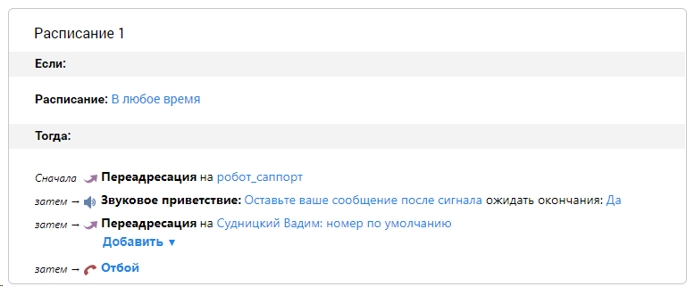

Нажмите «Сохранить». В результате блок настроек разделится на две части: в верхней будут указаны выбранные интервалы времени, в нижней — интервал «В любое другое время». Если в данном интервале аналогичным образом указать период, то он, в свою очередь, разделится на два:

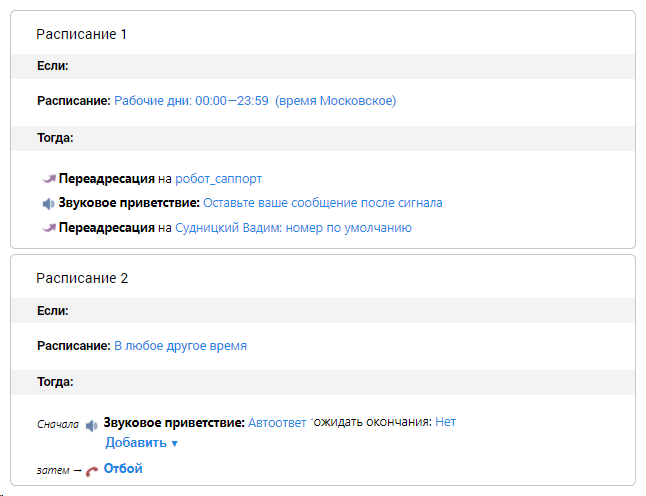

Таким образом, время действия правил можно дробить на нужное количество интервалов.

Для удаления блока наведите курсор на верхний правый угол того блока, который вы хотите удалить. Нажмите на появившийся «крестик» и подтвердите операцию удаления. Настройка правил Под блоком указания временных периодов находятся строки с действиями обработки со значениями по умолчанию. Последней идет строка с завершающим действием схемы. Это «Отбой», и изменить его нельзя (для добавленных в схему правил обработки вместо «Отбоя» можно задать «Возврат в главное меню»). Все остальные пункты можно удалять и перемещать. При нажатии на кнопку «Добавить» раскрывается меню, в котором можно выбрать нужную операцию для добавления в текущий блок. Пункт голосового меню Каждому пункту голосового меню присваивается номер, по которому абонент может к нему перейти. Также можно защитить любой из пунктов меню паролем, если необходимо ограничить доступ к действиям, осуществляемым при его выборе. При создании пункта голосового меню новый блок добавляется внутрь текущего. По умолчанию блок содержит те же действия, что и основной блок.

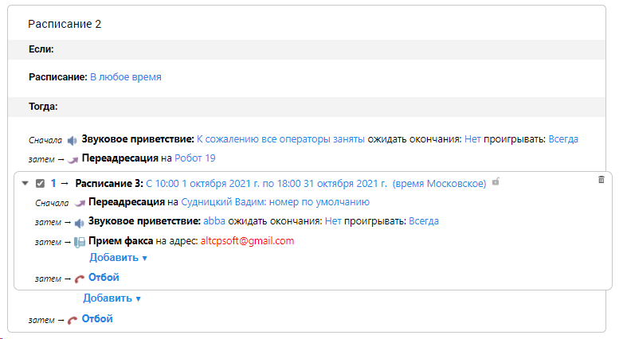

Предусмотрена возможность создания четырехуровневого голосового меню. Для этого в блоке с пунктом голосового меню первого уровня нажмите «Добавить» и выберите «Пункт голосового меню». После соглашения с дополнительными условиями будет создан второй уровень голосового меню.

Для создания третьего и четвертого уровней голосового меню действуйте аналогичным образом: в блоке с пунктом голосового меню второго или третьего уровня соответственно нажмите «Добавить» и выберите «Пункт голосового меню». Далее следует указать, куда Виртуальная АТС должна переадресовать звонок при выборе данного пункта голосового меню. Для этого в действии Переадресация укажите группу, сотрудника, внешний номер, схему распределения или SIP-trunk, на который будет переадресован вызов. Подробнее о создании и настройке SIP-trunk читайте здесь.

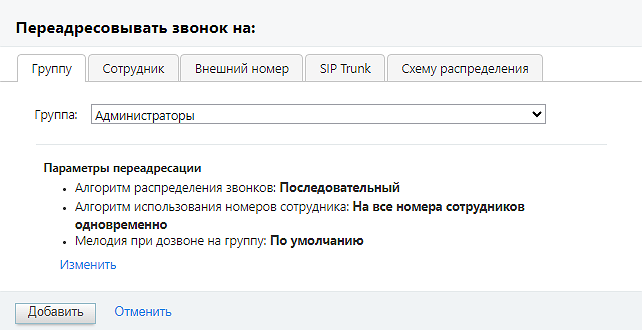

При переадресации на группу нажатие на кнопку Изменить открывает карточку выбранной группы, где можно внести изменения в параметры переадресации. При переадресации на сотрудника в качестве номера по умолчанию допускается выбор значения «Как настроено в карточке сотрудника». В этом случае звонок будет переведен на указанного сотрудника и принят в соответствии с настройками средств приёма звонков, установленными в карточке сотрудника.

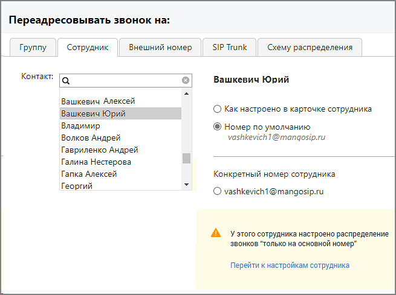

На вкладке может отображаться информационное сообщение с пиктограммой , указывающее на конфликтные ситуации в настройках карточки сотрудника. При переадресации на схему распределения в выпадающем списке доступных схем следует выбрать необходимую схему. В списке отображаются только схемы обладающие внутренним номером. Внутренний номер схемы распределения указывается на вкладке «Настройки для входящих линий», поле «Внут.ном.».

При переадресации на внешний номер необходимо выбрать канал связи.

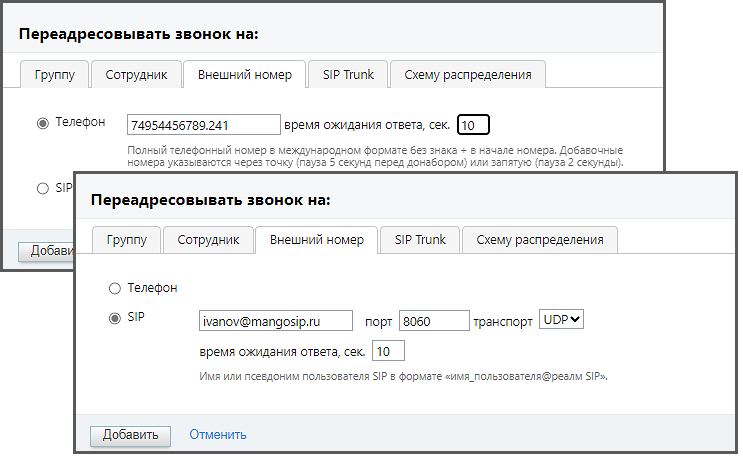

• Телефон: При выборе этой опции переадресация будет осуществляться на номер телефона. • SIP: При выборе этой опции будет осуществляться на SIP-учетку. • Порт (необязательное поле): Здесь можно указать порт, если он отличается от стандартного значения (например, 8060). Допустимые значения порта варьируются от 0 до 65535. • Транспорт (необязательное поле): Выберите тип транспорта для подключения к SIP-учетке. Можно выбрать TCP или UDP. Если это поле оставлено пустым, будет использоваться значение по умолчанию - UDP. • Время ожидания ответа, сек.: Здесь можно указать время ожидания ответа на звонок в секундах. Это определяет, сколько времени система будет ждать ответа от SIP-учетки, прежде чем перейти к следующему действию. • Имя или псевдоним пользователя SIP: Введите имя или псевдоним пользователя SIP в формате «имя_пользователя@реалм SIP». Это идентификатор, который будет использоваться для аутентификации на SIP-сервере. После заполнения всех необходимых полей следует нажать кнопку "Сохранить" или "Применить", чтобы применить внесенные изменения. Если пользователь вносит изменения в шаблон схемы переадресации, в поле ввода "Внутренний номер", создается копия шаблона с именем "Название шаблона: N", где - N порядковый номер.

Оповещение о начале праздничных дней Если на ВАТС имеется хотя бы одна активная схема распределения, для которой не установлено расписание «Нерабочие дни» для всех пользователей ВАТС, при входе в Личный кабинет в течение трех дней до наступления праздничного календарного дня и на протяжении самих праздников отображается оповещение:

Клик на кнопку «Проверить схемы» открывает вкладку «Настройки входящих линий». Правила обработки Как и пункт голосового меню, правило обработки представляет собой встраиваемый блок. Его положение зависит от того, в каком блоке вы нажали «Добавить» и выбрали данный пункт. Добавление правила обработки допускается во всех блоках, кроме четвертого уровня голосового меню. Кроме того, допускается создание второго уровня правила обработки за исключением случая, когда правило обработки создается внутри пункта голосового меню. Ниже перечислены правила обработки, предоставляемые Виртуальной АТС: • Донабор внутреннего номера (DISA). Позволяет ввести номер указанной длины для донабора внутренних номеров сотрудников из интерактивного голосового меню (IVR). В данном блоке переадресация вызовов допускается на внутренний номер, а также на префикс и маску транка (если совпадений с внутренним номером не найдено). • Отсутствие ввода. Определяет порядок обработки звонка, если при работе с интерактивным голосовым меню в течение интервала ожидания не произошло ввода данных. • Любой другой ввод. Определяет порядок обработки звонка, если при работе с интерактивным голосовым меню произошел ввод данных, которому не найдено соответствия среди пунктов меню/доступных внутренних номеров. • Ошибочный ввод. Определяет порядок обработки звонка, если при работе с интерактивным голосовым меню превышено количество неверных вводов. • Неверный ввод пароля. Определяет порядок обработки звонка, если при обращении к защищенному пункту интерактивного голосового меню за отведенное количество попыток не произошло ввода верного пароля.

совет Правила обработки, добавленные с помощью одноименной кнопки, действуют постоянно с момента дозвона, поэтому их порядок относительно других поменять нельзя. Для них можно лишь задать собственный временной период. Для экономии места на экране блоки этих правил можно свернуть (чтобы настроить правило внутри блока, необходимо развернуть его). На основании правил Виртуальная АТС определяет действия для обработки входящих звонков. Действия • Звуковое приветствие. Воспроизводит аудиофайл (сообщение, мелодия, приветствие) при обслуживании звонка. • Переадресация. Перенаправление входящего звонка на группу, конкретного сотрудника, а также на любые другие номера телефонов, SIP и Skype. • Переадресация по региону. Перенаправление входящего звонка в соответствии с выбранным правилом переадресации по региону. Если правила переадресации по региону отсутствуют, их можно создать в открывшемся окне. • Голосовая почта. Прием голосовых сообщений от абонентов, а также их пересылка на указанные адреса электронной почты. • Отбой. Завершение вызова со стороны Виртуальной АТС. Любое действие можно переместить можно переместить или удалить. Действие «Отбой» удалению не подлежит. Для перемещения действий относительно друг друга следует в нужной строке навести

курсор на пиктограмму и, удерживая нажатой левую кнопку мыши, переместить действие вниз или вверх.

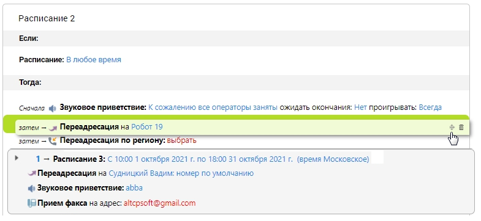

Для удаления действия следует навести курсор на нужную строку, нажать на пиктограмму «корзина» в правом углу и подтвердить операцию. Пример: Что мы хотим получить? При звонке абонента в компанию в рабочие дни с 09:00 до 18:59 он услышит голосовое приветствие, которое должно доиграть до конца. Если нажать «1», звонок переадресовывается на группу «Клиентский отдел». Если в течение 20 секунд нет ответа, можно оставить голосовое сообщение. Если нажать «2», звонок переводится на группу «Отдел продаж». Если в течение 20 секунд нет ответа, звонок будет переадресован на определенного сотрудника. Если в течение 60 секунд он не ответит, то абонент может оставить голосовое сообщение. Если абонент не нажал ни одной клавиши, звонок переадресовывается на группу «Клиентский отдел». Если нет ответа, можно оставить голосовое сообщение. В случае ошибочного ввода цифры в основном меню абонент услышит звуковое приветствие и сможет оставить голосовое сообщение. При звонке в нерабочее время абонент услышит голосовое приветствие. совет Не пугайтесь пространного описания. На самом деле в настройке нет ничего сложного. Овладев описанными в примере приемами, вы с легкостью сможете управлять правилами обработки звонков. Что нужно для этого сделать? 1. Выберите из соответствующих списков номер, для которого хотите настроить логику работы, и схему. 2. Укажите время работы схемы. При необходимости задать конкретные даты воспользуйтесь полем «Период». В нашем случае достаточно в раскрывающемся списке «Добавить» (поле «День и время») выбрать рабочие дни и задать интервал с 09:00 до 18:59. Нажмите кнопку «Сохранить». 3. Выберите звуковое приветствие. Выбранный аудиофайл будет проигрываться при входящем звонке, пока не закончится или пока вызов не примут. Можно выбрать готовое звуковое приветствие из списка, загрузить его с компьютера, а при наличии гарнитуры записать новое (также вы можете заказать профессиональную запись в студии «Манго Телеком»). Здесь же можно прослушать любой из доступных аудиофайлов. Если приветствие не задано, абонент услышит стандартную мелодию дозвона.

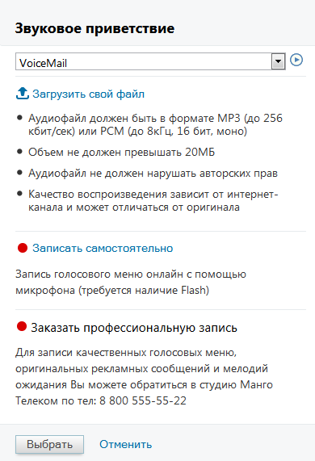

Если необходимо, чтобы абоненты прослушали звуковое приветствие полностью, в поле «Ожидать окончания» следует выбрать «Да». совет Помните, что абонент может не дослушать слишком длинное приветствие и в итоге не дождаться ответа сотрудника. 4. Удалите пункт «Переадресация»: для этого действия впоследствии будут созданы уточняющие правила. 5. В блоке настроек со временем срабатывания «Рабочие дни: 09:00—18:59» нажмите «Добавить» и выберите «Пункт голосового меню». Появится блок с номером «1» (при нажатии на цифру номер можно изменить). 6. Далее в том же блоке необходимо указать, куда Виртуальная АТС должна переадресовать звонок. В действии «Переадресация» щелкните по «не указано». В открывшейся форме необходимо выбрать группу «Клиентский отдел» (список содержит только созданные группы). Далее следует настроить переадресацию, поэтому нажмите «Изменить». 7. После нажатия «Изменить» будет открыта дополнительная форма для настроек группы. Здесь необходимо:

• отметить пункт «Особые настройки удержания вызовов»; • отметить пункт «Удерживать вызовы (ставить в очередь), если все операторы заняты»; • в поле «Максимальное время ожидания, сек» задать интервал 20 секунд; после чего нажать «Сохранить», затем «Добавить». На рисунке ниже отображен результат действий:

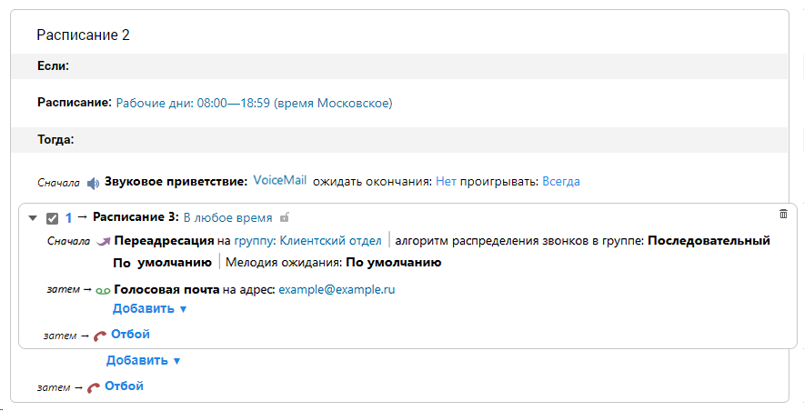

8. В блоке с пунктом голосового меню следует удалить действие «Звуковое приветствие». При необходимости измените адрес для голосовой почты. 9. Далее следует добавить пункт голосового меню второго уровня. Для этого в блоке с пунктом голосового меню первого уровня нажмите «Добавить» и выберите «Пункт голосового меню»). Действия для пункта «2» повторяют действия для пункта «1» с небольшим отличием: по нашим условиям следует добавить пункт «Переадресация» и выбрать определенного сотрудника, а также способ связи с ним. 10. Далее следует добавить правила обработки «Отсутствие ввода» и «Любой другой ввод». Они позволят не потерять звонок в тех случаях, когда абонент не выбрал ни одного пункта меню или нажал неверную цифру. Настройка действий осуществляется по аналогии с действиями для предыдущего правила обработки. 11. В завершении следует установить логику работы номера в нерабочее время. Для этого в блоке «В любое другое время» выбираем нужные действия. На рисунке на следующей странице — результат подобной настройки. При необходимости допускается изменение порядка правил обработки. Для этого наведите курсор на область в правом углу так, чтобы вид курсора изменился. Удерживая левую кнопку мыши, перетащите строку относительно других в нужную позицию и

отпустите кнопку. Повторяйте всю процедуру, пока не будет получена нужная последовательность правил. О наличии конфликтующих между собой правилах обработки звонка в схеме распределения пользователь уведомляется системным сообщением.

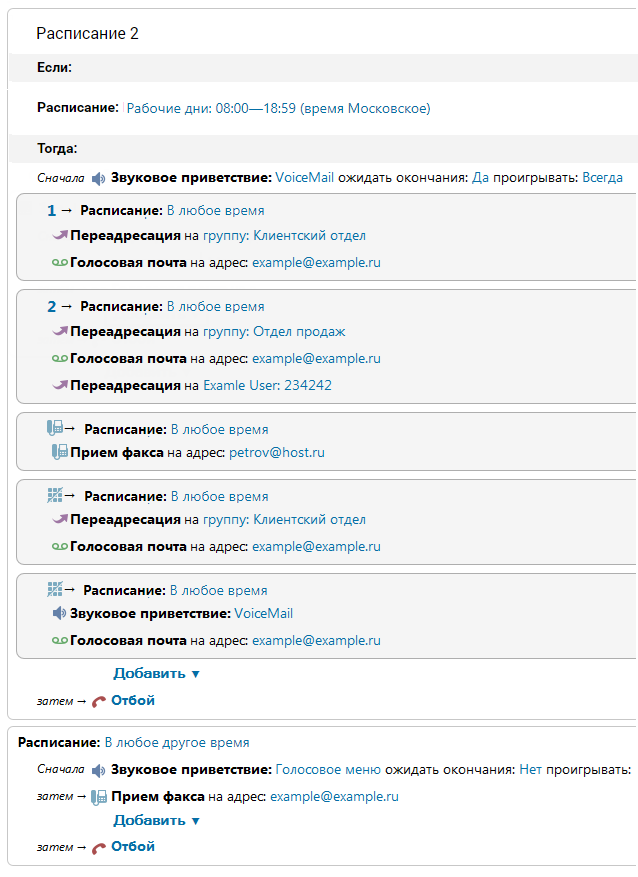

