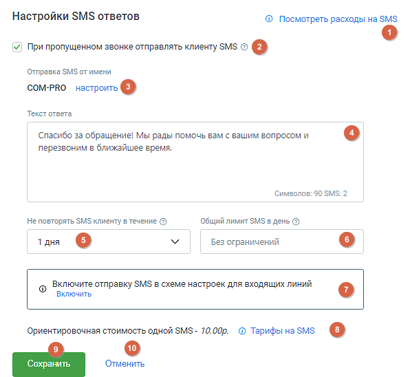

# 4.4.2.3. SMS Ответы

> Трассировка: PDF §4.4.2.3 · сквозные стр. 124-125 · источники: ч.2 `kb/mango-product-docs/sources/mango-lk-manual/LK_manual_v-121часть-2.pdf` с.23-24.

На этой странице вы можете настроить параметры для отправки SMS ответов своим клиентам.

Элементы страницы: 1. Просмотреть расходы на SMS — нажмите на эту кнопку-ссылку, чтобы перейти в раздел "Расходы на связь" и просмотреть информацию о расходах на SMS. 2. Отправка SMS при пропущенном звонке — этот чекбокс позволяет настроить автоматическую отправку SMS клиенту в случае пропущенного звонка. 3. Отправка SMS от имени — здесь указано корпоративное имя отправителя SMS. Пользователь может настроить это имя, нажав на кнопку-ссылку Настроить. 4. Поле «Текст ответа» — поле для ввода текста ответа, который будет отправлен клиенту в виде SMS.

Параметры отправки SMS: 5. Не повторять SMS клиенту в течение — выбор периода, от 1 до 7 дней. 6. Общий лимит SMS в день — выбор общего лимита отправляемых SMS в день. Допустимые значения: от 0 до Без ограничений. 7. Включить отправку SMS в схеме настроек для входящих линий — напоминание о необходимости включить отправку SMS в схеме настроек. Нажмите на кнопку- ссылку Включить, чтобы перейти в соответствующий раздел. 8. Ориентировочная стоимость SMS — здесь указана ориентировочная стоимость одного SMS отправления. Нажмите на кнопку-ссылку Тарифы на SMS, чтобы перейти на страницу с тарифами на SMS на сайте mango-office.ru и узнать подробности о ценах. 9. Кнопка Сохранить сохраняет внесенные изменения. 10. Кнопка Отменить возвращает данные к последнему сохраненному состоянию.
