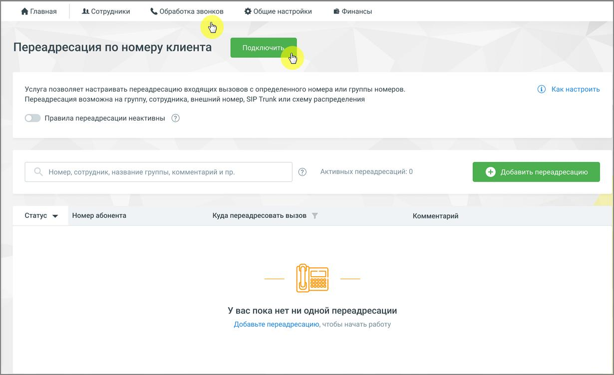
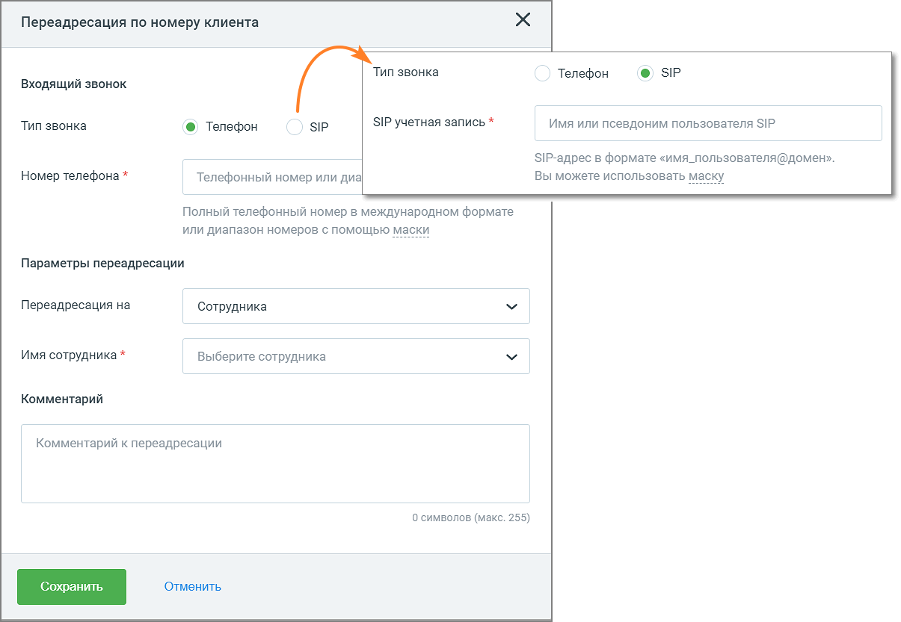
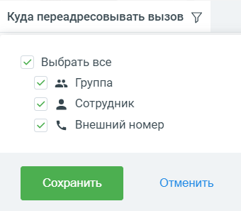

# 4.4.4. Переадресация по номеру клиента

> Трассировка: PDF §4.4.4 · сквозные стр. 131-134 · источники: ч.2 `kb/mango-product-docs/sources/mango-lk-manual/LK_manual_v-121часть-2.pdf` с.30-33.

внимание Инструмент доступен только для администратора Лицевого счета и пользователей с правом доступа «Администратор». Узнать больше можно в подразделе. Инструмент позволяет установить особые правила переадресации для входящих вызовов с определенного номера (номеров). При поступлении звонка от внешнего абонента система пытается определить его номер. Если операция успешна, то этот номер проверяется на соответствие имеющимся правилам переадресации. Если верификация пройдена, вызов переводится в соответствии с параметрами этого правила. Если номер не удалось определить, инструмент не будет работать. Если номер определен, но совпадений со специальными правилами переадресации нет, то дальнейшая обработка вызова производится в соответствии с остальными настройками Виртуальной АТС. Окно подключения услуги переадресации

Для подключения услуги переадресации звонков последовательно перейдите во вкладки Обработка звонков → Переадресация по номеру клиента. Нажмите кнопку «Подключить», ознакомьтесь со стоимостью услуги и подтвердите согласие на подключение.

Добавление, редактирование, удаление переадресации Для добавления новой переадресации нажмите кнопку «Добавить переадресацию».

В открывшейся форме заполните поля Тип звонка – выбор типа номера, откуда поступил входящий звонок, для которого будет установлена переадресация: телефон или SIP Trunk. По умолчанию тип звонка – телефон. Номер телефона – номер, откуда поступил входящий звонок, на который будет установлена переадресация. Для телефонных номеров можно указывать диапазоны. Для всех типов — маски номеров; маски устанавливаются с помощью специальных символов групповой замены «*» и «#»). При указании масок и диапазонов телефонные номера следует вводить в международном формате без использования символов «(», «)», «+» и «-» (символ «- » разрешается в диапазонах). При указании диапазонов номеров они должны быть одинаковой длины: 74952009000-74952009999 — правильно (а 749520-74952009999 — неверно). Знак «#» может заменять одну произвольную цифру или символ. Например, если введена строка 7495#555555, то правило переадресации будет работать для номеров 74951555555, 74952555555, ..., 74959555555. Знак «*» допускается использовать вместо произвольной последовательности цифр/символов. Например, если введена строка 7495200*, то правило переадресации будет работать для номеров 74952000000 — 74952009999.

SIP — учетная запись (адрес) пользователя SIP вносится в формате «имя пользователя@домен/поддомен SIP». Например: ivanov@mangosip.ru, ivanov@mycompany.mangosip.ru, ivanov@company.ru, ivanov@sales.mycompany.ru и т.д. Переадресация на – поле для выбора адресата: • Группа — укажите группу сотрудников для переадресации звонка; • Сотрудник — настройте переадресацию на конкретного сотрудника, с помощью переключателя выберите способ связи с ним; • Внешний номер — укажите для правила тип номера (способ связи) и введите в соответствующее поле телефонный номер/SIP-адрес Есть возможность добавить к правилу комментарий. После внесения изменений нажмите кнопку «Сохранить», и созданное правило отобразится в списке переадресаций. Чтобы активировать правило, установите его переключатель в положение «Включен». Для деактивации установите переключатель в положение «Выключен». Чтобы деактивировать все правила переадресации установите общий чекбокс «Правила переадресации активны» в положение «Выключен». Количество активных на текущий момент переадресаций отображается рядом с полем поиска: «Активных переадресаций:__» Чтобы отредактировать откройте правило, внесите изменения и сохраните их. Для удаления откройте правило, нажмите кнопку «Удалить» и подтвердите согласие на удаление. На вкладке возможен поиск по добавленным правилам переадресаций. Поиск осуществляется по принципу «на лету» по следующим данным: номеру абонента, по группе (названию, внутреннему номеру), по сотруднику (ФИО, внутреннему номеру или средству приема звонка), внешнему номеру телефона, внешней SIP учетной записи, комментарию к переадресации. Также на вкладке доступна фильтрация по адресату. Клик по пиктограмме «воронка» рядом с наименованием столбца открывает выпадающий список фильтров.

