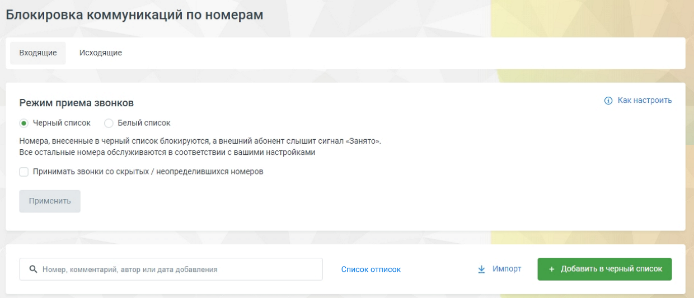
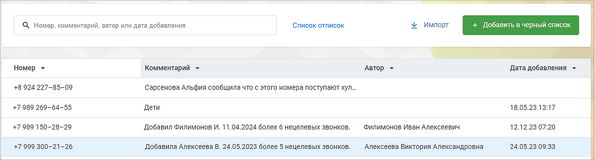

# 4.4.5. Черный/белый список

> Трассировка: PDF §4.4.5 · сквозные стр. 134-135 · источники: ч.2 `kb/mango-product-docs/sources/mango-lk-manual/LK_manual_v-121часть-2.pdf` с.33-34.

внимание Инструмент доступен только для администратора Лицевого счета и пользователей с правом доступа «Администратор». Узнать больше можно в подразделе. Инструмент позволит избавиться от звонков или всегда получать вызовы с определенных номеров. Подключите услугу кликом по кнопке Подключить. После подключения услуга может быть отключена кликом по кнопке Отключить.

После подключения установите режим приема звонков. совет Одновременно использовать черный и белый списки невозможно: включение одного приводит к автоматическому отключению другого, и наоборот. При поступлении вызова от внешнего абонента Виртуальная АТС определяет его номер. Если номер не удалось определить, проверяется возможность запрещать/разрешать принимать вызовы с неопределенных номеров, которая устанавливается при активации инструмента. Обработка вызова продолжается в соответствии с остальными настройками Виртуальной АТС, если: • включен белый список и определившийся номер присутствует в нем; • включен черный или белый список, номер не определен, звонки с неопределенных номеров разрешены;

• включен черный список и определившийся номер в нем отсутствует. Виртуальная АТС завершает вызов, транслируя внешнему абоненту сигнал «Занято», если: • включен белый список и определившийся номер в нем отсутствует; • включен черный или белый список, номер не определен, звонки с неопределенных номеров запрещены; • включен черный список и определившийся номер в нем присутствует. Процедура добавления номера/номеров в один из списков одинакова и производится с помощью одноименной кнопки. В открывшейся форме укажите тип номера (способ связи) и введите в соответствующее поле телефонный номер/имя пользователя SIP (есть возможность задавать для телефонных диапазоны; для всех типов — маски номеров; маски устанавливаются с помощью специальных символов групповой замены «*» и «#»). Подробнее о правилах указания номеров, диапазонов и масок в подразделе. Для импортирования номеров в списки нажмите кнопку «Импорт». В открывшемся окне скачайте шаблон, подготовьте файл импорта и загрузите в Личный кабинет.

Есть возможность добавить комментарий к номеру. Для изменения или удаления выберите номер и разверните его, кликнув по строке мышкой. Для удаления воспользуйтесь одноименной кнопкой. В окне также доступен поиск по номерам, добавленным в черный и белый списки. Поиск проводится по принципу «на лету», по всем столбцам таблицы. Нажатие на кнопку «Список отписок» открывает список отписок от рассылки WhatsApp в Текстовых коммуникациях. Кнопка отображается, если на ВАТС подключен раздел «Текстовые коммуникации» (базовая или расширенная версия). Клик по пиктограмме возле наименования столбца сортирует данные в столбце в

алфавитном порядке.
