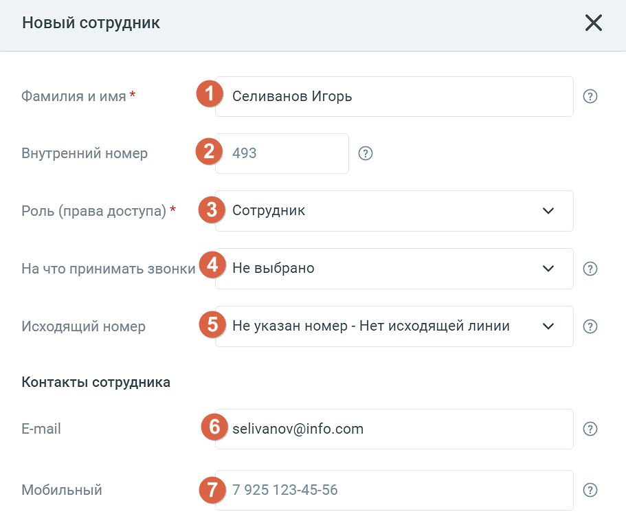
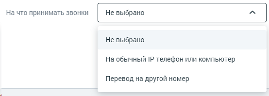
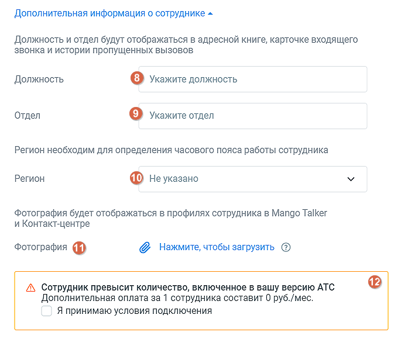
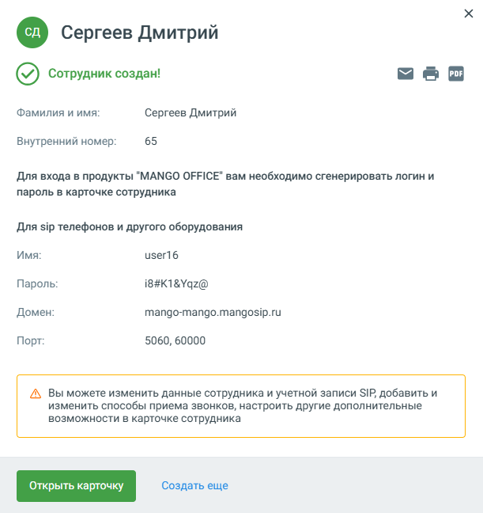
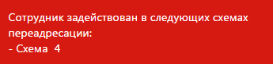

# 4.4.6.1. Работа с сотрудниками

> Трассировка: PDF §4.4.6.1 · сквозные стр. 141-146 · источники: ч.2 `kb/mango-product-docs/sources/mango-lk-manual/LK_manual_v-121часть-2.pdf` с.40-45.

Для добавления профиля нового пользователя нажмите соответствующую кнопку, и откроется форма «Новый сотрудник».

1. Укажите Ф.И.О. сотрудника. Если специалист с такими данными уже существует, отображаются соответствующее сообщение и ссылка на его карточку, в которой при необходимости можно внести изменения. 2. При создании профиля сотруднику автоматически присваивается порядковый внутренний номер. При необходимости его можно изменить. Внутренний номер должен быть уникальным и состоять из двух (минимум) двух и семи (максимум) символов;

совет Рекомендованная минимальная длина внутреннего номера составляет две цифры во избежание возникновения конфликтов с номерами пунктов голосового меню. 3. Укажите роль сотрудника (права доступа к функционалу Личного кабинета). 4. Укажите способ приема звонков.

При выборе вариантов «На обычный IP-телефон или компьютер» требуется наличие учетной записи SIP. Она создается в автоматическом режиме или задается позднее при редактировании карточки сотрудника. При выборе вариантов «Перевод на другой номер» необходимо указать телефонный номер в формате 7 925 123-45-67. 5. Исходящий номер: Выбор линии для исходящих звонков выполняется, только если к Виртуальной АТС подключено более одного телефонного номера, включая SIP-линии. Номер 8-800 недоступен для выбора в качестве исходящего номера. При выборе значения «Не указан номер – Нет исходящей линии» для сотрудника не указывается исходящий номер, что приводит к отсутствию возможности использовать внешнюю исходящую связь. Если при создании сотрудника на ВАТС нет ни одного телефонного номера DID или номера-заглушки, но есть одна SIP-линия, то поле «Исходящий номер» не отображается, а данная SIP-линия автоматически указывается в качестве линии для исходящих звонков. При количестве линий две и более поле отображается. 6. При создании сотрудника указанный электронный адрес записывается в карточку сотрудника. На этот адрес сотруднику отправляется письмо с информацией по завершению регистрации и установлению пароля сотрудника в Личном кабинете. Поле обязательно для заполнения и проверяется на уникальность. Если введенный электронный адрес принадлежит другому сотруднику ВАТС, появится соответствующее системное уведомление.

7. Если поле «Мобильный» оставить пустым, номер может подтягиваться из вкладки «Телефония» (если он соответствует параметрам мобильного телефона). Поле проверяется на уникальность. Если введенный номер мобильного телефона принадлежит другому сотруднику ВАТС, появится соответствующее системное уведомление. Поле является обязательным для заполнения, если оно используется в настройках двухфакторной авторизации.

8. Укажите должность нового сотрудника. 9. Укажите отдел, в котором работает сотрудник. 10. Выберите из выпадающего списка регион, в котором территориально находится сотрудник. 11. Загрузите фото сотрудника. Допустимые форматы png, jpeg, bmp. 12. Отметьте чекбокс согласия на дополнительную оплату за превышение количество сотрудников, добавленный в ЛК ВАТС.

Завершение После заполнения полей формы нажмите «Создать». Будет выполнена автоматическая проверка на корректность введенных данных. Если поле было заполнено с ошибкой, на экране отобразится соответствующее сообщение. Если ошибок нет, откроется форма (см. рис. ниже).

На указанный e-mail сотрудника автоматически отправляется информационное сообщение с доступами к учетной записи.

Если требуется совершить создать несколько сотрудников, выберите кнопку Добавить сотрудника повторно и повторите предыдущие действия. Для редактирования карточки сотрудника откройте его, нажав на имя сотруждника в списке сотружников. Карточка включает четыре вкладки, см. далее в этом разделе. Имя сотрудника указывается в заголовке на любой вкладке. Для редактирования

наименования нажмите . Введите новое имя и нажмите . После того, как все изменения внесены, нажмите «Сохранить» в нижней части вкладки. Для удаления сотрудника нажмите кнопку Удалить сотрудника. При удалении выполняется проверка, задействован ли сотрудник: • в схемах переадресации, • в переадресации по номеру клиента, • в настройках виджетов "Обратный звонок", • в мультиканальных виджетах; • в кампаниях исходящего обзвона Контакт-центра в статусах «Завершена», «Запланирована», «Остановлена» - в этом случае сотрудник исключается из списка операторов и удаляется; • если удаляемый сотрудник участвует в запланированном вызове Контакт-центра, вызов будет отменен, сотрудник удаляется. Если сотрудник указан хотя бы в одной схеме, переадресации по номеру клиента, настройке либо кампании Исходящего обзвона в статусе, отличном от «Завершена», «Запланирована», «Остановлена», удаление не производится, а на экране отображается предупреждение примерного вида:

. Так же удаляются все настроенные для сотрудника правила обработки звонков. ИМПОРТ СОТРУДНИКОВ Для импорта сотрудников кликните по кнопке «Импорт сотрудников» и выполните действия, указанные в открывшемся окне. Формат импортируемого файла csv. При импорте выполняются следующие условия: • система не проверят сотрудников на дубли. Если в списке несколько одинаковых сотрудников или ФИО нового сотрудника совпадает с именем существующего сотрудника ВАТС, то все равно создается новый сотрудник. • если создание какого-то конкретного сотрудника возможно (обязательные поля заполнены корректно, но в необязательных заполненных есть какие-то ошибки), то система создает сотрудника, пропуская обработку этих необязательных полей (считает их незаполненными).

• если создание какого-то конкретного сотрудника невозможно (не заполнены обязательные поля), то система пропускает сотрудника и идет дальше, т.е. создает следующих сотрудников. ЭКСПОРТ СОТРУДНИКОВ Нажатие на кнопку «Экспортировать» позволяет произвести экспорт сотрудников в файл csv. Функция доступна пользователям, у которых есть права на создание сотрудников и доступ к разделу "Сотрудники".
